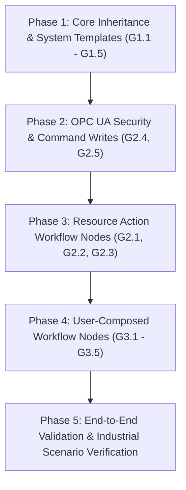

# Complete Architecture & Implementation Plan: Industrial Templates, Resource Inheritance, Workflow Nodes & Node Composition

## Executive Summary & Core Goals
This master plan unifies:
1. **Resource & Template Lifecycle**:
   - Creating resources from **System Templates** (Conveyors, AMRs, ASRS Cranes, Turntables, Scanners, Scales, WMS Connectors).
   - Creating resources from **User-Defined Templates** with custom property & method schemas.
   - Allowing resource instances to inherit, override, and add **instance-level custom properties & custom methods**.
2. **Resource Methods as System Workflow Nodes**:
   - Every method on an active resource (e.g. `CONV_01.START_MOTOR`, `AMR_05.NAVIGATE_TO_NODE`, `CRANE_01.PICKUP`, `WMS.CONFIRM_PALLET`) becomes executable as a **Workflow Node** in the Workflow Composer.
   - The Workflow Engine executes these nodes through the unified [`EntityServiceDispatcher`](file:///c:/Users/Windows10/Documents/GitHub/Warehouse_orchestrator/services/wes-service/src/main/java/com/company/warehouse/wes/business/resource/composer/service/EntityServiceDispatcher.java), talking directly to PLCs, OPC UA servers, MQTT brokers, or REST APIs.
3. **User-Composed Workflow Nodes**:
   - Users can compose custom reusable workflow nodes (pre-configured resource actions, multi-step sub-workflows, or compound logic) and save them to the **Workflow Node Palette**.
   - Composed nodes can be dragged and dropped into any workflow across different warehouse applications (Receiving, Sorting, Inbound Storage, AMR Transport, Outbound).

---

## High-Level Architecture Flow

```
┌────────────────────────────────────────────────────────────────────────┐
│                        1. TEMPLATE TIER                                │
│  ┌─────────────────────────┐            ┌───────────────────────────┐  │
│  │   System Archetypes     │            │   User-Defined Templates  │  │
│  │ (CONVEYOR, AMR, CRANE)  │ ──clone──► │   (PostgreSQL Schema)     │  │
│  └────────────┬────────────┘            └─────────────┬─────────────┘  │
└───────────────┼───────────────────────────────────────┼────────────────┘
                │                                       │
                ▼                                       ▼
┌────────────────────────────────────────────────────────────────────────┐
│                        2. RESOURCE TIER                                │
│  ┌──────────────────────────────────────────────────────────────────┐  │
│  │                    Concrete Resource Instance                    │  │
│  │  • Inherited Properties (Defaults & Constraints)                 │  │
│  │  • Instance Property Overrides & Custom Properties               │  │
│  │  • Inherited Methods (PackML / IDTA / System Archetype)          │  │
│  │  • Instance Custom Methods (Endpoints & Tag Bindings)            │  │
│  └──────────────────────────────────┬───────────────────────────────┘  │
└─────────────────────────────────────┼──────────────────────────────────┘
                                      │
                                      ▼ Exposes Effective Methods
┌────────────────────────────────────────────────────────────────────────┐
│                        3. WORKFLOW TIER                                │
│  ┌─────────────────────────┐            ┌───────────────────────────┐  │
│  │  Resource Action Nodes   │            │   User-Composed Nodes     │  │
│  │ [CONV_01.START_MOTOR]   │            │ (Composite Sub-workflows  │  │
│  │ [AMR_05.NAVIGATE]       │            │  & Saved Node Blueprints) │  │
│  └────────────┬────────────┘            └─────────────┬─────────────┘  │
│               └──────────────────────┬────────────────┘                │
│                                      ▼                                 │
│                         [Workflow Engine Dispatcher]                   │
│                                      │                                 │
│                                      ▼                                 │
│                         [EntityServiceDispatcher]                      │
│                ┌─────────────────────┼─────────────────────┐           │
│                ▼                     ▼                     ▼           │
│           [OPC UA Milo]         [PLC S7 / Modbus]       [REST API]     │
└────────────────────────────────────────────────────────────────────────┘
```

---

## Detailed Gap Analysis (Mapped to User Goals)

### Goal 1: Resource Creation Using System Templates & User Templates
| Gap ID | Component | Description | Status |
| :--- | :--- | :--- | :--- |
| **G1.1** | `RestSoftwareEntityArchetype` | Missing `@Component`; Spring skips discovery; `REST_API_GENERIC` absent at runtime. | **DONE** (Annotated with `@Component`) |
| **G1.2** | Physical Equipment Archetypes | Generic platform framework prioritized per user instructions; specific equipment archetypes deferred until user specifies taxonomy. | **FRAMEWORK READY** |
| **G1.3** | Domain Micro-Kernel Capabilities | Micro-kernel registered empty capabilities. Now passes `methodResolutionEngine.resolveCapabilities(...)`. | **DONE** |
| **G1.4** | Effective Methods API | `resolveEffectiveMethods()` now resolves 3 tiers (System Archetype, Template, Instance Custom). | **DONE** |
| **G1.5** | Base Template Cloning | Added `POST /api/v1/wes/resource-templates/from-archetype/{code}` in `ResourceTemplateController`. | **DONE** |

### Goal 2: Resource Methods as System Workflow Nodes
| Gap ID | Component | Description | Status |
| :--- | :--- | :--- | :--- |
| **G2.1** | Node Palette | `NodePalette.tsx` dynamically displays active resources and their effective methods under "Equipment". | **DONE** |
| **G2.2** | Canvas & Inspector | `ResourceActionConfigInspector.tsx` created for `RESOURCE_ACTION` with parameter binding & context variable chips. | **DONE** |
| **G2.3** | Backend Workflow Handler | `ResourceActionHandler.java` registered in `wes-service` executing through `EntityServiceDispatcher`. | **DONE** |
| **G2.4** | OPC UA Command Writes | `IndustrialPlcServiceExecutor.java` dynamic tag writing for arbitrary equipment commands. | **DONE** |
| **G2.5** | OPC UA Security | Dynamic security policies (None, Basic256Sha256, Aes128) and authentication (Anonymous vs Username). | **DONE** |

### Goal 3: User-Composed Workflow Nodes
| Gap ID | Component | Description | Status |
| :--- | :--- | :--- | :--- |
| **G3.1** | Composed Node Storage | `wes.workflow_node_template` table created in `V19__create_workflow_node_template_table.sql` & `WorkflowNodeTemplateEntity.java`. | **DONE** |
| **G3.2** | Composed Node API | `WorkflowNodeTemplateController.java` & `WorkflowNodeTemplateService.java` with CRUD endpoints. | **DONE** |
| **G3.3** | Palette "Composed" Tab | "Composed" tab & filter in `NodePalette.tsx` fetching templates from API. | **DONE** |
| **G3.4** | "Save as Composed Node" Action | "Save as Composed Palette Node" modal in `ResourceActionConfigInspector.tsx`. | **DONE** |
| **G3.5** | Composed Node Execution | Handled polymorphicly via node template definitions and `ResourceActionHandler`. | **DONE** |

---

## Complete Phased Implementation Plan



---

### Phase 1: Core Inheritance & System Templates
1. **Fix `RestSoftwareEntityArchetype`**:
   * Add `@Component` to [`RestSoftwareEntityArchetype.java`](file:///c:/Users/Windows10/Documents/GitHub/Warehouse_orchestrator/services/wes-service/src/main/java/com/company/warehouse/wes/business/resource/composer/archetype/RestSoftwareEntityArchetype.java).
2. **Implement Industrial System Archetypes**:
   * Create:
     * `ConveyorSystemEntityArchetype.java` (`CONVEYOR_SYSTEM`)
     * `AmrVda5050EntityArchetype.java` (`AMR_VDA5050`)
     * `AsrsStackerCraneEntityArchetype.java` (`ASRS_STACKER_CRANE`)
     * `TurntableTransferEntityArchetype.java` (`TURNTABLE_TRANSFER`)
     * `ScannerIndustrialEntityArchetype.java` (`SCANNER_INDUSTRIAL`)
     * `ScaleIndustrialEntityArchetype.java` (`SCALE_INDUSTRIAL`)
     * `WmsRestSoftwareEntityArchetype.java` (`WMS_REST_OAUTH2`)
3. **Fix Method Resolution & Registration in `ResourceManager.java`**:
   * `resolveEffectiveMethods()`: Delegate to `methodResolutionEngine.resolveMethods(...)`.
   * `createResource()`: Pass `methodResolutionEngine.resolveCapabilities(...)` into `ResourceClient.register(...)`.
4. **Base Template Cloning Endpoint**:
   * Add `POST /api/v1/resources/templates/from-archetype/{code}` in `ResourceTemplateController.java`.

---

### Phase 2: OPC UA Security & Equipment Command Execution
1. **Authenticated & Encrypted OPC UA Client**:
   * In `IndustrialPlcServiceExecutor.java`, extract `authType`, `securityPolicy`, `username`, and `password` from effective properties and configure the Milo client.
2. **Dynamic Equipment Command Execution**:
   * Add generic write fallback in `IndustrialPlcServiceExecutor.java` for commands like `START_MOTOR`, `STOP_MOTOR`, `MOVE_TO_POSITION` using tag bindings from `methodsConfig`.
3. **Automated Handshake Integration**:
   * Wire `EXECUTE_HANDSHAKE` in `IndustrialPlcServiceExecutor.java` to [`OpcUaHandshakeSequenceEngine`](file:///c:/Users/Windows10/Documents/GitHub/Warehouse_orchestrator/common/common-industrial/src/main/java/com/company/warehouse/common/industrial/opcua/handshake/OpcUaHandshakeSequenceEngine.java).

---

### Phase 3: Resource Action Workflow Nodes
1. **Backend `ResourceActionHandler`**:
   * Create `ResourceActionHandler.java` implementing `WorkflowNodeHandler`.
   * Supports node type `RESOURCE_ACTION`.
   * Reads `resourceId`, `methodName`, and `parameterBindings` from `nodeConfig`.
   * Evaluates parameter placeholders (`#{context.variable}`).
   * Calls `entityServiceDispatcher.execute(resourceId, methodName, resolvedParameters)`.
   * Emits execution output into workflow context under configured `outputVariable`.
2. **Frontend Dynamic Equipment Palette**:
   * Update [`NodePalette.tsx`](file:///c:/Users/Windows10/Documents/GitHub/Warehouse_orchestrator/client/warehouse-ui/src/features/workflows/components/NodePalette.tsx):
     * Fetch active resources via `resourceService.getAllResources()`.
     * Add `EQUIPMENT` category in the palette showing each resource and its methods (e.g. `[CONV-01] Start Motor`, `[AMR-01] Navigate`).
     * Also provide a generic `Resource Action` node.
3. **Frontend `ResourceActionInspector`**:
   * In [`NodeInspectorPanel.tsx`](file:///c:/Users/Windows10/Documents/GitHub/Warehouse_orchestrator/client/warehouse-ui/src/features/workflows/components/NodeInspectorPanel.tsx), add inspector for `RESOURCE_ACTION`:
     * Resource selector dropdown.
     * Method selector dropdown (dynamically populated from selected resource's effective methods).
     * Visual parameter binding table (Method Parameter $\leftrightarrow$ Context Variable).
     * Output variable name input.

---

### Phase 4: User-Composed Workflow Nodes
1. **Database Schema & Entity**:
   * Liquibase migration `V19__create_workflow_node_template_table.sql`:
     ```sql
     CREATE TABLE wo.workflow_node_template (
         id UUID PRIMARY KEY,
         node_code VARCHAR(60) NOT NULL UNIQUE,
         label VARCHAR(100) NOT NULL,
         category VARCHAR(30) NOT NULL, -- 'EQUIPMENT', 'INTEGRATION', 'COMPOSED', 'LOGIC'
         description VARCHAR(500),
         icon_name VARCHAR(50),
         badge_color VARCHAR(30),
         base_type VARCHAR(50) NOT NULL, -- 'RESOURCE_ACTION', 'SUB_WORKFLOW', 'API_MAPPER', etc.
         default_config JSONB NOT NULL DEFAULT '{}',
         input_schema JSONB DEFAULT '[]',
         output_schema JSONB DEFAULT '[]',
         created_by VARCHAR(50),
         created_at TIMESTAMP WITH TIME ZONE NOT NULL DEFAULT NOW()
     );
     ```
2. **API Controller & Service**:
   * Create `WorkflowNodeTemplateEntity.java`, `WorkflowNodeTemplateRepository.java`.
   * Create `WorkflowNodeTemplateController.java`:
     * `GET /api/v1/workflows/nodes/templates` (lists all standard + user-composed node templates)
     * `POST /api/v1/workflows/nodes/templates` (persists a composed node template)
     * `DELETE /api/v1/workflows/nodes/templates/{code}`
3. **Frontend Composed Nodes in Palette & Canvas**:
   * In `NodePalette.tsx`, load user-composed nodes under **"COMPOSED"** tab.
   * In `WorkflowComposerView.tsx` / `NodeInspectorPanel.tsx`, add button **"Save as Composed Node"** allowing users to turn any configured node into a permanent palette template with a custom label, description, and icon.
4. **Backend `ComposedNodeExecutionHandler`**:
   * Executes composed nodes by delegating to their underlying action or invoking their nested sub-workflow.

---

### Phase 5: Verification & End-to-End Industrial Scenario Testing

#### Complete Scenario Test: "Infeed Conveyor to AMR Handoff"
1. **Create Template**: User creates or selects `CONVEYOR_SYSTEM` template with `START_MOTOR` and `CLEAR_JAM`.
2. **Create Resources**:
   * `CONV-01` (Conveyor, protocol: `PLC_S7` or `OPC_UA`)
   * `AMR-01` (AMR, protocol: `MQTT/VDA5050`)
3. **Compose Workflow**:
   * Step 1: `TRIGGER` (Pallet Ingest Scan on HMI)
   * Step 2: `RESOURCE_ACTION` (`CONV-01.START_MOTOR`)
   * Step 3: `ASYNC_GATE` (Wait for Photo-Eye sensor arrival)
   * Step 4: `RESOURCE_ACTION` (`AMR-01.NAVIGATE_TO_NODE`, target: `STATION_IN_01`)
   * Step 5: `TERMINATOR` (Archive and log)
4. **Save Composed Node**:
   * Save Steps 2-4 as a single composed node: `"Conveyor-to-AMR Transfer Block"`.
   * Confirm it appears in the Palette under "Composed Nodes" and can be dropped into a new workflow.
5. **Execution Verification**:
   * Run workflow in simulation and live mode; verify execution logs and trace outputs.
