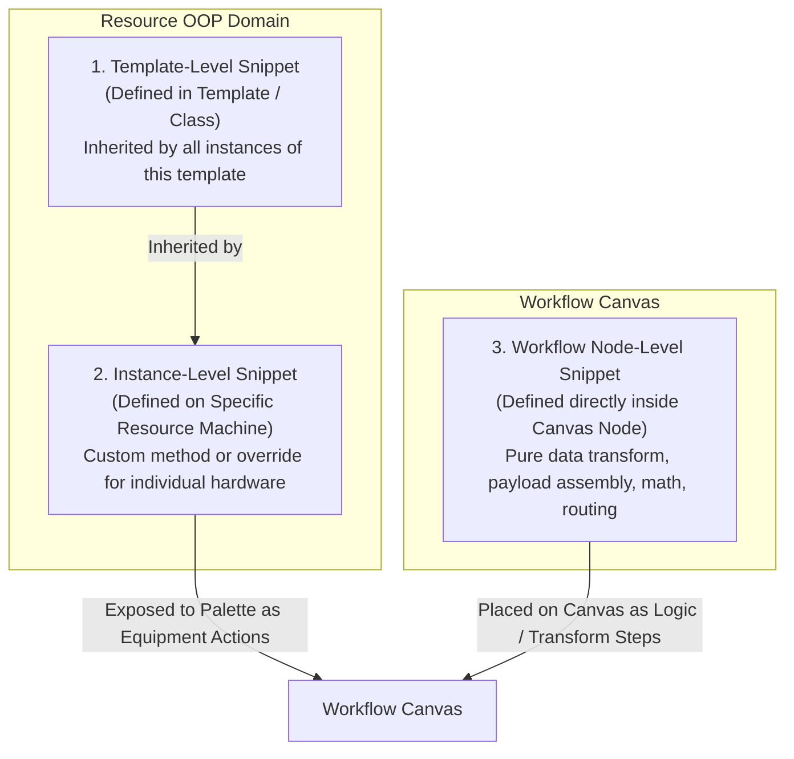
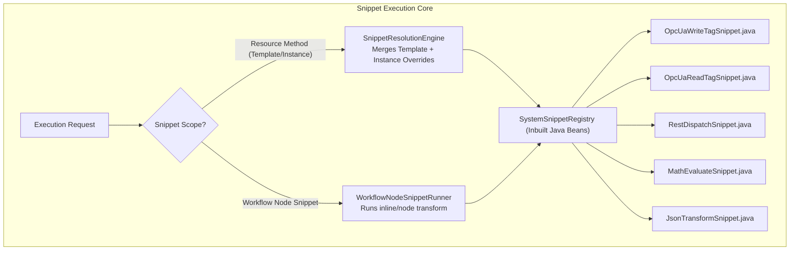

# Implementation Plan: System Snippets & No-Code Execution Framework

**Status:** Under Review & Collaboration  
**Goal:** Replace legacy enums (`ServiceType`, `ServiceSafetyTier`) with a clean **3-Tier Snippet Architecture** (Template, Instance, Workflow Node) using **Inbuilt Java System Snippets** and an intuitive **No-Code configuration experience** for workflow operators.

---

## 1. The 3 Snippet Scopes (OOP & Workflow Levels)

Based on your design, Snippets exist at 3 distinct levels:



### 1. Template-Level Snippets (OOP Class Definition)
- **Where they live**: Defined within the **Resource Template** (e.g. `OPC_UA_CLIENT`, `CONVEYOR_SYSTEM`, `REST_WMS_GATEWAY`).
- **Behavior**: Every Resource created from this template automatically **inherits** these snippets.
- **Example**: 
  - `OPC_UA_CLIENT` template provides `READ_TAG`, `WRITE_TAG`, `TEST_CONNECTION`.
  - `CONVEYOR_SYSTEM` template provides `START_MOTOR`, `STOP_MOTOR`, `READ_PHOTO_EYE`.
- **Properties Access**: Automatically injected with template-defined properties (`properties.endpointUrl`, `properties.tagPrefix`, `properties.defaultSpeed`).

### 2. Instance-Level Snippets (Concrete Machine Custom Methods)
- **Where they live**: Attached to a **specific Resource instance** (e.g. `CONV_01`, `BARCODE_SCANNER_A`).
- **Behavior**: 
  - Created when an automation engineer adds a **Custom Method** on a single machine or **overrides** an inherited template snippet.
  - Can implement hardware quirks, vendor-specific tag offsets, or bespoke calibration formulas for that specific device.
- **Properties Access**: Receives that specific instance's effective properties (`effectiveProperties`).

### 3. Workflow Node-Level Snippets (Canvas / Standalone Steps)
- **Where they live**: Embedded directly inside a **Workflow Node** on the Canvas (or saved as a reusable Workflow Node Template in the palette).
- **Behavior**:
  - Independent of any specific physical equipment.
  - Used for **No-Code / Low-Code data processing**: JSON payload transformation, math calculations, schema mapping, business rules, routing checks.
- **Context Access**: Injected with the entire workflow execution context (`context.palletLpn`, `context.destination`, `context.upstreamOutput`).

---

## 2. Execution & Data Flow Architecture



---

## 3. Detailed Phased Implementation Plan

### Phase 1: Legacy Code Cleanup & Removal of `type` / `safetyTier` / Bloat

#### 1.1 `common-resource` Module Refactoring
- [ ] [`org.platform.resourcemanager.domain.template.MethodDefinition.java`](file:///c:/Users/Windows10/Documents/GitHub/Warehouse_orchestrator/common/common-resource/src/main/java/org/platform/resourcemanager/domain/template/MethodDefinition.java):
  - **DELETE** `MethodType` enum (`AUTHENTICATION`, `DIAGNOSTIC`, `EXECUTION`, `TELEMETRY`, `CONTROL`).
  - **DELETE** `SafetyTier` enum (`READ_ONLY`, `OPERATIONAL`, `SAFETY_CRITICAL`).
  - **REMOVE** fields: `type`, `safetyTier`, `samplePayload`.
  - **ADD** clean snippet fields:
    ```java
    public record MethodDefinition(
        String name,
        String displayName,
        String category,
        String description,
        List<ParameterRule> parameterRules,
        Map<String, Object> outputSchema
    ) implements Serializable
    ```
  - **UPDATE** factory methods `standard(...)` and `custom(...)`.

#### 1.2 `wes-service` Backend Module Refactoring
- [ ] **DELETE Enums**:
  - Delete [`ServiceType.java`](file:///c:/Users/Windows10/Documents/GitHub/Warehouse_orchestrator/services/wes-service/src/main/java/com/company/warehouse/wes/business/resource/composer/model/ServiceType.java).
  - Delete [`ServiceSafetyTier.java`](file:///c:/Users/Windows10/Documents/GitHub/Warehouse_orchestrator/services/wes-service/src/main/java/com/company/warehouse/wes/business/resource/composer/model/ServiceSafetyTier.java).
- [ ] **Refactor [`ServiceDefinition.java`](file:///c:/Users/Windows10/Documents/GitHub/Warehouse_orchestrator/services/wes-service/src/main/java/com/company/warehouse/wes/business/resource/composer/model/ServiceDefinition.java)**:
  - **REMOVE** `type` (`ServiceType`), `safetyTier` (`ServiceSafetyTier`), `supportedStrategies` (`List<String>`), `samplePayload`.
  - **STREAMLINE** to:
    ```java
    private String name;               // e.g. "START_MOTOR", "WRITE_TAG"
    private String displayName;        // e.g. "Start Motor"
    private String category;           // e.g. "HARDWARE", "API", "TRANSFORM"
    private String description;
    private String pathTemplate;
    private String httpMethod;
    private List<Map<String, Object>> parametersSchema;
    private Map<String, Object> outputSchema;
    ```
- [ ] **Refactor [`com.company.warehouse.wes.domain.resource.MethodDefinition.java`](file:///c:/Users/Windows10/Documents/GitHub/Warehouse_orchestrator/services/wes-service/src/main/java/com/company/warehouse/wes/domain/resource/MethodDefinition.java)**:
  - **REMOVE** `type`, `safetyTier`, `supportedStrategies`, `samplePayload`.
- [ ] **Refactor System Archetypes**:
  - [`RestSoftwareEntityArchetype.java`](file:///c:/Users/Windows10/Documents/GitHub/Warehouse_orchestrator/services/wes-service/src/main/java/com/company/warehouse/wes/business/resource/composer/archetype/RestSoftwareEntityArchetype.java): Remove all `.type(...)` and `.safetyTier(...)` builder calls.
  - [`OpcUaClientEntityArchetype.java`](file:///c:/Users/Windows10/Documents/GitHub/Warehouse_orchestrator/services/wes-service/src/main/java/com/company/warehouse/wes/business/resource/composer/archetype/OpcUaClientEntityArchetype.java): Remove all `.type(...)` and `.safetyTier(...)` builder calls.
  - [`OpcUaServerEntityArchetype.java`](file:///c:/Users/Windows10/Documents/GitHub/Warehouse_orchestrator/services/wes-service/src/main/java/com/company/warehouse/wes/business/resource/composer/archetype/OpcUaServerEntityArchetype.java): Remove all `.type(...)` and `.safetyTier(...)` builder calls.
- [ ] **Refactor Composers & Mappers**:
  - [`ComposedEntityTemplate.java`](file:///c:/Users/Windows10/Documents/GitHub/Warehouse_orchestrator/services/wes-service/src/main/java/com/company/warehouse/wes/business/resource/composer/model/ComposedEntityTemplate.java): Strip `sType` / `sTier` mapping blocks.
  - [`EntityTemplateComposer.java`](file:///c:/Users/Windows10/Documents/GitHub/Warehouse_orchestrator/services/wes-service/src/main/java/com/company/warehouse/wes/business/resource/composer/EntityTemplateComposer.java): Remove `ServiceType` and `ServiceSafetyTier` parameters.
  - [`EntityComposerMapper.java`](file:///c:/Users/Windows10/Documents/GitHub/Warehouse_orchestrator/services/wes-service/src/main/java/com/company/warehouse/wes/business/resource/composer/EntityComposerMapper.java): Clean `toDto` and `toComposedTemplate` method mapping.
  - [`EntityMethodResolutionEngine.java`](file:///c:/Users/Windows10/Documents/GitHub/Warehouse_orchestrator/services/wes-service/src/main/java/com/company/warehouse/wes/business/resource/composer/engine/EntityMethodResolutionEngine.java): Remove dead enum resolution keys; output clean snippet dictionaries (`methodName`, `displayName`, `category`, `description`, `origin`, `parameters`).
- [ ] **Update Unit Tests**:
  - [`EntityTemplateComposerTest.java`](file:///c:/Users/Windows10/Documents/GitHub/Warehouse_orchestrator/services/wes-service/src/test/java/com/company/warehouse/wes/business/resource/composer/EntityTemplateComposerTest.java): Update builder calls without enums.
  - [`ResourceManagerTest.java`](file:///c:/Users/Windows10/Documents/GitHub/Warehouse_orchestrator/services/wes-service/src/test/java/com/company/warehouse/wes/business/resource/ResourceManagerTest.java): Verify clean 3-tier method resolution passes.

#### 1.3 `warehouse-ui` Frontend Refactoring
- [ ] [`resourceEnums.ts`](file:///c:/Users/Windows10/Documents/GitHub/Warehouse_orchestrator/client/warehouse-ui/src/features/resources/types/resourceEnums.ts):
  - **REMOVE** `type`, `safetyTier`, `supportedStrategies`, `samplePayload` from `MethodDefinition` interface.
- [ ] [`TemplateCustomMethodsTab.tsx`](file:///c:/Users/Windows10/Documents/GitHub/Warehouse_orchestrator/client/warehouse-ui/src/features/resources/components/templateStudio/TemplateCustomMethodsTab.tsx):
  - **DELETE** `<select>` dropdowns for "Execution Type" and "Safety Tier".
  - Replace with snippet category and visual composer.
- [ ] [`TemplateBaseMethodsTab.tsx`](file:///c:/Users/Windows10/Documents/GitHub/Warehouse_orchestrator/client/warehouse-ui/src/features/resources/components/templateStudio/TemplateBaseMethodsTab.tsx):
  - **REMOVE** badges for `safetyTier` (`SAFETY_CRITICAL`, `OPERATIONAL`) and `type`.
- [ ] [`ResourceShapesTab.tsx`](file:///c:/Users/Windows10/Documents/GitHub/Warehouse_orchestrator/client/warehouse-ui/src/features/resources/components/ResourceShapesTab.tsx):
  - **REMOVE** `Safety Tier` and `Type` columns from the Methods table.
- [ ] [`TemplateStudioModal.tsx`](file:///c:/Users/Windows10/Documents/GitHub/Warehouse_orchestrator/client/warehouse-ui/src/features/resources/components/TemplateStudioModal.tsx):
  - **REMOVE** hardcoded legacy defaults `{ type: 'CONTROL', safetyTier: 'SAFETY_CRITICAL' }`.
- [ ] [`MethodTableRow.tsx`](file:///c:/Users/Windows10/Documents/GitHub/Warehouse_orchestrator/client/warehouse-ui/src/features/resources/studio/components/MethodTableRow.tsx):
  - **REMOVE** safety tier badges and warning tags.

---

### Phase 2: Inbuilt Java System Snippet Framework
- [ ] **Define Unified `SystemSnippet` Interface**:
  ```java
  public interface SystemSnippet {
      String getSnippetCode();
      String getDisplayName();
      String getCategory();
      String getDescription();
      List<SnippetParameterDef> getParameters();
      
      SnippetExecutionResult execute(
          Map<String, Object> properties,  // Injected Resource Properties (null if node-level)
          Map<String, Object> params,      // Injected Input Parameters
          SnippetExecutionContext context  // Injected Workflow Context & Helpers
      );
  }
  ```
- [ ] **Implement Inbuilt System Snippets**:
  - **Hardware & Protocol Snippets (Template & Instance Level)**:
    - `OpcUaReadTagSnippet`: Reads single tag using `properties.endpointUrl` and `params.tagName`.
    - `OpcUaWriteTagSnippet`: Writes value using `properties.endpointUrl`, `params.tagName`, and `params.value`.
    - `OpcUaBatchReadSnippet`: Batch reads an array of tags.
    - `OpcUaTestConnectionSnippet`: Probes PLC connection and latency.
    - `RestDispatchSnippet`: Dispatches HTTP calls using `properties.host`, `properties.port`, `params.path`, and `params.body`.
    - `RestHealthCheckSnippet`: Probes endpoint health check.
  - **Workflow Node Snippets (Standalone / Transform Level)**:
    - `MathEvaluateSnippet`: Evaluates formulas (e.g. `(length * width * height) / 1000`).
    - `RangeCheckSnippet`: Validates if a number is within `[minValue, maxValue]`.
    - `JsonTransformSnippet`: Re-maps fields from workflow context into a new structure.
    - `StringFormatSnippet`: Generates formatted barcodes, LPNS, or labels.
- [ ] **Build `SystemSnippetRegistry`**:
  - Spring bean collecting all inbuilt `SystemSnippet` beans.
  - Centralized lookup, execution, error handling, and performance metrics.

---

### Phase 3: Resolution & Dispatcher Refactoring
- [ ] **Template & Instance Snippet Resolution**:
  - `EntityMethodResolutionEngine`:
    - Reads Template snippets (`template.snippetsSchema`).
    - Overrides/adds Instance custom snippets (`resource.snippetsConfig`).
    - Exposes complete `effectiveSnippets` on the Resource DTO.
- [ ] **Workflow Node-Level Execution Handler**:
  - `SnippetNodeHandler.java` (handling `nodeType: "SNIPPET"` / `"TRANSFORM"`):
    - Dispatches node-level snippets with access to workflow context.
- [ ] **Resource Action Handler Update**:
  - `ResourceActionHandler.java`:
    - Invokes Resource-bound snippet (Template/Instance) via `SystemSnippetRegistry`.

---

### Phase 4: Frontend No-Code Experience & Visual Method Composer
- [ ] **Visual Snippet Method Composer ([`VisualSnippetMethodComposer.tsx`](file:///c:/Users/Windows10/Documents/GitHub/Warehouse_orchestrator/client/warehouse-ui/src/features/resources/components/templateStudio/VisualSnippetMethodComposer.tsx))**:
  - **Left Side Snippet Palette**: System Snippets grouped by category (Hardware/PLC, APIs, Math/Transform).
  - **Drop Stage / Method Canvas**:
    - Users drag or click any snippet to place it as the underlying method logic.
    - **No-Code Input Slot Grid**: Each input required by the snippet has an interactive field.
    - **Clickable Property & Param Chips**: Easy 1-click binding of Resource Properties (`#{properties.tagPrefix}`) and Method Arguments (`#{params.speed}`).
    - **Live Testing Console**: Sandbox runner with "Test Run Snippet" button to preview outputs and return format instantly.
- [ ] **Node Palette Updates ([`NodePalette.tsx`](file:///c:/Users/Windows10/Documents/GitHub/Warehouse_orchestrator/client/warehouse-ui/src/features/workflows/components/NodePalette.tsx))**:
  - Group snippets cleanly into:
    - **Equipment Actions**: Inherited template snippets + instance custom snippets from active resources.
    - **Transform & Logic**: Workflow node snippets (Math, Range Check, JSON Mapping).
- [ ] **Cleanup Legacy UI**:
  - Replace old raw inputs in `TemplateCustomMethodsTab.tsx` with the new visual composer.
  - Remove all references to `safetyTier` and `serviceType`.

---

### Phase 5: Verification & End-to-End Testing
- [ ] Unit tests for `SystemSnippetRegistry` and all core `SystemSnippet` beans.
- [ ] Verification of 3 scopes:
  1. Template snippet inheritance test.
  2. Instance-level custom snippet override test.
  3. Workflow node snippet execution test.
- [ ] Compilation & build validation (`mvn test` and `npm run build`).

---

## 4. Discussion & Review Points

Please review this 3-tier structure:
1. **Naming**: Are you happy calling them `Template Snippets`, `Instance Snippets`, and `Workflow Node Snippets`?
2. **Parameters Mapping**: When a Template Snippet specifies a parameter (e.g. `tagAddress`), should it allow defaulting to a property like `#{properties.tagPrefix}.Command`?
3. **Approval**: If this matches your vision, we can proceed to Phase 1 (cleanup of enums and model simplification).
