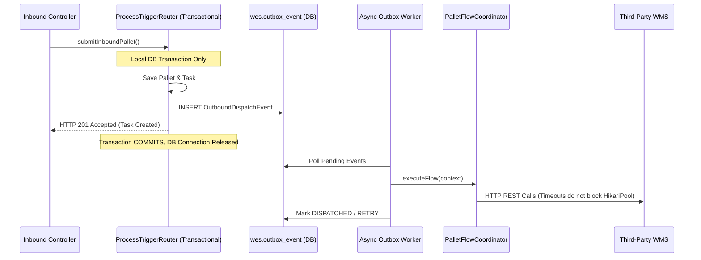

# Comprehensive Technical & Industrial Audit Report: WES Service (`wes-service`)

**Document Control:**
- **Auditor:** Multi-Disciplinary Manufacturing & Enterprise Systems Review Board (Industrial Automation, Enterprise Architecture, Senior Java Full-Stack, Business Analysis, and Operational Data Analytics)
- **Target System:** `Warehouse_orchestrator/services/wes-service`
- **Scope:** All Source Code, Architectural Boundaries, Database Schema & Migrations, Concurrency, and Integration SPIs
- **Classification:** Architectural & Industrial Operational Assessment

---

## 1. Executive Summary & Maturity Scorecard

The `wes-service` module represents the **Level 3 Execution Engine (MESA / ISA-95)** for the warehouse orchestrator. It bridges enterprise systems (ERP/Level 4, Third-Party WMS) and real-time material handling automation (PLCs, Conveyors, AS/RS, Scales, and Handheld RF Terminals/Level 2).

The development team has constructed commendable foundational pillars:
- Clean **Hexagonal / Ports-and-Adapters** separation for third-party WMS integration (`WmsIntegrationSpi`, `WmsRestAdapter`).
- A highly innovative, flexible **Dynamic Payload Templating Engine** (`DynamicPayloadEngine`) enabling runtime transformation of outbound WMS REST contracts without recompilation.
- A structured **3-Tier Inbound Validation Pipeline** (`PalletValidationCoordinator`) separating identity, physical envelope, and regulatory compliance.
- Explicit task-level operation sequencing (`WesTaskEntity`, `TaskOperationEntity`).

However, from the perspective of industrial manufacturing execution, distributed systems architecture, high-concurrency Java engineering, and regulatory audit compliance, **several critical anti-patterns and operational risks exist that could cause production outages, memory exhaustion, data corruption, and regulatory audit failures**.

### Architecture & Engineering Scorecard

| Dimension | Score (1-10) | Status | Primary Finding |
|---|:---:|:---:|---|
| **Industrial / ISA-95 Alignment** | 6.5 / 10 | ⚠️ Needs Work | Non-deterministic mock data in core paths; lack of GS1 SSCC checksums; brittle allergen regexes. |
| **Distributed Architecture & Resilience** | 5.0 / 10 | 🚨 Critical Hazard | Network I/O inside `@Transactional` database boundaries; missing Outbox & Saga rollback patterns. |
| **Java Full-Stack & JPA Performance** | 5.5 / 10 | 🚨 High Risk | OOM risks from unpaged `findAllByOrderByCreatedAtDesc()`; `.findByStatus().size()` heap bloat; Cartesian `FetchType.EAGER` joins. |
| **Concurrency & Thread Safety** | 6.0 / 10 | ⚠️ Needs Work | Global single `ReentrantLock` in `WmsTokenManager` creates cross-resource head-of-line blocking; lack of `@Version` on `WesTaskEntity`. |
| **Business Analysis & Domain Modeling** | 6.0 / 10 | ⚠️ Needs Work | Dangerous API bifurcation between `/pallets/inbound` and `/pallets/inbound/submit`; status strings instead of state machine enums. |
| **Data Governance & Audit Logging** | 5.5 / 10 | ⚠️ Incomplete | Automated pipeline steps bypass `wms_transaction_log`; only manual UI actions are audited. |

---

## 2. Manufacturing & Industrial Automation Assessment (ISA-95 / MESA)

### 2.1 ISA-95 Layer Separation & Operational Reality
In ISA-95 standards:
- **Level 4 (Business Planning & Logistics)**: ERP, Master Data catalog, Order planning.
- **Level 3 (Manufacturing / Warehouse Operations Management - MES/WES)**: Detailed scheduling, workflow dispatching, physical tracking, work order execution, quality segregation.
- **Level 2 (Automated Control / WCS)**: PLCs, Conveyor line tracking, high-speed diverters, AS/RS cranes, scales, dimensioners.

#### Critical Finding IND-01: Non-Deterministic / Mock Simulation in Core Execution Code
In `PalletExecutionService.java`:
```java
// Line 84
long seq = 100000 + random.nextInt(900000);
String palletLpn = ... : "PLT-2026-" + seq;

// Line 159 & 215
actualWeight = palletType.getTareWeightKg().add(materialQty).add(BigDecimal.valueOf(random.nextDouble() * 2.0 - 1.0));

// Line 168
LocalDate expiryDate = request.getExpiryDate() != null ? request.getExpiryDate() 
    : LocalDate.now().plusYears(1).plusMonths(random.nextInt(12));
```
**Industrial Verdict:** In a production industrial facility, generating mock weights with `random.nextDouble()` and fake expiry dates with `random.nextInt(12)` in production business services is an absolute violation of pharmaceutical (21 CFR Part 11) and food safety (FSMA/HACCP) standards. In actual operation, if weight or expiry is missing, the system must either:
1. Reject the pallet at the gate (`REJECT - SCALE_WEIGHT_REQUIRED`).
2. Route the pallet to a physical scale station operation (`PROFILE_SCAN_WEIGH`).
3. Require explicit operator capture or integration with scale telemetry.
*Random jitter must be removed immediately from production services and relegated solely to unit test mocks.*

### 2.2 Traceability, GS1-128 & Carrier Base Standards
- **LPN / SSCC Compliance:** Warehouse carriers universally rely on GS1 Serial Shipping Container Codes (SSCC-18) with Modulo-10 checksum validation. The current validation only checks string length and duplicate active status (`PalletLpnDuplicateValidator`), but does not validate SSCC / barcode structure.
- **Carrier Profile Truncation:** In database migration `V4__add_pallet_custom_attributes_and_process_log.sql`, `process_stage` is defined as `VARCHAR(10)`. Because of this constraint, `PalletExecutionService.java` enforces:
  ```java
  if (stage.length() > 10) { stage = stage.substring(0, 10); }
  ```
  This arbitrarily truncates standard stages like `QUALITY_CHECK` to `QUALITY_CH` or `DECOMMISSIONED` to `DECOMMISSI`, creating corrupted and illegible audit trail logs in `wes.pallet_process_log`.

### 2.3 Allergen & Hazardous Material Segregation
In `AllergenSegregationValidator.java`:
```java
String itemAttrs = item.getCustomAttributes().toLowerCase();
if (itemAttrs.contains("\"allergen\"") && !itemAttrs.contains("\"allergen\": \"none\"") && !itemAttrs.contains("\"allergen\":\"none\"")) {
    hasAllergen = true;
}
```
**Industrial Verdict:** Raw substring searching on JSON strings (`contains("\"allergen\"")`) is dangerously brittle:
- Attributes such as `{"non_allergen": true}` or `{"allergen_free": true}` or `{"allergen_tested": true}` will trigger false positive warnings.
- Missing case sensitivity handling on values or complex matrices (e.g. Tree Nuts vs Milk vs Gluten) cannot be resolved.
- Food safety mandates explicit allergen classification matrices (e.g., EU 1169/2011 14 major allergens or FDA Big 9).

---

## 3. Enterprise Software Architecture & Distributed Systems Assessment

### 3.1 The Synchronous Distributed Transaction Hazard (P0 - Architectural Blocker)

Look at `ProcessTriggerRouter.java`:
```java
@Transactional
public InboundExecutionResponse routeAndTrigger(PalletValidationContext context, ValidationResult validationResult) {
    // 1. Insert into wes.pallet (DB connection held)
    PalletEntity savedPallet = palletRepository.save(pallet);

    // 2. Insert into wes_task and task_operation (DB connection held)
    WesTaskEntity task = taskTrackingEngine.createAndStartTask(context, plannedOps);

    // 3. SYNCHRONOUS OUTBOUND HTTP NETWORK CALLS INSIDE DB TRANSACTION!
    if (isOutboundOrTransfer) {
        PalletFlowContext flowContext = PalletFlowContext.fromValidationContext(...);
        palletFlowCoordinator.executeFlow(flowContext); 
        // Calls WmsPreAnnounce -> WmsCreateOrder -> WmsReserveOrder -> WmsSendToOutbound
    }
    return ...;
}
```

#### Why This is Catastrophic:
1. `ProcessTriggerRouter.routeAndTrigger` opens a database transaction via `@Transactional`, which borrows an active connection from HikariCP (`WesHikariPool`, max size 10 in `application.yml`).
2. Inside that same transaction, `palletFlowCoordinator.executeFlow` performs **4 sequential HTTP REST requests** against external third-party WMS endpoints.
3. According to `application.yml`, WMS timeout settings are:
   - `connect-timeout-ms: 5000` (5 seconds)
   - `read-timeout-ms: 10000` (10 seconds)
4. If the external WMS experiences high latency or network degradation, each pallet intake holds an open database connection for **20 to 40 seconds**.
5. With only 10 Hikari connections, **just 10 concurrent pallet scans will starve the entire application connection pool**. All other operations—including health checks, operator queries, and task tracking—will freeze and fail with `ConnectionTimeoutException`.

**Architectural Remediation:**
Separate database ingestion from external network execution:
- Commit the pallet and task in the database with status `QUEUED_FOR_OUTBOUND`.
- Dispatch the flow asynchronously using an **ApplicationEvent / Spring `@Async` executor**, a **Transactional Outbox table**, or a background job queue.



### 3.2 Missing Outbox & Saga Compensation
- **No Compensation (Orphaned WMS Orders):** If Step 1 (`WmsPreAnnounce`) and Step 2 (`WmsCreateOrder`) succeed, but Step 3 (`WmsReserveOrder`) fails, the flow returns `false` and halts. However, **no cancellation or compensating transaction is sent to WMS**. The order in WMS remains active indefinitely as a "ghost" allocation.
- **Empty Outbox Directory:** While the maven POM description advertises "WAN outbox synchronization" and `infrastructure/outbox/.gitkeep` exists, there is currently zero implementation of an Outbox pattern.

### 3.3 Dynamic Mapping Engine Coverage Gap
`DynamicPayloadEngine` is implemented cleanly and provides template caching and expression evaluation. However:
- In `WmsRestAdapter.java`, only `preAnnouncePallet` utilizes `dynamicEngine.findActiveMapping()`.
- `createOrder`, `reserveOrder`, and `sendToOutbound` completely ignore dynamic mapping and hardcode static DTO mapping to fixed paths!
- If an enterprise is replacing the virtual WMS with SAP EWM or Manhattan, they can only dynamically map pre-announcements; orders and outbound releases still use the default static JSON schema!

---

## 4. Java Full-Stack & Spring Boot / JPA Performance Deep-Dive

### 4.1 Memory Leak & Out-Of-Memory (OOM) Vulnerabilities

#### Vulnerability J-01: Unbounded `findAllByOrderByCreatedAtDesc()`
In `PalletExecutionService.java`:
```java
@Transactional(readOnly = true)
public List<PalletDto> getAllPallets() {
    return palletRepository.findAllByOrderByCreatedAtDesc().stream()
            .map(this::toPalletDto)
            .collect(Collectors.toList());
}
```
And in `PalletInventoryController.java`:
```java
@GetMapping
public ResponseEntity<List<PalletDto>> getAllPallets() {
    return ResponseEntity.ok(palletExecutionService.getAllPallets());
}
```
**The Hazard:** In a production facility processing 2,000 pallets a day, after 6 months this query will attempt to fetch 360,000 pallets (along with eagerly fetched items, types, and strategies) into JVM heap, instantiate 360,000 DTOs, and serialize them into a 250 MB HTTP response. This guarantees an `OutOfMemoryError: Java heap space` and freezes the service.
**Fix:** Implement Spring Data `Pageable` pagination (`Page<PalletDto> getPallets(Pageable pageable)`).

#### Vulnerability J-02: Heap Bloat via `.size()` Instead of DB Count
In `MasterDataService.java`:
```java
// Line 64
.activeStagedPallets(palletRepository.findByStatus("STAGED").size())
```
**The Hazard:** Instead of executing `SELECT COUNT(*) FROM wes.pallet WHERE status = 'STAGED'`, this code fetches all entity instances into memory, attaches them to the Hibernate session, and measures the Java List `.size()`.
**Fix:** Add `long countByStatus(String status)` to `PalletRepository`.

### 4.2 Hibernate Fetch Strategy & Cartesian Product Problems
Look at `PalletEntity.java`:
```java
@ManyToOne(fetch = FetchType.EAGER)
private PalletHandlingStrategyEntity handlingStrategy;

@ManyToOne(fetch = FetchType.EAGER)
private PalletTypeMasterEntity palletType;

@OneToMany(mappedBy = "pallet", cascade = CascadeType.ALL, orphanRemoval = true, fetch = FetchType.EAGER)
private List<PalletItemEntity> items;
```
And in `WesTaskEntity.java`:
```java
@OneToMany(mappedBy = "task", cascade = CascadeType.ALL, orphanRemoval = true, fetch = FetchType.EAGER)
private List<TaskOperationEntity> operations;
```
**The Hazard:** `FetchType.EAGER` on collection relationships is widely recognized as a severe JPA anti-pattern:
- Every query executes implicit `LEFT OUTER JOIN`s. When querying pallets, Hibernate joins `pallet_item`, `pallet_type_master`, and `pallet_handling_strategy`.
- Fetching multiple eager collections causes Cartesian product row duplication in JDBC result sets.
- `FetchType.LAZY` with targeted `JOIN FETCH` (or Spring Data `@EntityGraph`) must be used for optimal database query plans.

### 4.3 Thread Contention & Locking Bottlenecks
In `WmsTokenManager.java`:
```java
private final ReentrantLock lock = new ReentrantLock();

public String getBearerToken(String resourceId) {
    ...
    lock.lock();
    try {
        ...
        return acquireNewToken(targetResId);
    } finally {
        lock.unlock();
    }
}
```
**The Hazard:** The service uses a **single global ReentrantLock** across all resources.
If the warehouse connects to three systems:
1. `LOGIQS-AMBIENT-WMS`
2. `SAP-EWM-COLD`
3. `AUTOMATED-CRANE-PLC`

If `SAP-EWM-COLD` is slow or timing out during token acquisition (waiting 5,000 ms), **all calls for `LOGIQS-AMBIENT-WMS` and `AUTOMATED-CRANE-PLC` are completely blocked waiting for the single lock**.
**Fix:** Use a keyed locking mechanism (e.g., `ConcurrentHashMap<String, ReentrantLock>` or compute-if-absent cache with Guava/Caffeine).

### 4.4 Missing Optimistic Locking on Tasks
- `PalletEntity` has `@Version private int version;`.
- `WesTaskEntity` has **no `@Version` attribute**.
When automated conveyor PLC callbacks (`/tasks/{id}/operations/{seq}/complete`) and operator handheld confirmations arrive nearly simultaneously, the absence of optimistic concurrency control allows silent overwrite of task state (lost updates).

---

## 5. Business Analysis (BA) & Domain Modeling Assessment

### 5.1 Critical Functional Bifurcation: The Dual Inbound Endpoints
There are currently **two competing endpoints** for creating inbound pallets:

```
Endpoint A: POST /api/v1/wes/pallets/inbound (in PalletInventoryController)
  ├── Uses CreateInboundPalletRequest
  ├── Calls PalletExecutionService.createInboundPallet()
  ├── Generates random weights and random LPNs
  ├── ZERO validation performed (bypasses Tier 1, Tier 2, Tier 3)
  └── Creates NO task or operations in wes_task!

Endpoint B: POST /api/v1/wes/pallets/inbound/submit (in InboundPalletController)
  ├── Uses InboundPalletSubmissionRequest
  ├── Runs PalletValidationCoordinator (Tier 1, Tier 2, Tier 3)
  ├── Rejects overweight, unlisted SKUs, duplicate active LPNs
  ├── Creates WesTaskEntity with planned operations
  └── Orchestrates WMS flow
```

**Business Impact:**
If a handheld scanner developer or third-party integrator connects to Endpoint A (`/api/v1/wes/pallets/inbound`), invalid and unvalidated pallets will be created directly in inventory without any execution tasks.
**BA Recommendation:** Deprecate Endpoint A or consolidate it to delegate directly into `PalletValidationCoordinator` and `ProcessTriggerRouter`.

### 5.2 Master Data Authority Ambiguity
The repository currently defines WES as the master data authority for `ItemMasterEntity`, `SkuMasterEntity`, and `PalletTypeMasterEntity`.
However:
- Standard enterprise architecture places SKU and Material Master in the ERP (SAP/Oracle) or primary WMS.
- If WES is indeed the master, it must broadcast domain events (`ItemMasterCreatedEvent`, `SkuUpdatedEvent`) via gRPC or message queue when master data changes, allowing external WMS systems to maintain synchronized local caches. Currently, master data modifications in `MasterDataService` do not trigger any outbound event notifications.

---

## 6. Data Analysis & Operational Intelligence Gaps

### 6.1 Audit Log Bypass in Automated Workflows
The database contains `wes.wms_transaction_log` with migration `V8` and `V10`.
However:
- `saveTransactionLog(...)` is called **only in `WmsFormsController`** (the manual UI testing controller).
- When pallets flow through the automated engine via `PalletFlowCoordinator` -> `WmsPreAnnounceStepHandler` -> `WmsRestAdapter`, **not a single row is written to `wms_transaction_log`**!
In an industrial operational review, 99.9% of warehouse throughput is automated; failing to log automated transactions in the persistence tier renders `wms_transaction_log` useless for telemetry, SLA tracking, and error retrospectives.

### 6.2 Key Operational Metrics (KPIs) Missing
A state-of-the-art WES should expose operational metrics for telemetry dashboards:
1. **OEE / Inbound Throughput:** Pallets received per hour per dock door.
2. **Cycle Time per Operation:** Average milliseconds between `started_at` and `completed_at` on `wes.task_operation`.
3. **Bottleneck Heatmap:** Identifying which operation type (`CONVEYOR_TRANSPORT` vs `WMS_BIN_ALLOCATION` vs `FORKLIFT_MANUAL_MOVE`) suffers the highest failure or wait times.
4. **Third-Party API SLA Tracking:** Success rate and latency percentiles (P95, P99) of external WMS endpoints.

---

## 7. Prioritized Defect & Improvement Inventory

| Priority | ID | Component / File | Issue Description | Proposed Solution |
|---|:---:|---|---|---|
| **P0** | ARC-01 | [ProcessTriggerRouter.java](file:///c:/Users/Windows10/Documents/GitHub/Warehouse_orchestrator/services/wes-service/src/main/java/com/company/warehouse/wes/business/process/trigger/ProcessTriggerRouter.java#L32-L94) | Synchronous HTTP calls inside `@Transactional` holding Hikari connections. | Move `executeFlow` outside transaction boundary; trigger via application event or async executor. |
| **P0** | PERF-01 | [PalletInventoryController.java](file:///c:/Users/Windows10/Documents/GitHub/Warehouse_orchestrator/services/wes-service/src/main/java/com/company/warehouse/wes/api/controller/PalletInventoryController.java#L31-L33) | `getAllPallets()` fetches entire table into memory without pagination. | Add `Pageable` parameters to repository and controller (`Page<PalletDto>`). |
| **P1** | ARC-02 | [WmsRestAdapter.java](file:///c:/Users/Windows10/Documents/GitHub/Warehouse_orchestrator/services/wes-service/src/main/java/com/company/warehouse/wes/infrastructure/client/wms/adapter/WmsRestAdapter.java#L121-L188) | `createOrder`, `reserveOrder`, `sendToOutbound` do not use `DynamicPayloadEngine`. | Expand `DynamicPayloadEngine` integration to all WMS SPI methods. |
| **P1** | AUD-01 | [PalletFlowCoordinator.java](file:///c:/Users/Windows10/Documents/GitHub/Warehouse_orchestrator/services/wes-service/src/main/java/com/company/warehouse/wes/business/process/flow/PalletFlowCoordinator.java) | Automated pipeline steps bypass `WmsTransactionLogRepository`. | Move transaction logging into `WmsRestAdapter` or an `@Around` SPI audit aspect. |
| **P1** | THREAD-01 | [WmsTokenManager.java](file:///c:/Users/Windows10/Documents/GitHub/Warehouse_orchestrator/services/wes-service/src/main/java/com/company/warehouse/wes/infrastructure/client/wms/auth/WmsTokenManager.java#L37) | Single global `ReentrantLock` blocks all resources if one WMS is slow. | Use keyed locking per `resourceId` (`ConcurrentHashMap<String, Object>`). |
| **P1** | DATA-01 | [WesTaskEntity.java](file:///c:/Users/Windows10/Documents/GitHub/Warehouse_orchestrator/services/wes-service/src/main/java/com/company/warehouse/wes/data/entity/WesTaskEntity.java) | Missing `@Version` column allows race conditions and lost updates on tasks. | Add `@Version private int version;` to `WesTaskEntity` and DB schema. |
| **P2** | IND-01 | [PalletExecutionService.java](file:///c:/Users/Windows10/Documents/GitHub/Warehouse_orchestrator/services/wes-service/src/main/java/com/company/warehouse/wes/business/service/PalletExecutionService.java#L51-L215) | Fake `Random` generator for weights, expiry, and sequence in business service. | Remove random generators; require explicit sensor inputs or scale station operations. |
| **P2** | BA-01 | [PalletInventoryController.java](file:///c:/Users/Windows10/Documents/GitHub/Warehouse_orchestrator/services/wes-service/src/main/java/com/company/warehouse/wes/api/controller/PalletInventoryController.java#L35-L38) | Endpoint `/pallets/inbound` bypasses 3-tier validation and task generation. | Deprecate and route all inbound ingestion through `InboundPalletController.submit`. |
| **P2** | PERF-02 | [PalletEntity.java](file:///c:/Users/Windows10/Documents/GitHub/Warehouse_orchestrator/services/wes-service/src/main/java/com/company/warehouse/wes/data/entity/PalletEntity.java#L48-L82) | `FetchType.EAGER` on multiple entity relationships causing Cartesian products. | Change to `FetchType.LAZY` with specific query fetch joins. |
| **P2** | PERF-03 | [MasterDataService.java](file:///c:/Users/Windows10/Documents/GitHub/Warehouse_orchestrator/services/wes-service/src/main/java/com/company/warehouse/wes/business/service/MasterDataService.java#L64) | `.findByStatus("STAGED").size()` loads all entities into heap to get count. | Replace with `palletRepository.countByStatus("STAGED")`. |
| **P3** | IND-02 | [V4__add_pallet_custom_attributes_and_process_log.sql](file:///c:/Users/Windows10/Documents/GitHub/Warehouse_orchestrator/services/wes-service/src/main/resources/db/migration/V4__add_pallet_custom_attributes_and_process_log.sql#L27) | `process_stage VARCHAR(10)` forces 10-char truncation of standard stages. | Alter table to `VARCHAR(40)`. |
| **P3** | IND-03 | [AllergenSegregationValidator.java](file:///c:/Users/Windows10/Documents/GitHub/Warehouse_orchestrator/services/wes-service/src/main/java/com/company/warehouse/wes/business/validation/subvalidators/tier3/AllergenSegregationValidator.java#L50-L55) | String substring match `contains("\"allergen\"")` causes false positives. | Parse JSON via Jackson node structure and inspect allergen arrays properly. |

---

## 8. Strategic Modernization & Architectural Action Plan

### Phase 1: Stability & High-Concurrency Hardening (Immediate)
1. **Decouple Network Calls from DB Transactions:** In `ProcessTriggerRouter`, terminate the `@Transactional` boundary after saving `wes.pallet` and `wes.wes_task`. Trigger `palletFlowCoordinator.executeFlow` asynchronously via an `ApplicationEventPublisher` listener or an `@Async` task executor.
2. **Implement Pagination on Pallet Inventory:** Modify `PalletRepository` to support `Pageable` and update `PalletInventoryController.getAllPallets` with default `page=0, size=50`.
3. **Fix MasterData KPI Count Query:** Add `countByStatus` to `PalletRepository` to prevent heap memory exhaustion.
4. **Keyed Lock in Token Manager:** Replace the single `ReentrantLock` with a concurrent striped lock or per-resource locking to isolate authentication delays across resources.

### Phase 2: Domain Harmonization & Industrial Precision
1. **Unify Inbound API:** Consolidate `PalletInventoryController.createInboundPallet` into `InboundPalletController.submitInboundPallet`. Eliminate random jitter simulation from `PalletExecutionService`.
2. **Comprehensive Dynamic Mapping:** Extend `DynamicPayloadEngine` into `createOrder`, `reserveOrder`, and `sendToOutbound` within `WmsRestAdapter`.
3. **Universal Audit Logging:** Move `saveTransactionLog` out of `WmsFormsController` and place it directly inside `WmsRestAdapter` so that 100% of WMS interactions (both manual and automated) are audited in `wes.wms_transaction_log`.
4. **Optimistic Locking:** Add `version` column to `wes.wes_task` and `@Version` annotation to `WesTaskEntity`.

### Phase 3: Advanced Resilience (Outbox & Saga)
1. **Transactional Outbox Table:** Create `wes.outbox_event` table. When tasks are created, write an event to `outbox_event` in the same database transaction.
2. **Reliable Outbox Publisher:** Run a scheduled background worker that reads pending outbox events, dispatches to third-party WMS via `WmsRestAdapter`, and marks events as processed with retry backoff.
3. **Saga Compensations:** If `reserveOrder` fails in WMS, dispatch an automatic compensation call (`cancelOrder`) to avoid leaving orphaned orders in external WMS instances.

---

## 9. Architectural Questions for the Engineering Leadership Team

To finalize and assist in executing the improvement implementations, we invite discussion on the following architectural questions:

1. **Transaction Boundary Decoupling:** Would you prefer the automated outbound flow (`executeFlow`) to be triggered via Spring's asynchronous application event listener (`@TransactionalEventListener(phase = TransactionPhase.AFTER_COMMIT)`) or should we implement the complete Transactional Outbox pattern immediately?
2. **Inbound Endpoint Deprecation:** Can we deprecate `/api/v1/wes/pallets/inbound` and direct all frontend UI and scanner integrations to use `/api/v1/wes/pallets/inbound/submit` with the 3-tier validation engine?
3. **Dynamic Template Scope:** For `createOrder`, `reserveOrder`, and `sendToOutbound`, should we adopt the same `ApiIntegrationMappingEntity` template approach as `PRE_ANNOUNCE`, allowing third-party WMS installations to completely customize all 4 payloads?
4. **Master Data Replication:** Should WES broadcast catalog change events via Kafka/RabbitMQ or gRPC streams when materials or SKUs are created/updated?
