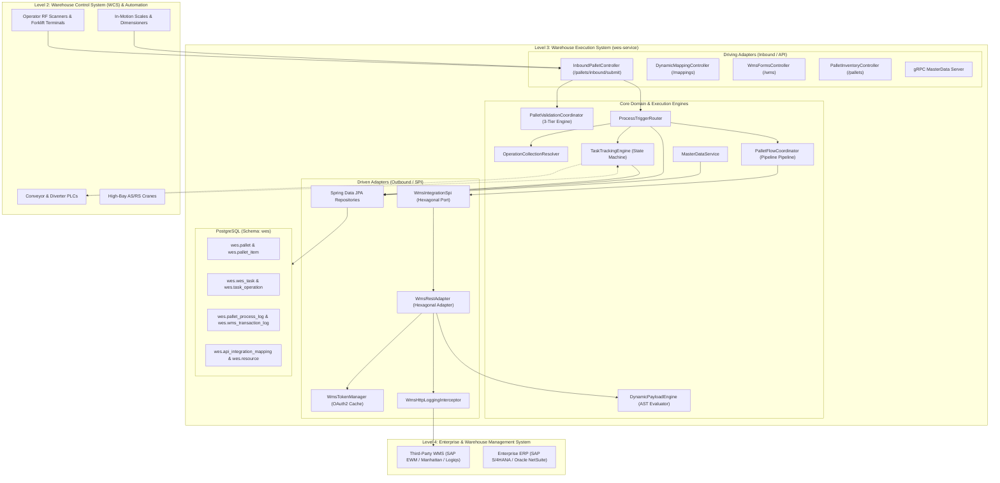
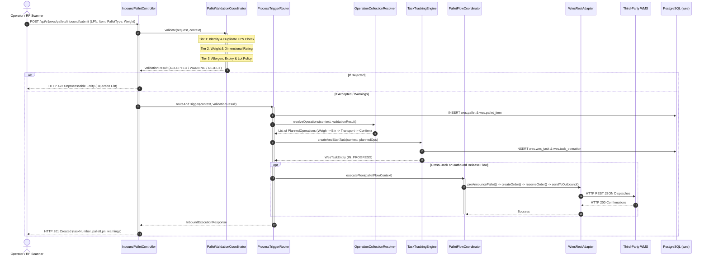
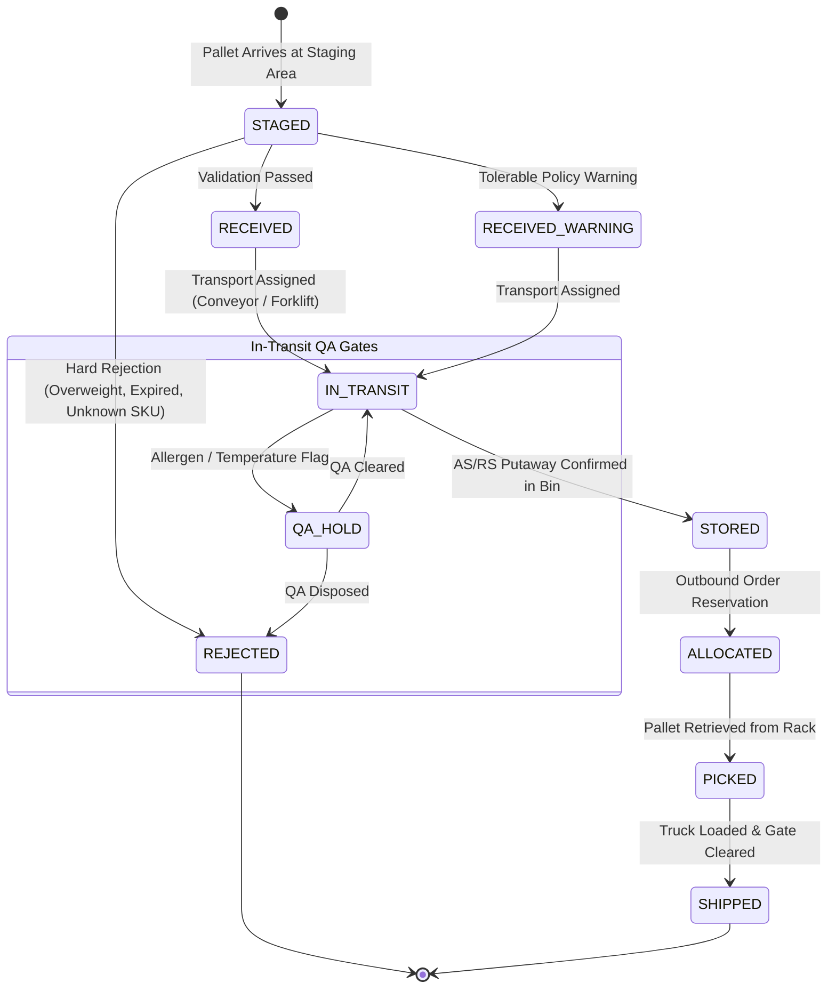
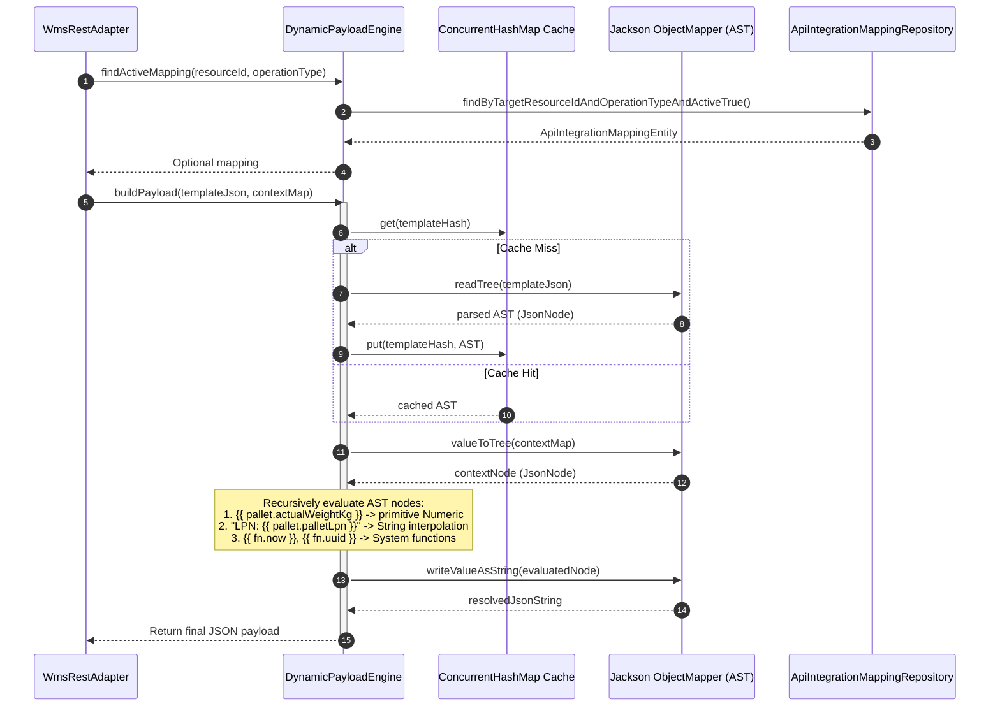

# WES Service UML Architecture & Process Diagrams

This document contains visual UML diagrams for `services/wes-service`, modeled in **Mermaid** for immediate rendering and cross-referenced with production **PlantUML (`.puml`)** source files located in this directory.

---

## 1. Core Domain & Architecture Class Diagram

> **PlantUML Source**: [class_diagram.puml](file:///c:/Users/Windows10/Documents/GitHub/Warehouse_orchestrator/doc/wes/class_diagram.puml)

```mermaid
classDiagram
    direction TB

    class InboundPalletController {
        +validateInboundPallet(request) ResponseEntity~ValidationResult~
        +submitInboundPallet(request) ResponseEntity~InboundExecutionResponse~
        +getTaskById(taskId) ResponseEntity~WesTaskEntity~
        +completeOperation(taskId, seq, request) ResponseEntity~WesTaskEntity~
        +failOperation(taskId, seq, request) ResponseEntity~WesTaskEntity~
    }

    class PalletInventoryController {
        +getAllPallets() ResponseEntity~List~
        +createInboundPallet(request) ResponseEntity~PalletDto~
        +getPalletProcessLogs(id) ResponseEntity~List~
        +recordProcessLog(id, request) ResponseEntity~PalletProcessLogDto~
    }

    class DynamicMappingController {
        +getMappings(resourceId, opType) ResponseEntity~List~
        +createMapping(entity) ResponseEntity~ApiIntegrationMappingEntity~
        +updateMapping(id, entity) ResponseEntity~ApiIntegrationMappingEntity~
        +previewPayload(request) ResponseEntity~Map~
        +testRunDispatch(request) ResponseEntity~Map~
    }

    class PalletValidationCoordinator {
        -List~PalletSubValidator~ subValidators
        +validate(request, context) ValidationResult
    }

    class PalletSubValidator {
        <<interface>>
        +getTier() ValidationTier
        +supports(context) boolean
        +validate(context, result) void
    }

    class ProcessTriggerRouter {
        +routeAndTrigger(context, validationResult) InboundExecutionResponse
    }

    class OperationCollectionResolver {
        +resolveOperations(context, validationResult) List~PlannedOperation~
    }

    class TaskTrackingEngine {
        +createAndStartTask(context, plannedOps) WesTaskEntity
        +completeOperation(taskId, seq, result, loc) WesTaskEntity
        +failOperation(taskId, seq, reason) WesTaskEntity
    }

    class PalletFlowCoordinator {
        -List~PalletFlowStepHandler~ stepHandlers
        +executeFlow(context) boolean
    }

    class DynamicPayloadEngine {
        +findActiveMapping(resourceId, opType) Optional
        +buildPayload(templateJson, context) String
        +buildHeaders(headersJson, context) Map
    }

    class WmsIntegrationSpi {
        <<interface>>
        +preAnnouncePallet(cmd) WmsPreAnnounceResult
        +createOrder(cmd) WmsOrderResult
        +reserveOrder(cmd) WmsReserveResult
        +sendToOutbound(cmd) WmsOutboundResult
    }

    class WmsRestAdapter {
        +preAnnouncePallet(cmd) WmsPreAnnounceResult
        +createOrder(cmd) WmsOrderResult
        +reserveOrder(cmd) WmsReserveResult
        +sendToOutbound(cmd) WmsOutboundResult
    }

    class PalletEntity {
        +UUID id
        +String palletLpn
        +String loadType
        +String status
        +String currentLocation
        +BigDecimal actualWeightKg
        +String customAttributes
        +List~PalletItemEntity~ items
    }

    class WesTaskEntity {
        +UUID id
        +String taskNumber
        +String taskType
        +String palletLpn
        +String status
        +int currentOperationSeq
        +List~TaskOperationEntity~ operations
    }

    class TaskOperationEntity {
        +UUID id
        +int sequence
        +String operationType
        +String handlerType
        +String status
        +String inputPayload
        +String outputResult
    }

    InboundPalletController --> PalletValidationCoordinator
    InboundPalletController --> ProcessTriggerRouter
    ProcessTriggerRouter --> OperationCollectionResolver
    ProcessTriggerRouter --> TaskTrackingEngine
    ProcessTriggerRouter --> PalletFlowCoordinator
    PalletValidationCoordinator o-- PalletSubValidator
    WmsRestAdapter ..|> WmsIntegrationSpi
    WmsRestAdapter --> DynamicPayloadEngine
    PalletEntity "1" *-- "0..*" PalletItemEntity
    WesTaskEntity "1" *-- "1..*" TaskOperationEntity
```

---

## 2. Component Architecture (ISA-95 & Hexagonal)

> **PlantUML Source**: [component_diagram.puml](file:///c:/Users/Windows10/Documents/GitHub/Warehouse_orchestrator/doc/wes/component_diagram.puml)

---

## 3. Inbound Ingestion & Validation Execution Sequence

> **PlantUML Source**: [sequence_diagram_inbound.puml](file:///c:/Users/Windows10/Documents/GitHub/Warehouse_orchestrator/doc/wes/sequence_diagram_inbound.puml)

---

## 4. Pallet and Task Life-Cycle State Machine

> **PlantUML Source**: [state_diagram_pallet_task.puml](file:///c:/Users/Windows10/Documents/GitHub/Warehouse_orchestrator/doc/wes/state_diagram_pallet_task.puml)

---

## 5. Dynamic Payload & Mapping Engine Sequence

> **PlantUML Source**: [dynamic_mapping_engine.puml](file:///c:/Users/Windows10/Documents/GitHub/Warehouse_orchestrator/doc/wes/dynamic_mapping_engine.puml)

