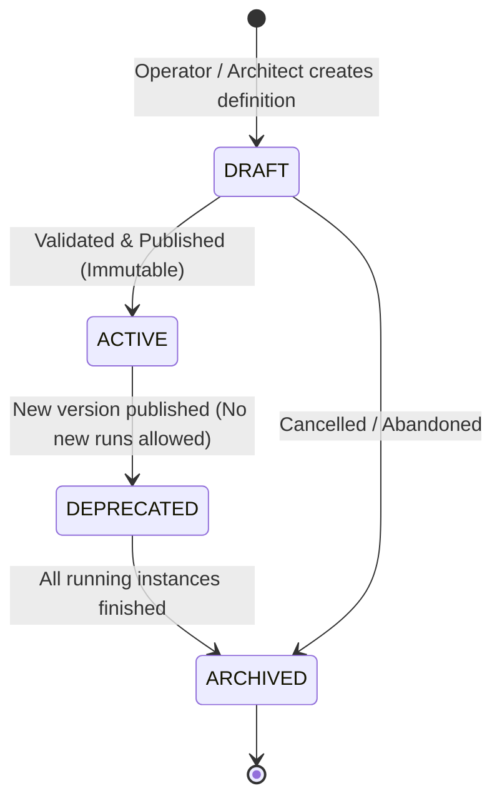

# WES Process Definition Architecture & Management Specification

> **Document Type**: Architecture & Data Management Specification  
> **Topic**: Process Definition, Versioning & Storage Strategy  
> **Status**: DRAFT — Ready for Review  
> **Target Service**: `wes-service`  
> **Related Documents**:  
> - [WES Process, Task & WMS Interface Architecture](file:///c:/Users/Windows10/Documents/GitHub/Warehouse_orchestrator/docs/adapters/WES_Process_Task_And_WMS_Interface_Architecture.md)  
> - [SAP EWM IDoc WES Interface](file:///c:/Users/Windows10/Documents/GitHub/Warehouse_orchestrator/docs/adapters/SAP_EWM_IDoc_WES_Interface.md)

---

## 1. Executive Summary

In a warehouse execution system (WES), a **Process Definition** represents a business workflow template (e.g. Standard Pallet Inbound, Production Receipt with Allergen Quarantine, FEFO Customer Outbound, Empty Pallet De-stacking).

As a warehouse grows across multiple customer sites, suppliers, and equipment configurations, the number of distinct processes quickly reaches **hundreds (100s)**. This document specifies:
1. **Core Process Attributes**: Definition schema, types, statuses, lifecycle, and flexible custom properties.
2. **Storage & Management Decision**: In-depth analysis of **Database vs. JSON files vs. Hybrid GitOps**, with a concrete recommendation for scaling to 100s of processes.
3. **Database Schema & DDL**: Version-safe, audited relational tables in PostgreSQL with `JSONB`.
4. **JSON Schema & Examples**: Canonical process definition files with validation rules.
5. **Runtime Immutability & Migration Rules**: Safe handling of running processes when a definition is upgraded.

---

## 2. Core Process Model Attributes

Every process template contains the following standard attributes:

| Attribute | Type | Nullable | Description | Example |
| :--- | :--- | :--- | :--- | :--- |
| **`process_id`** | String (PK Part 1) | No | Business identifier code (unique across process family) | `PROC-INB-RAW-PO-01` |
| **`version`** | Integer (PK Part 2) | No | Incremental version number (immutable once published) | `1`, `2`, `3` |
| **`process_name`** | String | No | Human-readable title displayed in UI and logs | `Raw Material PO Receipt & Putaway` |
| **`process_type`** | Enum / String | No | Functional category of warehouse operation | `INBOUND`, `OUTBOUND`, `INTERNAL`, `COUNTING` |
| **`status`** | Enum / String | No | Operational availability state | `DRAFT`, `ACTIVE`, `DEPRECATED`, `ARCHIVED` |
| **`description`** | String / Text | Yes | Functional documentation and use case summary | `Handles vendor PO pallet intake with QA hold` |
| **`custom_properties`**| JSONB / Object | No | Key-value dictionary for flow rules & flags | `{ "allergenCheckRequired": true, ... }` |
| **`step_graph`** | JSONB / Array | No | The execution steps, sequence, and handlers | Sequence of steps, routing rules, tasks |
| **`created_at`** | Timestamp UTC | No | Record creation timestamp | `2026-09-11T10:00:00Z` |
| **`created_by`** | String | No | User / Service that authored the definition | `admin@company.com` |
| **`updated_at`** | Timestamp UTC | No | Last modification timestamp | `2026-09-11T12:30:00Z` |
| **`updated_by`** | String | No | User / Service that made the last change | `system-sync` |

---

### Process Types Catalog

Processes are categorized by standard functional areas:

```
┌────────────────────────────────────────────────────────────────────────┐
│                          PROCESS TYPES                                 │
├───────────────────┬───────────────────┬────────────────────────────────┤
│ INBOUND           │ OUTBOUND          │ INTERNAL & SYSTEM              │
├───────────────────┼───────────────────┼────────────────────────────────┤
│ • RAW_MATERIAL_PO │ • SALES_ORDER_PICK│ • REPLENISHMENT                │
│ • PRODUCTION_IN   │ • PRODUCTION_ISSUE│ • PALLET_TRANSFER              │
│ • RETURN_RMA      │ • WAVE_DISPATCH   │ • PALLET_STACKING_DESTACKING   │
│ • CROSS_DOCK      │ • DIRECT_LPN_SHIP │ • CYCLE_COUNTING               │
│ • BLIND_RECEIPT   │ • EMERGENCY_EXPED │ • QUALITY_INSPECTION_RELEASE   │
└───────────────────┴───────────────────┴────────────────────────────────┘
```

---

### Process Lifecycle & Statuses



- **`DRAFT`**: Editable. Only test executions allowed in staging sandbox. Cannot be executed in live production.
- **`ACTIVE`**: Published and locked. **Completely immutable**. Running warehouse jobs instantiate against this version. Only one version per `process_id` is marked `ACTIVE` at any time.
- **`DEPRECATED`**: A newer version exists. In-flight jobs continue running to completion using this version, but no *new* process instances can be created.
- **`ARCHIVED`**: Historical record. Read-only audit trail.

---

### Process Custom Properties (`custom_properties`)

To prevent altering the relational database schema every time a project introduces a new business constraint, `custom_properties` holds dynamic parameters:

```json
{
  "allergenHandling": {
    "segregationRequired": true,
    "restrictedZones": ["ZONE-ORGANIC-01", "ZONE-NUT-FREE-02"]
  },
  "temperatureClass": "COLD_CHAIN_4C",
  "qaInspection": {
    "mandatorySampleScan": true,
    "initialHoldStatus": "QUARANTINE"
  },
  "automationRules": {
    "allowConveyorTransport": true,
    "allowAmrFleet": false,
    "maxPalletWeightKg": 1200.0,
    "maxPalletHeightMm": 1800
  },
  "wmsIntegration": {
    "allocationStrategy": "FEFO_STRICT",
    "requireSynchronousBinApproval": true,
    "wmsTimeoutSeconds": 15
  },
  "uiDefaults": {
    "formId": "FORM_INBOUND_PALLET_RECEIPT",
    "promptScaleWeighing": true
  }
}
```

---

## 3. Storage Architecture: Database vs. JSON Files

When managing **100s of processes**, teams often ask: *Should we store them in the database or in JSON files?*

### Comparison Matrix

| Criteria | Option A: Pure JSON Files in Git | Option B: Pure Database (PostgreSQL) | Option C: Hybrid GitOps + PostgreSQL (Recommended) |
| :--- | :--- | :--- | :--- |
| **Source Control & Audit** | Excellent (Git commits, diffs, PR reviews) | Weak (requires DB audit tables / CDC) | **Best** (Git is single source of truth; DB is query cache) |
| **Queryability & Filtering** | Poor (grep / parsing files on disk) | High (Fast SQL queries, filtering by type/status) | **High** (PostgreSQL JSONB indexed queries) |
| **Runtime Modification** | Difficult (requires Git commit & redeploy) | High (instant UI updates, but dangerous) | **Balanced** (Controlled deployment with dynamic overrides) |
| **Multi-Tenancy / Sites** | Folder sprawl (`/site-a/`, `/site-b/`) | High (`site_id` / `tenant_id` foreign key) | **High** (Tenant-filtered DB view seeded from Git) |
| **Performance** | High (in-memory parsing at startup) | High (indexed DB reads, cached in Redis) | **Maximum** (DB query with local Caffeine/Redis cache) |
| **Rollback Safety** | Instant (`git revert`) | Hard (manual SQL rollback scripts) | **Instant** (`git revert` + automated DB sync) |

---

### The Recommended Solution: Hybrid GitOps Model

```
┌────────────────────────────────────────────────────────────────────────┐
│                GIT REPOSITORY (Developer / Architect)                  │
│                                                                        │
│   resources/processes/                                                 │
│   ├── inbound/                                                         │
│   │   ├── PROC-INB-RAW-PO-01.v1.json                                   │
│   │   ├── PROC-INB-RAW-PO-01.v2.json                                   │
│   │   └── PROC-INB-MFG-LINE-02.v1.json                                 │
│   └── outbound/                                                        │
│       ├── PROC-OUT-SALES-WAVE-01.v1.json                               │
│       └── PROC-OUT-DIRECT-LPN-02.v1.json                               │
└───────────────────────────────────┬────────────────────────────────────┘
                                    │
                                    │ 1. CI/CD or App Startup Sync
                                    ▼
┌────────────────────────────────────────────────────────────────────────┐
│                 POSTGRESQL RUNTIME DATABASE (WES Service)              │
│                                                                        │
│   Table: wes.process_definition                                        │
│   - Fast runtime lookup by (process_id, status = 'ACTIVE')             │
│   - JSONB GIN index on custom_properties (e.g. allergen filter)        │
│   - Complete version history preserved                                 │
└───────────────────────────────────┬────────────────────────────────────┘
                                    │
                                    │ 2. Read & Cache (Caffeine / Spring)
                                    ▼
┌────────────────────────────────────────────────────────────────────────┐
│                   WES PROCESS RUNTIME ENGINE                           │
│   Instantiates running workflows in: wes.process_instance              │
└────────────────────────────────────────────────────────────────────────┘
```

#### Why Hybrid is the Industry Standard for 100s of Processes:
1. **Developer / DevOps Experience**: Process definitions are treated as **Code** (`*.json` or `*.yml`). They are peer-reviewed, version-controlled, and validated against a JSON Schema during CI builds.
2. **Zero Inconsistency**: WES boots up and checks the `/resources/processes/` directory. If a new version is detected, it automatically upserts into PostgreSQL.
3. **Fast Querying in Production**: Handheld terminals, operator screens, and routers query PostgreSQL using indexed SQL (e.g. `SELECT * FROM wes.process_definition WHERE process_type = 'INBOUND' AND status = 'ACTIVE'`).
4. **Safety**: Production code never parses raw files on every user click. PostgreSQL provides connection pooling, JSONB validation, and transaction safety.

---

## 4. PostgreSQL Database Schema

```sql
-- ============================================================================
-- SCHEMA: WES PROCESS DEFINITION & VERSION CATALOG
-- ============================================================================

CREATE TABLE IF NOT EXISTS wes.process_definition (
    id UUID PRIMARY KEY DEFAULT gen_random_uuid(),
    
    -- Identification & Versioning
    process_id VARCHAR(60) NOT NULL,              -- e.g. 'PROC-INB-RAW-PO-01'
    version INT NOT NULL DEFAULT 1,               -- 1, 2, 3...
    process_name VARCHAR(120) NOT NULL,
    process_type VARCHAR(40) NOT NULL,            -- 'INBOUND', 'OUTBOUND', 'INTERNAL', etc.
    status VARCHAR(20) NOT NULL DEFAULT 'DRAFT',  -- 'DRAFT', 'ACTIVE', 'DEPRECATED', 'ARCHIVED'
    description TEXT,
    
    -- Execution Blueprint
    initial_step_code VARCHAR(60) NOT NULL,       -- Pointer to first step
    step_graph JSONB NOT NULL,                    -- Array of steps, routing rules, handlers
    
    -- Flexible Custom Attributes & Configuration
    custom_properties JSONB NOT NULL DEFAULT '{}'::jsonb,
    
    -- Audit & Authorship
    created_at TIMESTAMPTZ NOT NULL DEFAULT NOW(),
    created_by VARCHAR(80) NOT NULL DEFAULT 'system',
    updated_at TIMESTAMPTZ NOT NULL DEFAULT NOW(),
    updated_by VARCHAR(80) NOT NULL DEFAULT 'system',
    
    -- Unique compound constraint: One version per process_id
    CONSTRAINT uq_process_id_version UNIQUE (process_id, version)
);

-- Indexes for high-frequency queries
CREATE INDEX idx_proc_def_lookup ON wes.process_definition(process_id, version);
CREATE INDEX idx_proc_def_active ON wes.process_definition(process_type, status) WHERE status = 'ACTIVE';

-- GIN index for querying custom properties inside JSONB
CREATE INDEX idx_proc_def_custom_props ON wes.process_definition USING GIN (custom_properties);

-- ============================================================================
-- RUNTIME PROCESS EXECUTION INSTANCE (References immutable definition version)
-- ============================================================================

CREATE TABLE IF NOT EXISTS wes.process_instance (
    id UUID PRIMARY KEY DEFAULT gen_random_uuid(),
    
    -- Reference to the immutable definition version
    process_definition_id UUID NOT NULL REFERENCES wes.process_definition(id),
    process_id VARCHAR(60) NOT NULL,
    process_version INT NOT NULL,
    
    -- Business Keys
    business_key VARCHAR(100) NOT NULL,           -- e.g. pallet_lpn 'PLT-2026-0091' or order_number
    current_step_code VARCHAR(60) NOT NULL,
    status VARCHAR(30) NOT NULL DEFAULT 'RUNNING',-- 'RUNNING', 'COMPLETED', 'FAILED', 'CANCELLED'
    
    -- Dynamic Context Accumulator (stores live task results, allocated bins, WMS IDs)
    context_data JSONB NOT NULL DEFAULT '{}'::jsonb,
    
    started_at TIMESTAMPTZ NOT NULL DEFAULT NOW(),
    completed_at TIMESTAMPTZ,
    error_details TEXT
);

CREATE INDEX idx_proc_inst_business_key ON wes.process_instance(business_key);
CREATE INDEX idx_proc_inst_running ON wes.process_instance(status) WHERE status = 'RUNNING';
```

---

## 5. Standard JSON Process Definition Example

Here is a complete, production-ready example of `resources/processes/inbound/PROC-INB-RAW-PO-01.v1.json`:

```json
{
  "$schema": "https://company.warehouse/schemas/wes-process-v1.json",
  "processId": "PROC-INB-RAW-PO-01",
  "version": 1,
  "processName": "Raw Material PO Intake with Allergen Quarantine",
  "processType": "INBOUND",
  "status": "ACTIVE",
  "description": "Handles inbound raw material pallets from supplier purchase orders. Enforces allergen segregation and WMS putaway allocation.",
  "initialStepCode": "OPERATOR_INBOUND_FORM",
  
  "customProperties": {
    "inboundType": "RAW_MATERIAL_PO",
    "allergenHandling": {
      "segregationRequired": true,
      "quarantineOnReceipt": true
    },
    "defaultQaStatus": "QUARANTINE",
    "requiresScaleWeighing": true,
    "maxTareDeviationPct": 5.0,
    "wmsAllocationStrategy": "DIRECTED_PUTAWAY",
    "fallbackStagingZone": "RCV-BUFFER-LANE-01"
  },

  "stepGraph": [
    {
      "stepCode": "OPERATOR_INBOUND_FORM",
      "stepName": "Operator Pallet Scan & Form Submit",
      "handlerType": "OPERATOR_FORM",
      "config": {
        "formId": "FORM_INBOUND_PALLET_RECEIPT",
        "allowManualLpnGeneration": true
      },
      "onSuccess": "VALIDATE_MASTER_DATA",
      "onFailure": "ABORT_PROCESS"
    },
    {
      "stepCode": "VALIDATE_MASTER_DATA",
      "stepName": "Validate SKU & Allergen Masters",
      "handlerType": "SYSTEM_VALIDATION",
      "config": {
        "checkItemActive": true,
        "checkSkuPackaging": true,
        "validateBatchFormat": true
      },
      "onSuccess": "ASSIGN_WMS_PUTAWAY_TASK",
      "onFailure": "OPERATOR_INBOUND_FORM"
    },
    {
      "stepCode": "ASSIGN_WMS_PUTAWAY_TASK",
      "stepName": "Request Storage Bin from Third-Party WMS",
      "handlerType": "WMS_INTERFACE",
      "config": {
        "actionKey": "INBOUND_PUTAWAY_CREATE",
        "timeoutSeconds": 20
      },
      "onSuccess": "DETERMINE_EQUIPMENT_ROUTING",
      "onFailure": "SEND_TO_BUFFER_STAGING"
    },
    {
      "stepCode": "DETERMINE_EQUIPMENT_ROUTING",
      "stepName": "Inspect Zone & Equipment Infrastructure",
      "handlerType": "FLOW_ROUTER",
      "routingRules": [
        {
          "condition": "context.targetZone.hasConveyor == true",
          "nextStep": "DISPATCH_CONVEYOR_WCS"
        },
        {
          "condition": "context.targetZone.hasAmr == true",
          "nextStep": "DISPATCH_FLEET_AMR"
        },
        {
          "condition": "default",
          "nextStep": "DISPATCH_OPERATOR_MANUAL_MOVE"
        }
      ]
    },
    {
      "stepCode": "DISPATCH_CONVEYOR_WCS",
      "stepName": "WCS Conveyor Transport to Storage Spur",
      "handlerType": "WCS_EQUIPMENT",
      "config": {
        "equipmentType": "CONVEYOR_LINE"
      },
      "onSuccess": "CONFIRM_WMS_PUTAWAY_COMPLETE",
      "onFailure": "RAISE_EQUIPMENT_EXCEPTION"
    },
    {
      "stepCode": "DISPATCH_OPERATOR_MANUAL_MOVE",
      "stepName": "Instruct Forklift Driver to Destination Bin",
      "handlerType": "OPERATOR_TASK",
      "config": {
        "requireDropoffScan": true
      },
      "onSuccess": "CONFIRM_WMS_PUTAWAY_COMPLETE",
      "onFailure": "OPERATOR_ASSISTANCE_REQUIRED"
    },
    {
      "stepCode": "CONFIRM_WMS_PUTAWAY_COMPLETE",
      "stepName": "Send Arrival ACK to WMS & Sync Pallet",
      "handlerType": "WMS_INTERFACE",
      "config": {
        "actionKey": "INBOUND_PUTAWAY_CONFIRM"
      },
      "onSuccess": "COMPLETE_PROCESS",
      "onFailure": "RETRY_WMS_ACK"
    }
  ]
}
```

---

## 6. How to Manage Hundreds of Processes (Operational Lifecycle)

```
        Developer / Solution Architect
                     │
                     ▼
         1. Writes JSON Definition
         (e.g., PROC-OUT-FEFO-01.v2.json)
                     │
                     ▼
         2. Git PR Review & Merge
                     │
                     ▼
       3. CI Pipeline: Schema Validation
       (Validates step connections & IDs)
                     │
                     ▼
      4. Deployment / Service Boot
                     │
                     ▼
       WES ProcessSyncService:
       - Scans resources/processes/**/*.json
       - Inserts new version into PostgreSQL
       - Updates existing to 'DEPRECATED' if new 'ACTIVE' exists
                     │
                     ▼
       Runtime UI (WES Admin Portal):
       - View all 100+ processes
       - Filter by Type (Inbound/Outbound)
       - Toggle ACTIVE / DEPRECATED status
       - Inspect live running instances
```

### In-Flight Safety (The Immutability Rule)
When managing 100s of processes, **never update an ACTIVE process in place**.
1. If `PROC-INB-RAW-PO-01` v1 is running on 50 pallets currently on the conveyor, modifying v1 could cause null pointer exceptions if steps are renamed or deleted.
2. Instead, create `v2`.
3. Set `v1` status to `DEPRECATED`. All 50 in-flight pallets finish using `v1`.
4. All new pallets starting their inbound flow automatically pick `v2` (the latest `ACTIVE` version).

---

## 7. Next Steps

1. **Database Migration**: Create `services/wes-service/src/main/resources/db/migration/V7__process_definition_schema.sql` based on the DDL above.
2. **Process JSON Seed Files**: Add standard baseline processes (`PROC-INB-MANUAL-01.json`, `PROC-INB-CONVEYOR-01.json`, `PROC-OUT-FEFO-01.json`) under `resources/processes/`.
3. **ProcessSyncService**: Implement the startup synchronizer in Spring Boot to automatically load JSON processes into PostgreSQL.
4. **Next Focused Document**: Proceed to the next split document: **Task Handler & Subsystem Dispatcher** or **Operator Service Form Engine**.
