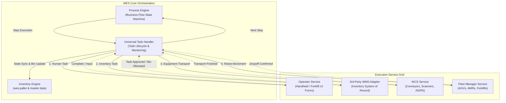
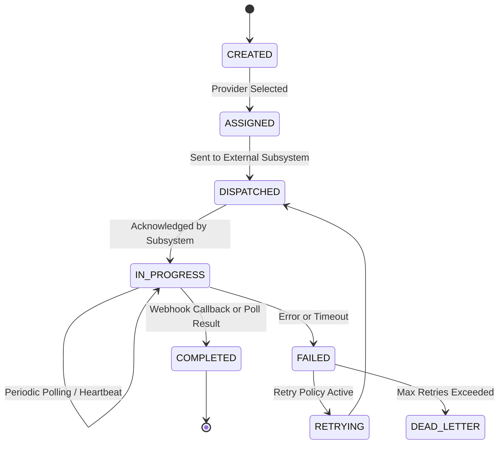

# WES Process, Task Orchestration & Third-Party WMS Interface Architecture

> **Document Type**: Architecture & Implementation Specification  
> **Status**: APPROVED DRAFT  
> **Created**: 2026-09-11  
> **Target Service**: `wes-service` / Warehouse Orchestration Platform  
> **Related Documents**:  
> - [SAP EWM IDoc WES Interface](file:///c:/Users/Windows10/Documents/GitHub/Warehouse_orchestrator/docs/adapters/SAP_EWM_IDoc_WES_Interface.md)  
> - [WMS WES Integration Strategy](file:///c:/Users/Windows10/Documents/GitHub/Warehouse_orchestrator/docs/wms/WMS_WES_Integration_Strategy.md)

---

## 1. Executive Summary & Core Problem

In modern automated and semi-automated warehouses, project requirements change significantly across customer sites:
- **Different Third-Party WMS Systems**: Site A uses SAP EWM, Site B uses Manhattan Active, Site C uses Oracle WMS Cloud, Site D uses a custom proprietary supplier API.
- **Different Warehouse Processes**: Site A performs manual receiving with forklift putaway; Site B offloads onto a conveyor directly into an AS/RS; Site C uses Autonomous Mobile Robots (AMRs) for cross-docking.
- **Hardcoding Anti-Pattern**: Hardcoding third-party WMS REST endpoints or flow logic inside controller or UI code creates fragile spaghetti architectures that cannot be reused across projects.

### The Solution: 3-Tier Decoupled Architecture

```
┌─────────────────────────────────────────────────────────────────────────────────────────┐
│                                 TIER 1: PROCESS ENGINE                                  │
│              Project-specific Workflows (Inbound, Outbound, Transfer, Stacking)         │
└───────────────────────────────────────────┬─────────────────────────────────────────────┘
                                            │ Dispatches Steps
                                            ▼
┌─────────────────────────────────────────────────────────────────────────────────────────┐
│                               TIER 2: UNIVERSAL TASK HANDLER                            │
│           Assigns, Coordinates, Monitors & Synchronizes Tasks Across Subsystems         │
└───────┬───────────────────────────┬───────────────────────────┬───────────────────┬─────┘
        │                           │                           │                   │
        ▼                           ▼                           ▼                   ▼
┌──────────────┐            ┌──────────────┐            ┌──────────────┐    ┌──────────────┐
│   OPERATOR   │            │ 3RD-PARTY WMS│            │     WCS      │    │    FLEET     │
│   SERVICE    │            │  INTERFACE   │            │ (CONVEYOR /  │    │   MANAGER    │
│(Dynamic Forms│            │(Declarative  │            │    CRANE)    │    │ (AGV / AMR)  │
│ & Terminals) │            │ API Adapter) │            │              │    │              │
└──────────────┘            └──────────────┘            └──────────────┘    └──────────────┘
```

By decoupling **Process Definition** from **Task Orchestration**, and decoupling **Task Orchestration** from **Service Interfaces**, any new warehouse process or third-party WMS supplier can be onboarded via declarative configuration and modular SPI plugins without touching core business logic.

---

## 2. Topic 1: WES Task Handling Across Multiple Services

A single warehouse process involves multiple physical and software subsystems executing tasks in coordinated harmony:



### Subsystem Interaction Matrix

| Subsystem | What WES Asks From It | What It Reports Back to WES | Communication Protocol |
| :--- | :--- | :--- | :--- |
| **Operator Service** | Display dynamic form, prompt barcode scan, request pallet weight, assign manual transport task | Form input data, barcode scanned, manual task completed | WebSocket / STOMP, REST `/api/v1/operator` |
| **Third-Party WMS** | Create inbound receiving task, allocate storage bin, request order allocation, post pick release | WMS Task ID, assigned Bin/Zone, pick validation, inventory confirmation | Declarative REST/JSON, Webhooks, SOAP/XML, Kafka |
| **WCS Service** | Start conveyor line, route pallet to divert D-04, store pallet into AS/RS rack aisle 2 | Photocell trigger, barcode scan at junction, transport complete callback | gRPC / REST `/api/v1/wcs` |
| **Fleet Manager** | Dispatch AMR to pick pallet at Staging-1 and drop at Dock-3 | Robot assigned, in-transit, arrived, dropoff complete | REST / WebSocket / Fleet adapter |

---

## 3. Topic 2: Operator Service & Dynamic Flow Forms

Operators interact with WES across diverse warehouse stations (Receiving dock, QA desk, Manual racking, Staging lanes, Shipping gates). Rather than creating rigid, hard-coded UI screens, WES uses a **Dynamic Form & Flow Definition Engine**.

```
┌─────────────────────────────────────────────────────────────┐
│                    OPERATOR SERVICE                         │
│                                                             │
│  ┌─────────────────────────┐   ┌─────────────────────────┐  │
│  │   Form Schema Engine    │   │  Flow Step Configurator │  │
│  │ (JSON-Schema Definition)│   │  (Sequence & Conditions)│  │
│  └────────────┬────────────┘   └────────────┬────────────┘  │
│               │                             │               │
│               ▼                             ▼               │
│  ┌───────────────────────────────────────────────────────┐  │
│  │         Master Data Validation Middleware             │  │
│  │   (ItemMaster, SkuMaster, PalletTypeMaster, Strategy) │  │
│  └───────────────────────────────────────────────────────┘  │
└─────────────────────────────────────────────────────────────┘
```

### Dynamic Form Definitions

Every operator flow has a declarative JSON schema. For example, `INBOUND_MANUAL_PALLET`:

```json
{
  "formId": "FORM_INBOUND_PALLET_RECEIPT",
  "flowType": "MANUAL_INBOUND",
  "title": "Manual Pallet Receiving",
  "fields": [
    {
      "name": "palletLpn",
      "label": "Pallet LPN / Barcode",
      "type": "BARCODE_SCAN",
      "required": true,
      "validation": { "pattern": "^PLT-[0-9]{4}-[0-9]{6}$" }
    },
    {
      "name": "loadType",
      "label": "Load Classification",
      "type": "SELECT",
      "options": ["MATERIAL_WITH_SKU", "MATERIAL", "PALLET_STACK", "NO_LOAD"],
      "defaultValue": "MATERIAL_WITH_SKU"
    },
    {
      "name": "skuCode",
      "label": "SKU Identifier",
      "type": "ASYNC_SEARCH",
      "dataSource": "/api/v1/wes/skus",
      "visibleIf": "loadType == 'MATERIAL_WITH_SKU'",
      "required": true
    },
    {
      "name": "quantity",
      "label": "Received Quantity",
      "type": "NUMBER",
      "required": true,
      "min": 1
    },
    {
      "name": "lotNumber",
      "label": "Supplier Lot Number",
      "type": "TEXT",
      "required": true
    },
    {
      "name": "expiryDate",
      "label": "Expiration Date",
      "type": "DATE",
      "required": false
    },
    {
      "name": "actualWeightKg",
      "label": "Scale Weight (kg)",
      "type": "DECIMAL",
      "autoFillFromScale": true
    }
  ]
}
```

### Flow Execution by Operator Service
1. **Form Delivery**: Handheld or workstation requests active form: `GET /api/v1/operator/forms/{flowType}`.
2. **Instant Validation**: Client-side UI validates against schema; backend validates foreign keys against `wes.item_master`, `wes.sku_master`, and `wes.pallet_type_master`.
3. **Job Hand-off**: On valid submit (`POST /api/v1/operator/forms/submit`), the Operator Service creates an execution context and hands it to the **Process Engine**.

---

## 4. Topic 3: Project-to-Project Process Handling Engine

Warehouse projects differ drastically. Project A needs a 3-step inbound; Project B needs a 6-step inbound with automated scale verification and AMR transport. The **Process Engine** models each workflow as a directed graph of steps.

### Process Definition Schema (`wes.process_definition`)

```sql
CREATE TABLE IF NOT EXISTS wes.process_definition (
    id UUID PRIMARY KEY DEFAULT gen_random_uuid(),
    process_code VARCHAR(60) NOT NULL UNIQUE,       -- 'STD_INBOUND_CONVEYOR', 'MANUAL_INBOUND_PUTAWAY'
    process_name VARCHAR(100) NOT NULL,
    version INT NOT NULL DEFAULT 1,
    description TEXT,
    initial_step_code VARCHAR(60) NOT NULL,
    steps_config JSONB NOT NULL,                   -- Complete step graph (state machine)
    is_active BOOLEAN NOT NULL DEFAULT TRUE,
    created_at TIMESTAMPTZ NOT NULL DEFAULT NOW(),
    updated_at TIMESTAMPTZ NOT NULL DEFAULT NOW()
);

CREATE TABLE IF NOT EXISTS wes.process_instance (
    id UUID PRIMARY KEY DEFAULT gen_random_uuid(),
    process_code VARCHAR(60) NOT NULL,
    business_key VARCHAR(100) NOT NULL,            -- e.g. pallet_lpn 'PLT-2026-104921' or order_no
    current_step_code VARCHAR(60) NOT NULL,
    status VARCHAR(30) NOT NULL DEFAULT 'RUNNING', -- 'RUNNING', 'SUSPENDED', 'COMPLETED', 'FAILED'
    context_data JSONB NOT NULL DEFAULT '{}',      -- Accumulated process state (SKU, bin, IDs)
    started_at TIMESTAMPTZ NOT NULL DEFAULT NOW(),
    completed_at TIMESTAMPTZ
);
```

### Process Step Model (`steps_config` JSON)

```json
{
  "steps": [
    {
      "stepCode": "OPERATOR_PALLET_REGISTRATION",
      "handlerType": "OPERATOR_FORM",
      "config": { "formId": "FORM_INBOUND_PALLET_RECEIPT" },
      "onSuccess": "CREATE_WMS_PUTAWAY_TASK",
      "onFailure": "TERMINATE_WITH_ERROR"
    },
    {
      "stepCode": "CREATE_WMS_PUTAWAY_TASK",
      "handlerType": "WMS_INTERFACE",
      "config": { "actionKey": "INBOUND_PUTAWAY_CREATE" },
      "onSuccess": "ROUTE_BASED_ON_ZONE",
      "onFailure": "NOTIFY_OPERATOR_RETRY"
    },
    {
      "stepCode": "ROUTE_BASED_ON_ZONE",
      "handlerType": "FLOW_ROUTER",
      "routingRules": [
        { "condition": "targetZone.hasConveyor == true", "nextStep": "DISPATCH_WCS_TRANSPORT" },
        { "condition": "targetZone.isAmrZone == true", "nextStep": "DISPATCH_FLEET_AMR" },
        { "condition": "default", "nextStep": "DISPATCH_OPERATOR_MANUAL_MOVE" }
      ]
    },
    {
      "stepCode": "DISPATCH_WCS_TRANSPORT",
      "handlerType": "WCS_EQUIPMENT",
      "config": { "equipmentType": "CONVEYOR_LINE" },
      "onSuccess": "CONFIRM_WMS_ARRIVAL",
      "onFailure": "RAISE_EQUIPMENT_ALERT"
    },
    {
      "stepCode": "CONFIRM_WMS_ARRIVAL",
      "handlerType": "WMS_INTERFACE",
      "config": { "actionKey": "INBOUND_PUTAWAY_CONFIRM" },
      "onSuccess": "FINALIZE_PALLET_INVENTORY",
      "onFailure": "LOG_DISCREPANCY"
    }
  ]
}
```

---

## 5. Topic 4: Third-Party WMS Interface Standardization & Mapping Engine

Every third-party WMS vendor has unique endpoints, verbs, authentication, and payload formats:
- Supplier 1 (SAP EWM): `POST /sap/opu/odata/ewm/WarehouseTask` with XML or OData JSON.
- Supplier 2 (Manhattan): `POST /api/wmos/v1/inbound-lpn` with proprietary JSON segments.
- Supplier 3 (Custom Rest WMS): `PUT /external/v2/jobs` with flat parameters.

### Declarative WMS Interface Profile

Instead of writing new Java code for every supplier, WES provides a **Declarative API Mapping Engine**. Each supplier is defined in a profile YAML or database table (`wes.wms_endpoint_config`).

```
┌────────────────────────────────────────────────────────────────────────┐
│               DECLARATIVE WMS INTERFACE ENGINE                         │
│                                                                        │
│  Canonical Business Actions:                                           │
│  - INBOUND_PUTAWAY_CREATE                                              │
│  - INBOUND_PUTAWAY_CONFIRM                                             │
│  - OUTBOUND_ORDER_CREATE                                               │
│  - OUTBOUND_PICK_CONFIRM                                               │
│  - INVENTORY_SYNC_EVENT                                                │
│                                                                        │
│  ┌───────────────────────┐   ┌──────────────────────────────────────┐  │
│  │  Supplier Config yml  │   │     Template Transformation Engine   │  │
│  │  - Base URL & Auth    │   │  (FreeMarker / JSONPath / SpEL)      │  │
│  │  - Endpoint Patterns  │──►│  Canonical WesCommand → Supplier DTO │  │
│  │  - Callback Config    │   │  Supplier Response → Canonical Res   │  │
│  └───────────────────────┘   └──────────────────────────────────────┘  │
└────────────────────────────────────────────────────────────────────────┘
```

### Supplier Profile Specification Example (`suppliers/manhattan-active.yml`)

```yaml
supplierKey: MANHATTAN_ACTIVE
description: "Manhattan Active WMS Integration Profile"
connection:
  baseUrl: "https://manhattan.customer.com/api/v1"
  authType: OAUTH2_CLIENT_CREDENTIALS
  tokenUrl: "https://manhattan.customer.com/oauth/token"
  clientId: "${WMS_CLIENT_ID}"
  clientSecret: "${WMS_CLIENT_SECRET}"

actions:
  INBOUND_PUTAWAY_CREATE:
    httpMethod: POST
    endpoint: "/inventory/lpns"
    headers:
      Content-Type: "application/json"
      X-Facility-Id: "FAC-01"
    requestTemplate: |
      {
        "lpnId": "${context.palletLpn}",
        "itemNumber": "${context.itemCode}",
        "unitOfMeasure": "${context.baseUom!'EA'}",
        "quantity": ${context.quantity},
        "lot": "${context.lotNumber}",
        "dockLocation": "${context.stagingLocation!'RCV-DOCK-01'}",
        "notificationWebhook": "https://wes-gateway/api/v1/wes/wms-callbacks/MANHATTAN_ACTIVE/tasks/${task.id}"
      }
    responseExtractor:
      externalTaskIdPath: "$.taskId"
      statusPath: "$.status"
      allocatedBinPath: "$.destinationLocation"
    completionMode: ASYNC_CALLBACK # ASYNC_CALLBACK or SYNC_POLL

  INBOUND_PUTAWAY_CONFIRM:
    httpMethod: PATCH
    endpoint: "/inventory/tasks/${task.externalTaskId}/complete"
    requestTemplate: |
      {
        "finalLocation": "${context.finalLocation}",
        "completedTimestamp": "${nowIso}"
      }
    responseExtractor:
      statusPath: "$.state"

  OUTBOUND_ORDER_CREATE:
    httpMethod: POST
    endpoint: "/orders/release"
    requestTemplate: |
      {
        "orderNumber": "${context.orderNumber}",
        "requestedSku": "${context.skuCode}",
        "quantity": ${context.quantity},
        "destinationGate": "${context.destinationGate}"
      }
    responseExtractor:
      externalTaskIdPath: "$.orderId"
      statusPath: "$.orderStatus"
    completionMode: ASYNC_CALLBACK
```

---

## 6. Topic 5: Universal Task Handler (The Execution Bridge)

The **Task Handler** is the operational core connecting Process Steps to external actions:

### Task Lifecycle State Machine



### Task Entity Definition (`wes.wes_task`)

```sql
CREATE TABLE IF NOT EXISTS wes.wes_task (
    id UUID PRIMARY KEY DEFAULT gen_random_uuid(),
    process_instance_id UUID REFERENCES wes.process_instance(id),
    task_type VARCHAR(40) NOT NULL,               -- 'WMS_INBOUND_PUTAWAY', 'WCS_CONVEYOR_MOVE', 'OPERATOR_MOVE', 'FLEET_ROBOT_DISPATCH'
    target_service VARCHAR(30) NOT NULL,          -- 'WMS', 'WCS', 'OPERATOR', 'FLEET'
    
    -- Correlation Identifiers
    pallet_lpn VARCHAR(60),
    order_number VARCHAR(100),
    external_task_id VARCHAR(100),                -- ID in WMS, WCS, or Fleet
    
    -- Execution State
    status VARCHAR(30) NOT NULL DEFAULT 'CREATED',-- 'CREATED', 'ASSIGNED', 'DISPATCHED', 'IN_PROGRESS', 'COMPLETED', 'FAILED'
    allocated_location VARCHAR(100),              -- Storage bin / dropoff point
    final_location VARCHAR(100),
    
    -- Monitoring & Resilience
    completion_mode VARCHAR(20) NOT NULL,         -- 'ASYNC_CALLBACK', 'SYNC_POLL', 'MANUAL_CONFIRM'
    poll_count INT NOT NULL DEFAULT 0,
    next_poll_at TIMESTAMPTZ,
    retry_count INT NOT NULL DEFAULT 0,
    max_retries INT NOT NULL DEFAULT 3,
    error_message TEXT,
    
    created_at TIMESTAMPTZ NOT NULL DEFAULT NOW(),
    updated_at TIMESTAMPTZ NOT NULL DEFAULT NOW()
);

CREATE INDEX idx_wes_task_status ON wes.wes_task(status);
CREATE INDEX idx_wes_task_external_id ON wes.wes_task(external_task_id);
CREATE INDEX idx_wes_task_next_poll ON wes.wes_task(next_poll_at) WHERE status = 'IN_PROGRESS';
```

### Dual-Channel Task Monitoring

1. **Push Webhook Receiver (`WmsCallbackController`)**:
   - Listens on `/api/v1/wes/wms-callbacks/{providerKey}/tasks/{taskId}`
   - Validates supplier signature / token.
   - Extracts result data and marks `wes_task` as `COMPLETED`.
   - Triggers `InventorySyncService` to update `wes.pallet`.
2. **Pull Polling Fallback (`WmsTaskPollerScheduler`)**:
   - Scheduled job runs every 10 seconds.
   - Queries `wes_task` where `status = 'IN_PROGRESS'` AND `completion_mode = 'SYNC_POLL'` (or overdue callbacks).
   - Invocates supplier `queryTaskStatus(taskId)`.
   - On completion, completes task and triggers inventory update.

---

## 7. Topic 6: Scalable Project & Code Structure

The recommended project layout inside `services/wes-service`:

```text
services/wes-service/src/main/java/com/company/warehouse/wes/
│
├── api/
│   ├── controller/
│   │   ├── OperatorFormController.java       # Exposes dynamic form definitions & submissions
│   │   ├── ProcessOrchestrationController.java# Triggers & queries high-level warehouse processes
│   │   ├── UniversalTaskController.java       # Task monitoring & manual overrides
│   │   └── WmsCallbackController.java         # Universal Webhook callback ingress for all suppliers
│   └── dto/
│       ├── form/                              # Dynamic form schemas & submission DTOs
│       ├── process/                           # Process start & status DTOs
│       └── task/                              # Universal task requests & responses
│
├── business/
│   ├── process/                               # [TOPIC 3: PROCESS HANDLING]
│   │   ├── ProcessEngine.java                 # Executes process graph steps
│   │   ├── ProcessStepExecutor.java           # Strategy interface for step handlers
│   │   ├── model/ProcessDefinition.java
│   │   └── model/ProcessExecutionContext.java
│   │
│   ├── task/                                  # [TOPIC 5: UNIVERSAL TASK HANDLER]
│   │   ├── UniversalTaskHandler.java          # Creates, dispatches & transitions tasks
│   │   ├── TaskDispatcher.java                # Routes task to correct Subsystem Gateway
│   │   ├── TaskMonitorService.java            # Status checks, timeout tracking & retries
│   │   └── model/TaskContext.java
│   │
│   ├── operator/                              # [TOPIC 2: OPERATOR SERVICE]
│   │   ├── OperatorFormService.java           # Resolves dynamic forms based on flow
│   │   ├── OperatorTaskDispatcher.java        # Pushes instructions to operator terminal
│   │   └── FormValidationService.java         # Validates against Item/SKU masters
│   │
│   └── integration/                           # [TOPIC 4: WMS & SUBSYSTEM ADAPTERS]
│       ├── wms/                               # Declarative Third-Party WMS Gateway
│       │   ├── WmsGateway.java                # Universal interface for WMS actions
│       │   ├── DeclarativeWmsClient.java      # Dynamic HTTP executor using supplier profiles
│       │   ├── TemplateMappingEngine.java     # FreeMarker / SpEL payload transformer
│       │   ├── ResponseExtractor.java         # JSONPath result parser
│       │   └── config/WmsSupplierProfile.java # Profile POJO loaded from YAML/DB
│       ├── wcs/                               # WCS Gateway (Conveyors, AS/RS)
│       │   └── WcsGateway.java
│       └── fleet/                             # Fleet Manager Gateway (AGV, AMR)
│           └── FleetGateway.java
│
├── data/
│   ├── entity/
│   │   ├── ProcessDefinitionEntity.java       # wes.process_definition
│   │   ├── ProcessInstanceEntity.java         # wes.process_instance
│   │   ├── WesTaskEntity.java                 # wes.wes_task
│   │   └── WmsSupplierProfileEntity.java      # wes.wms_supplier_profile
│   └── repository/
│       ├── ProcessDefinitionRepository.java
│       ├── ProcessInstanceRepository.java
│       ├── WesTaskRepository.java
│       └── WmsSupplierProfileRepository.java
│
└── infrastructure/
    ├── scheduler/
    │   └── WmsTaskPollerScheduler.java        # Periodic polling fallback for pending tasks
    └── template/
        └── FreeMarkerTemplateConfig.java      # Template rendering engine
```

---

## 8. Complete Walkthrough Example: Inbound Pallet Receipt

```
Time   │ Subsystem       │ Action
───────┼─────────────────┼─────────────────────────────────────────────────────────────
T+0    │ Operator        │ Brings physical pallet to Inbound Lane 1.
T+1    │ Operator UI     │ Loads dynamic form `FORM_INBOUND_PALLET_RECEIPT`.
T+2    │ Operator UI     │ Operator scans pallet LPN `PLT-2026-9912`, enters SKU `SKU-BEV-01`, Qty `80`.
T+3    │ WES Process     │ `ProcessEngine` starts `STD_INBOUND_CONVEYOR` workflow instance.
T+4    │ WES Validation  │ Validates SKU and Pallet Type against `wes.sku_master`. Pallet created (`RECEIVED`).
T+5    │ Task Handler    │ Creates task `TSK-1001` (`WMS_INBOUND_PUTAWAY`) with target `WMS`.
T+6    │ WMS Gateway     │ Renders supplier template for Manhattan Active; calls `POST /inventory/lpns`.
T+7    │ Manhattan WMS   │ Receives LPN, assigns storage bin `A-04-12`, returns `taskId: WMS-TK-551`.
T+8    │ Task Handler    │ Updates `wes_task` to `IN_PROGRESS`, records target bin `A-04-12`.
T+9    │ Flow Router     │ Checks zone layout: `A-04-12` has conveyor route. Advances process step.
T+10   │ Task Handler    │ Creates task `TSK-1002` (`WCS_CONVEYOR_MOVE`). Hands off to `WcsGateway`.
T+11   │ WCS Service     │ Conveyor moves pallet physically to Aisle 4 diversion spur.
T+12   │ WCS Service     │ Pallet arrives at spur. WCS calls callback: `TSK-1002` completed.
T+13   │ WMS Gateway     │ Calls Manhattan `PATCH /inventory/tasks/WMS-TK-551/complete`.
T+14   │ WES Inventory   │ Updates `wes.pallet`: status = `STORED`, currentLocation = `A-04-12`.
T+15   │ Process Engine  │ All steps completed. Process instance marked `COMPLETED`.
```

---

## 9. Scalability & Extensibility Blueprint

When rolling out this system to a **new warehouse project**:
1. **No Code Changes for Existing Services**:
   - WCS, Fleet Manager, and Operator UI remain intact.
2. **Onboarding a New Third-Party WMS**:
   - Add a new YAML profile in `resources/suppliers/{new-supplier}.yml` (or insert into `wes.wms_supplier_profile`).
   - Define endpoint URLs, Auth type, and JSON payload templates.
3. **Onboarding a New Customer Process**:
   - Define a new process definition in `wes.process_definition` via JSON configuration.
   - Configure step sequence and transition rules.
4. **Zero Downtime Switch**:
   - Change `active-supplier-key` in `application.yml` or database to seamlessly switch between Virtual WMS, Manhattan, SAP EWM, or Blue Yonder.
