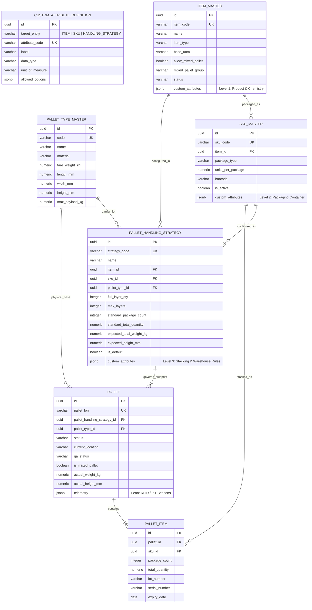

# Master Data & Pallet Management Database Specification (`warehouse_db.wes`)

**DOCUMENT ID**: DB-SPEC-WES-004 (3-Tier Scoped Custom Fields Architecture)  
**SCHEMA**: `wes`  
**DATABASE**: `warehouse_db` (PostgreSQL 16+)  
**CORE ARCHITECTURE**: Master Definition (Item & SKU) $\rightarrow$ Pallet Handling Strategy (Blueprint) $\rightarrow$ Physical Pallet LPN.  
**CUSTOM FIELD SCOPES**: Strictly partitioned into **Item**, **SKU**, and **Handling Strategy**.

---

## 1. Schema Entity-Relationship Diagram (ERD)

---

## 2. The 3 Custom Field Scopes

### Level 1: `ITEM` Scope
- **Domain**: Product properties, chemistry, biology, shelf life, regulations.
- **Examples**: `allergen`, `storage_condition`, `acclimatization_hours`, `flash_point_c`, `viscosity`.
- **Target Audience**: R&D, Product Master Data Team, Quality Assurance.

### Level 2: `SKU` Scope
- **Domain**: Packaging format, container dimensions, tare weight, retail barcodes.
- **Examples**: `sku_length_mm`, `sku_width_mm`, `sku_height_mm`, `gross_weight_kg`, `is_fragile`, `cap_seal_type`.
- **Target Audience**: Packaging Engineering Team.

### Level 3: `HANDLING_STRATEGY` Scope
- **Domain**: Warehouse floor rules, automated crane kinematics, conveyor routing, stacking limits.
- **Examples**: `load_bearing` (`DOUBLE_STACKABLE`, `NON_STACKABLE`), `slip_sheet_required`, `stretch_wrap_tension`, `overhang_allowed_mm`.
- **Target Audience**: Warehouse Operations & Automation Engineering Team.

---

## 3. Performance Protection for Lakhs of Pallets
Because custom fields live exclusively in the **Master Configuration tables** (`item_master`, `sku_master`, `pallet_handling_strategy` $\approx$ a few thousand rows), the physical inventory table **`pallet`** ($\approx$ 500,000+ rows) remains **ultra-compact and lightning fast**:
- Zero duplicate JSON keys stored across 500,000 rows.
- Standard PostgreSQL B-Tree indexes on `(status, qa_status, current_location)`.
- Instant lookups for automated cranes and AGV fleets.

---

## 4. Migration File Location
`services/wes-service/src/main/resources/db/migration/V1__create_master_data_and_pallet_tables.sql`
