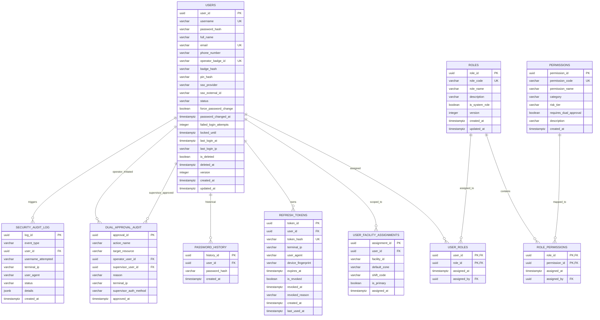

# User Management & IAM Database Specification (`warehouse_db.auth`)

**DOCUMENT ID**: DB-SPEC-AUTH-001  
**SCHEMA**: `auth`  
**DATABASE**: `warehouse_db` (PostgreSQL 16+)  
**PURPOSE**: Complete Data Dictionary, Table Definitions, Column Specifications, Constraints, and Indexing for the User Management & Authentication Module  
**STANDARDS COMPLIANCE**: 
- **IEC 62443-3-3 / IEC 62443-4-2** (Industrial Automation Cybersecurity: Identification & Authentication Control, Use Control, Four-Eyes Principle SR 2.4, Account Lockout SR 2.1)
- **NIST SP 800-63B** (Digital Identity Guidelines: Argon2id Memory-Hard Hashing, Password History)
- **ISA-95 Level 2/3** (Role-Based Access Control for Operations, Maintenance, and Supervisors)

---

## 1. Schema Entity-Relationship Diagram (ERD)



---

## 2. Table & Column Definitions (Data Dictionary)

### Table 1: `auth.users`
**Primary Purpose**: Stores core operator, supervisor, and administrator identities, authentication hashes (Argon2id, RFID, PIN), account lockouts, and lifecycle states.

| Column Name | SQL Data Type | Nullable | Default | Constraints & References | Description & Security Purpose |
| :--- | :--- | :---: | :--- | :--- | :--- |
| `user_id` | `UUID` | **NO** | `gen_random_uuid()` | `PRIMARY KEY` | Immutable internal surrogate key. |
| `username` | `VARCHAR(64)` | **NO** | *None* | `UNIQUE`, `CHECK (length(username) >= 3)` | Operator login username. Normalized to lowercase via unique B-tree index. |
| `password_hash` | `VARCHAR(255)` | **YES** | `NULL` | *None* | Memory-hard **Argon2id** hash ($m=65536, t=3, p=4$). Nullable for pure SSO accounts. |
| `full_name` | `VARCHAR(128)` | **NO** | *None* | *None* | Display name shown on UI header, logs, and touch terminal greeting. |
| `email` | `VARCHAR(128)` | **YES** | `NULL` | `UNIQUE` | Corporate email address for alerts and notifications. |
| `phone_number` | `VARCHAR(32)` | **YES** | `NULL` | *None* | SMS alert / emergency on-call contact. |
| `operator_badge_id` | `VARCHAR(64)` | **YES** | `NULL` | `UNIQUE` | Physical RFID / barcode card serial printed on badge (e.g. `BADGE-08912`). |
| `badge_hash` | `VARCHAR(255)` | **YES** | `NULL` | *None* | Salted HMAC-SHA256 hash of badge chip payload for fast scanner login lookup. |
| `pin_hash` | `VARCHAR(255)` | **YES** | `NULL` | *None* | Argon2id hash of 4-to-6 digit PIN for touch kiosk quick screen unlock. |
| `sso_provider` | `VARCHAR(32)` | **NO** | `'LOCAL'` | `CHECK (sso_provider IN ('LOCAL', 'AZURE_AD', 'OKTA', 'KEYCLOAK', 'OIDC'))` | Identity provider mode. `LOCAL` for offline plant; external IDP for enterprise. |
| `sso_external_id` | `VARCHAR(128)` | **YES** | `NULL` | *None* | Unique subject identifier (OID/Sub) from corporate enterprise IDP. |
| `status` | `VARCHAR(32)` | **NO** | `'ACTIVE'` | `CHECK (status IN ('ACTIVE', 'LOCKED', 'SUSPENDED', 'DEACTIVATED'))` | Account lifecycle state. Only `ACTIVE` users can authenticate. |
| `force_password_change` | `BOOLEAN` | **NO** | `TRUE` | *None* | **IEC 62443 Compliance**: Forces newly provisioned users to change password on first login. |
| `password_changed_at` | `TIMESTAMPTZ` | **YES** | `NULL` | *None* | Timestamp of last password change (used to enforce 90-day password rotation). |
| `failed_login_attempts` | `INTEGER` | **NO** | `0` | `CHECK (failed_login_attempts >= 0)` | Consecutive failed attempts counter. Reset to 0 upon successful login. |
| `locked_until` | `TIMESTAMPTZ` | **YES** | `NULL` | *None* | **IEC 62443 SR 2.1**: Account lockout expiration timestamp (triggered after 5 failures). |
| `last_login_at` | `TIMESTAMPTZ` | **YES** | `NULL` | *None* | Timestamp of most recent successful authentication. |
| `last_login_ip` | `VARCHAR(45)` | **YES** | `NULL` | *None* | IPv4 or IPv6 of the last authenticated client terminal. |
| `is_deleted` | `BOOLEAN` | **NO** | `FALSE` | *None* | Soft-delete flag preserving referential integrity in industrial audit logs. |
| `deleted_at` | `TIMESTAMPTZ` | **YES** | `NULL` | *None* | Soft-deletion timestamp. |
| `version` | `INTEGER` | **NO** | `0` | *None* | JPA `@Version` optimistic locking counter to prevent concurrent overwrite collisions. |
| `created_at` | `TIMESTAMPTZ` | **NO** | `NOW()` | *None* | Record creation timestamp (UTC). |
| `updated_at` | `TIMESTAMPTZ` | **NO** | `NOW()` | *None* | Record last update timestamp (UTC). |

---

### Table 2: `auth.roles`
**Primary Purpose**: Defines standard operational and administrative roles in the warehouse hierarchy (ISA-95 Level 2/3).

| Column Name | SQL Data Type | Nullable | Default | Constraints & References | Description & Security Purpose |
| :--- | :--- | :---: | :--- | :--- | :--- |
| `role_id` | `UUID` | **NO** | `gen_random_uuid()` | `PRIMARY KEY` | Unique role identifier. |
| `role_code` | `VARCHAR(64)` | **NO** | *None* | `UNIQUE` | Machine-readable identifier: `ROLE_ADMIN`, `ROLE_SUPERVISOR`, `ROLE_OPERATOR`, `ROLE_MAINTENANCE`, `ROLE_AUDITOR`. |
| `role_name` | `VARCHAR(128)` | **NO** | *None* | *None* | Human-readable role title (e.g., "Warehouse Shift Supervisor"). |
| `description` | `VARCHAR(255)` | **YES** | `NULL` | *None* | Detailed description of role responsibilities and boundaries. |
| `is_system_role` | `BOOLEAN` | **NO** | `FALSE` | *None* | System protection flag: if `TRUE`, role cannot be renamed or deleted via UI/API. |
| `version` | `INTEGER` | **NO** | `0` | *None* | JPA optimistic locking version. |
| `created_at` | `TIMESTAMPTZ` | **NO** | `NOW()` | *None* | Creation timestamp (UTC). |
| `updated_at` | `TIMESTAMPTZ` | **NO** | `NOW()` | *None* | Last modification timestamp (UTC). |

---

### Table 3: `auth.permissions`
**Primary Purpose**: Fine-grained security tokens granting access to specific UI pages, hazardous action buttons, or backend REST/gRPC mutations under IEC 62443.

| Column Name | SQL Data Type | Nullable | Default | Constraints & References | Description & Security Purpose |
| :--- | :--- | :---: | :--- | :--- | :--- |
| `permission_id` | `UUID` | **NO** | `gen_random_uuid()` | `PRIMARY KEY` | Unique permission identifier. |
| `permission_code` | `VARCHAR(64)` | **NO** | *None* | `UNIQUE` | Unique token: `PAGE:ASRS:VIEW`, `BTN:CONVEYOR:E_STOP_RESET`, `API:USER:CREATE`. |
| `permission_name` | `VARCHAR(128)` | **NO** | *None* | *None* | Human-readable permission title. |
| `category` | `VARCHAR(32)` | **NO** | *None* | `CHECK (category IN ('UI_PAGE', 'UI_BUTTON', 'API_MUTATION', 'SYSTEM_ADMIN'))` | Target layer classification for UI guards and Spring Security `@PreAuthorize`. |
| `risk_tier` | `VARCHAR(32)` | **NO** | `'STANDARD'` | `CHECK (risk_tier IN ('MONITORING', 'STANDARD', 'SAFETY_CRITICAL'))` | Risk classification. `SAFETY_CRITICAL` triggers additional audit logging. |
| `requires_dual_approval` | `BOOLEAN` | **NO** | `FALSE` | *None* | **IEC 62443 SR 2.4**: If `TRUE`, button or API requires secondary supervisor sign-off. |
| `description` | `VARCHAR(255)` | **YES** | `NULL` | *None* | Functional explanation of what the permission authorizes. |
| `created_at` | `TIMESTAMPTZ` | **NO** | `NOW()` | *None* | Creation timestamp (UTC). |

---

### Table 4: `auth.user_roles` (Junction Table)
**Primary Purpose**: Many-to-many relationship mapping users to their assigned roles.

| Column Name | SQL Data Type | Nullable | Default | Constraints & References | Description |
| :--- | :--- | :---: | :--- | :--- | :--- |
| `user_id` | `UUID` | **NO** | *None* | `REFERENCES auth.users(user_id) ON DELETE CASCADE` | Assigned user. |
| `role_id` | `UUID` | **NO** | *None* | `REFERENCES auth.roles(role_id) ON DELETE CASCADE` | Granted role. |
| `assigned_at` | `TIMESTAMPTZ` | **NO** | `NOW()` | *None* | When the role was granted. |
| `assigned_by` | `UUID` | **YES** | `NULL` | `REFERENCES auth.users(user_id) ON DELETE SET NULL` | Administrator who authorized the role assignment. |
| **PRIMARY KEY** | `(user_id, role_id)` | | | Composite Primary Key | Enforces uniqueness per user-role pair. |

---

### Table 5: `auth.role_permissions` (Junction Table)
**Primary Purpose**: Many-to-many relationship mapping roles to their granular permissions.

| Column Name | SQL Data Type | Nullable | Default | Constraints & References | Description |
| :--- | :--- | :---: | :--- | :--- | :--- |
| `role_id` | `UUID` | **NO** | *None* | `REFERENCES auth.roles(role_id) ON DELETE CASCADE` | Target role. |
| `permission_id` | `UUID` | **NO** | *None* | `REFERENCES auth.permissions(permission_id) ON DELETE CASCADE` | Bound permission. |
| `assigned_at` | `TIMESTAMPTZ` | **NO** | `NOW()` | *None* | Assignment timestamp. |
| `assigned_by` | `UUID` | **YES** | `NULL` | `REFERENCES auth.users(user_id) ON DELETE SET NULL` | Administrator who bound the permission. |
| **PRIMARY KEY** | `(role_id, permission_id)` | | | Composite Primary Key | Enforces uniqueness per role-permission pair. |

---

### Table 6: `auth.user_facility_assignments`
**Primary Purpose**: Scopes user access to physical warehouse facilities, operational zones, and work shifts. Prevents Insecure Direct Object References (IDOR) across facilities.

| Column Name | SQL Data Type | Nullable | Default | Constraints & References | Description & Security Purpose |
| :--- | :--- | :---: | :--- | :--- | :--- |
| `assignment_id` | `UUID` | **NO** | `gen_random_uuid()` | `PRIMARY KEY` | Assignment unique identifier. |
| `user_id` | `UUID` | **NO** | *None* | `REFERENCES auth.users(user_id) ON DELETE CASCADE` | Scoped operator/supervisor. |
| `facility_id` | `VARCHAR(64)` | **NO** | *None* | *None* | Scoped warehouse facility code (e.g. `FAC-BLR-01`). Injected into JWT claims. |
| `default_zone` | `VARCHAR(32)` | **YES** | `NULL` | *None* | Default work area (e.g. `INBOUND_STAGING`, `ASRS_BAY_1`, `PICK_PACK`). |
| `shift_code` | `VARCHAR(32)` | **YES** | `NULL` | *None* | Assigned shift schedule (e.g. `SHIFT_MORNING`, `SHIFT_NIGHT`). |
| `is_primary` | `BOOLEAN` | **NO** | `TRUE` | *None* | Flag designating the primary default facility when user belongs to multiple. |
| `assigned_at` | `TIMESTAMPTZ` | **NO** | `NOW()` | *None* | Creation timestamp. |
| **UNIQUE** | `(user_id, facility_id)` | | | Unique Constraint | A user has at most one assignment per physical facility. |

---

### Table 7: `auth.refresh_tokens`
**Primary Purpose**: Manages refresh token rotation, device session binding, and instantaneous token revocation upon user logout or security breach.

| Column Name | SQL Data Type | Nullable | Default | Constraints & References | Description & Security Purpose |
| :--- | :--- | :---: | :--- | :--- | :--- |
| `token_id` | `UUID` | **NO** | `gen_random_uuid()` | `PRIMARY KEY` | Session / token unique identifier. |
| `user_id` | `UUID` | **NO** | *None* | `REFERENCES auth.users(user_id) ON DELETE CASCADE` | Owning authenticated user. |
| `token_hash` | `VARCHAR(255)` | **NO** | *None* | `UNIQUE` | SHA-256 hash of the 256-bit cryptographically random refresh token. |
| `terminal_ip` | `VARCHAR(45)` | **NO** | *None* | *None* | IP address where session was established. |
| `user_agent` | `VARCHAR(255)` | **YES** | `NULL` | *None* | Client browser or rugged HMI tablet User-Agent string. |
| `device_fingerprint` | `VARCHAR(128)` | **YES** | `NULL` | *None* | Hardware kiosk or tablet fingerprint for device-bound sessions. |
| `expires_at` | `TIMESTAMPTZ` | **NO** | *None* | *None* | Absolute session expiration timestamp (typically 24 hours). |
| `is_revoked` | `BOOLEAN` | **NO** | `FALSE` | *None* | Instant revocation flag checked on every token refresh request. |
| `revoked_at` | `TIMESTAMPTZ` | **YES** | `NULL` | *None* | Timestamp when session was revoked. |
| `revoked_reason` | `VARCHAR(64)` | **YES** | `NULL` | *None* | Reason for revocation: `USER_LOGOUT`, `ADMIN_REVOKE`, `SUSPECTED_HIJACK`. |
| `created_at` | `TIMESTAMPTZ` | **NO** | `NOW()` | *None* | Session start timestamp. |
| `last_used_at` | `TIMESTAMPTZ` | **NO** | `NOW()` | *None* | Last token rotation timestamp. |

---

### Table 8: `auth.password_history`
**Primary Purpose**: Enforces NIST SP 800-63B and IEC 62443 password hygiene policies by preventing users from reusing their previous 5 passwords.

| Column Name | SQL Data Type | Nullable | Default | Constraints & References | Description & Security Purpose |
| :--- | :--- | :---: | :--- | :--- | :--- |
| `history_id` | `UUID` | **NO** | `gen_random_uuid()` | `PRIMARY KEY` | Historical entry identifier. |
| `user_id` | `UUID` | **NO** | *None* | `REFERENCES auth.users(user_id) ON DELETE CASCADE` | Owning user. |
| `password_hash` | `VARCHAR(255)` | **NO** | *None* | *None* | Historical Argon2id password hash. |
| `created_at` | `TIMESTAMPTZ` | **NO** | `NOW()` | *None* | Timestamp when this password was set. |

---

### Table 9: `auth.dual_approval_audit`
**Primary Purpose**: **IEC 62443-3-3 SR 2.4 (Four-Eyes Principle)**. Provides a non-repudiable audit trail whenever a hazardous or safety-critical action is authorized by a secondary supervisor.

| Column Name | SQL Data Type | Nullable | Default | Constraints & References | Description & Security Purpose |
| :--- | :--- | :---: | :--- | :--- | :--- |
| `approval_id` | `UUID` | **NO** | `gen_random_uuid()` | `PRIMARY KEY` | Immutable audit record identifier. |
| `action_name` | `VARCHAR(128)` | **NO** | *None* | *None* | Safety-critical action (e.g. `CONVEYOR_ESTOP_RESET`, `ASRS_CRANE_BYPASS`). |
| `target_resource` | `VARCHAR(128)` | **NO** | *None* | *None* | Physical equipment ID (e.g. `CV-LINE-04`, `CRANE-HIGHBAY-01`). |
| `operator_user_id` | `UUID` | **NO** | *None* | `REFERENCES auth.users(user_id)` | Initiating operator who requested the action. |
| `supervisor_user_id` | `UUID` | **NO** | *None* | `REFERENCES auth.users(user_id)` | Authorizing supervisor who verified and approved the override. |
| `reason` | `VARCHAR(255)` | **NO** | *None* | *None* | Mandatory justification entered or selected by the supervisor. |
| `terminal_ip` | `VARCHAR(45)` | **NO** | *None* | *None* | IP address of the terminal where the dual approval was verified. |
| `supervisor_auth_method` | `VARCHAR(32)` | **NO** | `'RFID_PIN'` | `CHECK (supervisor_auth_method IN ('RFID_PIN', 'PASSWORD', 'BIOMETRIC'))` | Method used to verify supervisor identity. |
| `approved_at` | `TIMESTAMPTZ` | **NO** | `NOW()` | *None* | Immutable UTC timestamp. |

---

### Table 10: `auth.security_audit_log`
**Primary Purpose**: Complete forensic audit log for all authentication attempts, badge scans, lockouts, password modifications, and permission escalations.

| Column Name | SQL Data Type | Nullable | Default | Constraints & References | Description & Security Purpose |
| :--- | :--- | :---: | :--- | :--- | :--- |
| `log_id` | `UUID` | **NO** | `gen_random_uuid()` | `PRIMARY KEY` | Immutable audit log record identifier. |
| `event_type` | `VARCHAR(64)` | **NO** | *None* | *None* | Event code: `LOGIN_SUCCESS`, `LOGIN_FAILURE`, `BADGE_TAP_SUCCESS`, `ACCOUNT_LOCKED`, `PASSWORD_CHANGED`, `ROLE_MODIFIED`. |
| `user_id` | `UUID` | **YES** | `NULL` | `REFERENCES auth.users(user_id) ON DELETE SET NULL` | Associated user (null if username did not exist during failed login). |
| `username_attempted` | `VARCHAR(64)` | **YES** | `NULL` | *None* | Raw username entered during login attempt. |
| `terminal_ip` | `VARCHAR(45)` | **NO** | *None* | *None* | Originating client IP address. |
| `user_agent` | `VARCHAR(255)` | **YES** | `NULL` | *None* | Client browser or HMI application agent. |
| `status` | `VARCHAR(32)` | **NO** | *None* | `CHECK (status IN ('SUCCESS', 'FAILURE', 'BLOCKED', 'ERROR'))` | Outcome of the security event. |
| `details` | `JSONB` | **YES** | `NULL` | *None* | Contextual key-value metadata (e.g. failure count, updated role IDs). |
| `created_at` | `TIMESTAMPTZ` | **NO** | `NOW()` | *None* | Immutable UTC event timestamp. |

---

## 3. High-Performance Indexing Strategy

To guarantee sub-millisecond query execution on bare-metal hardware:

```sql
-- 1. Fast case-insensitive username lookup for login (< 1ms)
CREATE UNIQUE INDEX idx_users_username_lower ON auth.users (LOWER(username));

-- 2. Partial index for physical RFID badge scans (< 1ms scan time)
CREATE INDEX idx_users_badge_hash ON auth.users (badge_hash) WHERE badge_hash IS NOT NULL;

-- 3. Partial index for corporate SSO lookup
CREATE INDEX idx_users_sso_lookup ON auth.users (sso_provider, sso_external_id) WHERE sso_external_id IS NOT NULL;

-- 4. Partial index for active (non-deleted) users
CREATE INDEX idx_users_active_lookup ON auth.users (user_id, status) WHERE is_deleted = FALSE;

-- 5. Fast refresh token validation & lookup by token hash
CREATE UNIQUE INDEX idx_refresh_tokens_hash ON auth.refresh_tokens (token_hash);

-- 6. Active sessions by user
CREATE INDEX idx_refresh_tokens_user_active ON auth.refresh_tokens (user_id) WHERE is_revoked = FALSE;

-- 7. Password history lookup ordered by recency
CREATE INDEX idx_password_history_user_recent ON auth.password_history (user_id, created_at DESC);

-- 8. Four-Eyes audit log queries by equipment resource and time
CREATE INDEX idx_dual_approval_resource_time ON auth.dual_approval_audit (target_resource, approved_at DESC);

-- 9. Security audit log queries by event type and time
CREATE INDEX idx_security_audit_event_time ON auth.security_audit_log (event_type, created_at DESC);
```

---

## 4. Key Security & Operational Invariants

1. **Argon2id Parameters**:
   - `type`: Argon2id
   - `memory`: 65536 KB (64 MB)
   - `iterations`: 3
   - `parallelism`: 4
   - `saltLength`: 16 bytes
   - `hashLength`: 32 bytes
2. **Account Lockout Policy (IEC 62443 SR 2.1)**:
   - Max failed attempts: `5`
   - Lockout duration: `15 minutes` (sets `locked_until = NOW() + INTERVAL '15 minutes'`)
   - Reset on success: `failed_login_attempts = 0`, `locked_until = NULL`
3. **Password History Policy (NIST SP 800-63B)**:
   - When a password is changed, the new hash is compared against the last `5` rows in `auth.password_history`.
   - If a match is detected, the password update is rejected with an error: *"Password has been used recently. Please choose a new password."*
4. **Four-Eyes Principle (IEC 62443 SR 2.4)**:
   - Operator and Supervisor cannot be the same user ID:
     `CHECK (operator_user_id <> supervisor_user_id)` enforced in business validation and DB check.
