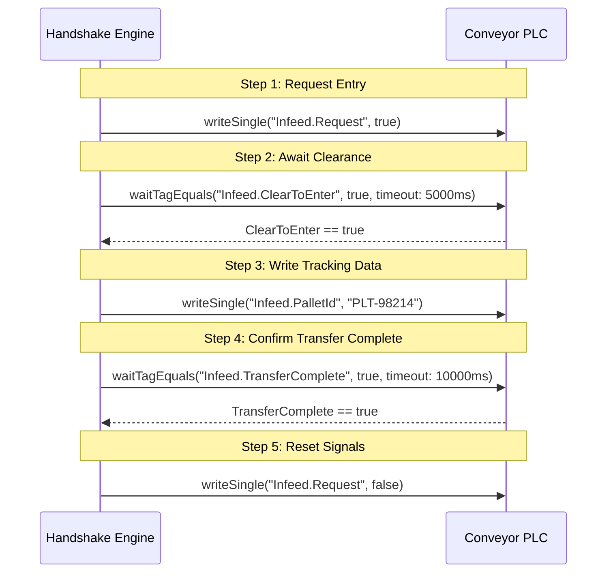

# Industrial OPC UA Common Library Specification & Architecture Guide

## 1. Overview & Purpose

The **`common-industrial` OPC UA Library** (`com.company.warehouse.common.industrial.opcua`) is a high-performance, air-gapped industrial communication module designed to bridge shop-floor Programmable Logic Controllers (PLCs), Industrial PCs, sensors, and Automated Guided Vehicles (AGVs) with the Warehouse Orchestrator platform.

### Core Design Principles:

1. **100% Offline & Air-Gapped (Zero CDN / Zero Cloud)**: Runs locally on industrial edge gateways and central servers.
2. **IEC 62443 Industrial Cybersecurity**: Implements secure user identity tokens (`USERNAME_PASSWORD`, `X509_CERTIFICATE`, `JWT_TOKEN`) and transport encryption (`Basic256Sha256`, `Aes128_Sha256_RsaOaep`).
3. **Unified Bidirectional I/O Contract (`OpcUaOperations`)**: A single API surface shared by both Client and Server engines, simplifying testing, simulation, and production execution.
4. **Milo Stack Abstraction**: Shields business logic from low-level Eclipse Milo UaClient/UaServer primitives, providing high-level type-safe records and automatic reconnection/session watchdog management.

---

## 2. Architecture & Module Structure

```mermaid
graph TD
    subgraph Caller Services
        WES[WES Service / Resource Templates]
        WCS[WCS Service / Runtime Manager]
    end

    subgraph "common-industrial :: opcua"
        OPS[<<interface>> OpcUaOperations]
      
        subgraph Client Engine
            CLIENT_IF[<<interface>> OpcUaClientEngine]
            MILO_CLIENT[MiloOpcUaClientEngine]
        end
      
        subgraph Server Engine
            SERVER_IF[<<interface>> OpcUaServerEngine]
            VIRTUAL_SERVER[VirtualOpcUaServerEngine]
        end

        subgraph Sequence Engine
            HANDSHAKE[OpcUaHandshakeSequenceEngine]
        end

        subgraph Data Models
            MODELS[OpcUaClientConfig<br/>OpcUaServerConfig<br/>OpcUaTagDefinition<br/>OpcUaTagValue<br/>OpcUaDataType<br/>OpcUaSecurityPolicy<br/>OpcUaAuthType]
        end
    end

    subgraph Physical / Virtual Equipment
        PLC[Physical PLC: Siemens S7 / Beckhoff / Rockwell]
        SIM[Virtual OPC UA Server]
    end

    WES --> OPS
    WCS --> OPS
    CLIENT_IF --|> OPS
    SERVER_IF --|> OPS
    MILO_CLIENT ..|> CLIENT_IF
    VIRTUAL_SERVER ..|> SERVER_IF
    HANDSHAKE --> OPS
    MILO_CLIENT -->|opc.tcp| PLC
    VIRTUAL_SERVER -->|Hosts AddressSpace| SIM
```

### Package Layout:

```
common/common-industrial/src/main/java/com/company/warehouse/common/industrial/opcua/
├── OpcUaOperations.java                      # Unified Bidirectional I/O Interface
├── client/
│   ├── OpcUaClientEngine.java                # Client SPI Contract
│   └── MiloOpcUaClientEngine.java            # Production Eclipse Milo Client Implementation
├── server/
│   ├── OpcUaServerEngine.java                # Server SPI Contract
│   └── VirtualOpcUaServerEngine.java         # Embedded Milo Server for PLC Simulation
├── handshake/
│   ├── OpcUaHandshakeSequenceEngine.java     # Multi-step PLC Handshake Workflow Engine
│   ├── HandshakeStep.java                    # Step Definition Record
│   ├── HandshakeStepType.java                # Step Action Enum (READ, WRITE, WAIT_EQUALS)
│   └── HandshakeExecutionResult.java         # Execution Result & Telemetry
└── model/
    ├── OpcUaAuthType.java                    # Auth Type Enum (ANONYMOUS, USERNAME_PASSWORD, etc.)
    ├── OpcUaSecurityPolicy.java              # Security Policy Enum (NONE, BASIC256_SHA256, etc.)
    ├── OpcUaDataType.java                    # Industrial Data Types (INT32, FLOAT, BOOLEAN, etc.)
    ├── OpcUaClientConfig.java                # Client Connection Parameters
    ├── OpcUaServerConfig.java                # Server Hosting Configuration
    ├── OpcUaTagDefinition.java               # Tag Metadata Schema
    ├── OpcUaTagGroupDefinition.java          # Tag Group Schema
    └── OpcUaTagValue.java                    # Runtime Value Container (Value, Quality, Timestamps)
```

---

## 3. Core Interface: `OpcUaOperations`

`com.company.warehouse.common.industrial.opcua.OpcUaOperations` defines the standard contract implemented by both client and server engines.

```java
public interface OpcUaOperations extends AutoCloseable {
    // --- Tag & Group Registration ---
    void registerTag(OpcUaTagDefinition tag);
    void registerTagGroup(OpcUaTagGroupDefinition group);
    Optional<OpcUaTagDefinition> getTagDefinition(String tagKeyOrNodeId);
    Optional<OpcUaTagGroupDefinition> getTagGroup(String groupKey);

    // --- Single Operations ---
    OpcUaTagValue readSingle(String tagKeyOrNodeId);
    boolean writeSingle(String tagKeyOrNodeId, Object value);

    // --- Batch / Group Operations ---
    Map<String, OpcUaTagValue> readBatch(List<String> tagKeysOrNodeIds);
    Map<String, OpcUaTagValue> readGroup(String groupKey);
    Map<String, Boolean> writeBatch(Map<String, Object> values);
    Map<String, Boolean> writeGroup(String groupKey, Map<String, Object> values);

    // --- Subscriptions ---
    String subscribe(String tagKeyOrNodeId, Consumer<OpcUaTagValue> listener);
    String subscribeGroup(String groupKey, Consumer<Map<String, OpcUaTagValue>> groupListener);
    void unsubscribe(String subscriptionId);

    // --- Browsing & Discovery ---
    List<String> browse(String parentNodeId);
}
```

### Key Method Details:

| Method                          | Description                                                              | Primary Use Case                                  |
| :------------------------------ | :----------------------------------------------------------------------- | :------------------------------------------------ |
| `readSingle(tagKey)`          | Reads current typed value, StatusCode, and timestamps from PLC tag       | Polling, telemetry checkpoints, diagnostics       |
| `writeSingle(tagKey, val)`    | Writes a typed value (coerced automatically to target`OpcUaDataType`)  | Command dispatch, setpoints, e-stops              |
| `readBatch(keys)`             | Reads multiple tags in a single network round-trip                       | Pallet tracking check, station state snapshot     |
| `writeBatch(values)`          | Writes multiple tag values atomically in a single round-trip             | Simultaneous handshake triggers & setpoints       |
| `subscribe(tagKey, listener)` | Creates an OPC UA Monitored Item with sampling interval & delivery queue | Real-time sensor changes, conveyor motion events  |
| `browse(parentNodeId)`        | Recursively inspects child folders, variables, and methods               | **Tag Discovery**, addressing space mapping |

---

## 4. Client Engine: `MiloOpcUaClientEngine`

Located in `client.MiloOpcUaClientEngine`, this class manages connections to physical or simulated PLCs.

### 4.1 Connection Lifecycle

- **`connect(OpcUaClientConfig config)`**:
  1. Resolves Milo `SecurityPolicy` based on `config.securityPolicy()`.
  2. Configures `IdentityProvider` (e.g. `UsernameProvider`, `AnonymousProvider`).
  3. Builds `OpcUaClient` with timeouts and application URI.
  4. Connects synchronously with timeout protection.
  5. Sets internal `connected` atomic flag.
- **`disconnect()`**:
  1. Gracefully deletes all active OPC UA subscriptions from the server.
  2. Disconnects client session.
  3. Clears subscription registry.
- **`isConnected()`**: Thread-safe check of active session status.

### 4.2 Browsing & Tag Discovery (`browse`)

```java
List<String> browse(String parentNodeId)
```

- Accepts node IDs formatted as `ns=2;s=Device.Folder` or default root `i=84` (`ObjectsFolder`).
- Traverses the server address space and returns browse path strings including variable node identifiers and folder names.
- Essential for UI tag pickers and automatic tag discovery.

### 4.3 Monitored Item Subscriptions (`subscribe`)

```java
String subscribe(String tagKeyOrNodeId, Consumer<OpcUaTagValue> listener)
```

- Creates an OPC UA subscription on the server (1000ms publish interval).
- Attaches a `ReadValueId` with `AttributeId.Value`.
- Configures `MonitoringParameters` with 250ms sampling interval and discarding oldest policy.
- Binds consumer callback to incoming `DataValue` events, converting them into thread-safe `OpcUaTagValue` instances.
- Returns a unique subscription UUID for clean removal via `unsubscribe(id)`.

---

## 5. Server Engine: `VirtualOpcUaServerEngine`

Located in `server.VirtualOpcUaServerEngine`, this class hosts an embedded OPC UA server in memory.

### Use Cases:

1. **Simulation & Digital Twin**: Simulates conveyor lines, scanners, and diverters without needing physical hardware.
2. **Offline Integration Testing**: Unit and end-to-end tests run reliably in CI/CD without hardware dependencies.
3. **Training & Demonstrations**: Allows testing HMI dashboards against live OPC UA tags.

### Key Methods:

- **`start(OpcUaServerConfig config)`**: Initializes Eclipse Milo `OpcUaServer`, registers custom namespace `urn:company:warehouse:virtual:plc`, and binds to `0.0.0.0:<port>`.
- **`registerNode(OpcUaTagDefinition tag, Object initialValue)`**: Dynamically creates `UaVariableNode` in the server address space under the virtual folder.
- **`writeSingle(tagKey, value)`**: Updates the server variable node and triggers notifications to connected OPC UA clients.
- **`stop()`**: Shuts down the Milo server and releases socket ports.

---

## 6. Data Models (`opcua.model`)

### 6.1 `OpcUaClientConfig` (Immutable Record)

Defines all network and security credentials needed to reach an OPC UA server:

```java
public record OpcUaClientConfig(
    String clientCode,               // Unique identifier (e.g. "PLC_LINE_01")
    String endpointUrl,              // opc.tcp://192.168.1.100:4840
    OpcUaSecurityPolicy securityPolicy,// NONE, BASIC256_SHA256, AES128_SHA256_RSAOAEP
    OpcUaAuthType authType,          // ANONYMOUS, USERNAME_PASSWORD, X509_CERTIFICATE, JWT_TOKEN
    String username,                 // Optional PLC username
    String password,                 // Optional PLC password
    String keystorePath,             // Path to .p12 / .jks client keystore
    String keystorePassword,         // Password for keystore
    String certificateAlias,         // Certificate alias
    String jwtToken,                 // Optional JWT Bearer token
    Long requestTimeoutMs,           // Default: 5000ms
    Long sessionTimeoutMs,           // Default: 60000ms
    Long reconnectIntervalMs,        // Default: 3000ms
    Integer keepaliveFailuresAllowed // Default: 4
)
```

### 6.2 `OpcUaTagDefinition` (Record)

Metadata describing an individual tag on the PLC:

```java
public record OpcUaTagDefinition(
    String tagKey,                   // Logical key (e.g. "CONV_01_SPEED")
    String nodeId,                   // OPC UA NodeId (e.g. "ns=2;s=DB10.Speed")
    OpcUaDataType dataType,          // FLOAT, INT32, BOOLEAN, STRING
    String accessLevel,              // READ, WRITE, READ_WRITE
    Long scanRateMs,                 // Target scan rate in ms
    Double deadband,                 // Value change threshold for event firing
    String description               // Engineering documentation
)
```

### 6.3 `OpcUaTagValue` (Record)

The payload returned from tag reads and subscriptions:

```java
public record OpcUaTagValue(
    String tagKey,                   // Tag identifier
    Object value,                    // Coerced Java object (Boolean, Double, Integer, String)
    OpcUaDataType dataType,          // Data type
    String statusCode,               // "Good", "Bad_NotFound", etc.
    Instant sourceTimestamp,         // PLC hardware timestamp
    Instant serverTimestamp,         // OPC UA Server receive timestamp
    boolean isGood                   // Convenience helper (statusCode starts with "Good")
)
```

### 6.4 `OpcUaDataType` (Enum)

Supported primitive data types:
`BOOLEAN`, `BYTE`, `INT16`, `INT32`, `INT64`, `UINT16`, `UINT32`, `UINT64`, `FLOAT`, `DOUBLE`, `STRING`, `DATETIME`, `BYTE_STRING`.

- Includes `coerce(Object value)` to convert incoming values into the strict type expected by the PLC.

---

## 7. Handshake Sequence Engine: `OpcUaHandshakeSequenceEngine`

Located in `handshake.OpcUaHandshakeSequenceEngine`, this component orchestrates complex multi-step handshakes between the orchestrator and PLCs.

### Supported Step Types (`HandshakeStepType`):

1. **`WRITE_TAG`**: Writes a parameter (with dynamic placeholder evaluation, e.g. `#{barcode}`).
2. **`WAIT_TAG_EQUALS`**: Polls tag until it matches expected value (with configurable timeout).
3. **`WAIT_TAG_BIT_SET`**: Checks bitwise masks on status words.
4. **`READ_TAG`**: Captures a tag's current value into workflow context output.
5. **`DELAY_MS`**: Introduces mechanical settling delay.

### Example Transfer Handshake Workflow:



---

## 8. Integration with WES Templates & WCS Runtime

This library directly powers the **OPC UA Resource Architecture**:

1. **Standard Code Archetype (`OpcUaPlcEntityArchetype.java` in WES)**:
   - Uses `OpcUaClientConfig` fields as its property schema.
   - Declares methods: `DISCOVER_TAGS`, `READ_TAG`, `WRITE_TAG`, `SUBSCRIBE_TAG`, `TEST_CONNECTION`.
2. **Runtime Execution (`WcsOpcUaRuntimeManager` / `MiloOpcUaClientEngine`)**:
   - Manages connection pools of `OpcUaClientEngine` instances keyed by resource code.
   - When a resource method is triggered, it delegates directly to `io.browse()`, `io.readSingle()`, or `io.writeSingle()`.
3. **Virtual Testing**:
   - In simulation mode, `VirtualOpcUaServerEngine` starts automatically and serves simulated PLC tags to the client engine.

---

## 9. Usage Examples

### 9.1 Connecting Client & Reading a Tag

```java
// 1. Build Client Configuration
OpcUaClientConfig config = OpcUaClientConfig.builder()
        .clientCode("PLC_INFEED_01")
        .endpointUrl("opc.tcp://192.168.1.50:4840")
        .authType(OpcUaAuthType.USERNAME_PASSWORD)
        .username("operator")
        .password("industrial_secret")
        .securityPolicy(OpcUaSecurityPolicy.BASIC256_SHA256)
        .requestTimeoutMs(5000L)
        .build();

// 2. Connect
MiloOpcUaClientEngine client = new MiloOpcUaClientEngine();
client.connect(config);

// 3. Register Tag Definition
client.registerTag(OpcUaTagDefinition.builder()
        .tagKey("CONVEYOR_SPEED")
        .nodeId("ns=2;s=Infeed.SpeedMps")
        .dataType(OpcUaDataType.FLOAT)
        .accessLevel("READ_WRITE")
        .build());

// 4. Read Tag
OpcUaTagValue tagValue = client.readSingle("CONVEYOR_SPEED");
System.out.println("Speed: " + tagValue.value() + " Quality: " + tagValue.statusCode());

// 5. Write Tag
client.writeSingle("CONVEYOR_SPEED", 1.25f);
```

### 9.2 Browsing Address Space (Tag Discovery)

```java
// Discover all child nodes under ObjectsFolder
List<String> nodes = client.browse("ns=0;i=84");
nodes.forEach(node -> System.out.println("Discovered Node: " + node));
```

### 9.3 Real-Time Tag Subscription

```java
String subId = client.subscribe("CONVEYOR_SPEED", val -> {
    System.out.printf("Live Telemetry Update: %s = %s at %s%n",
            val.tagKey(), val.value(), val.sourceTimestamp());
});

// When done:
client.unsubscribe(subId);
```
