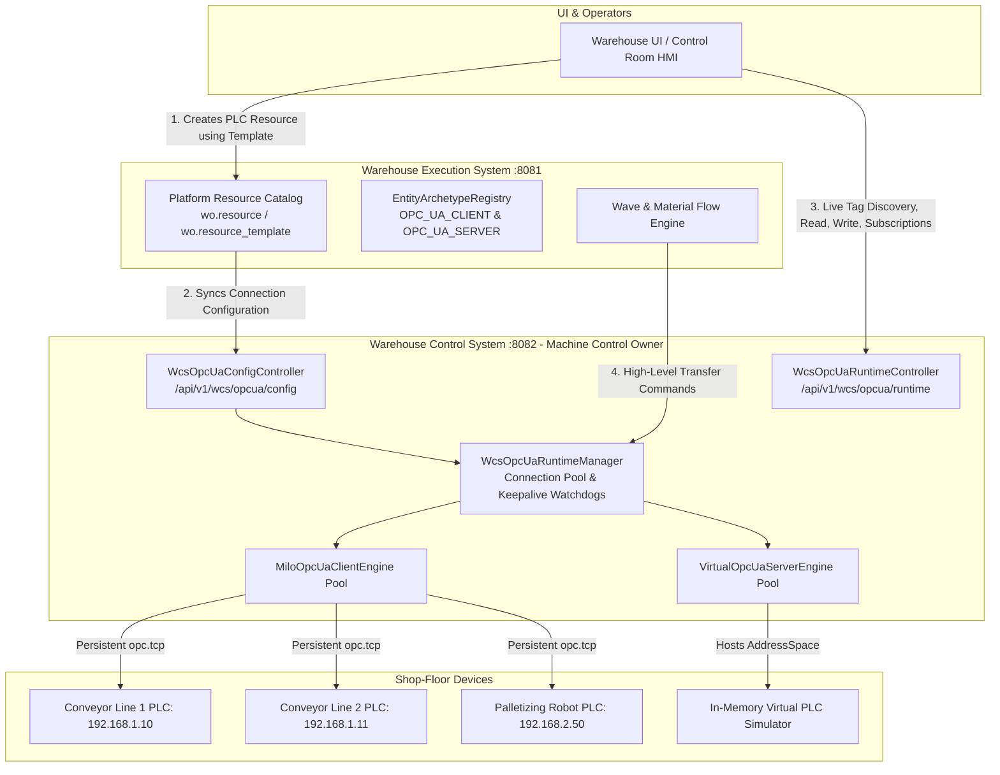

# Implementation Plan: Standard OPC UA Client & Server Templates with WCS Industrial Device Control

## Document Overview
This document specifies the technical architecture, property matrices, predefined methods, runtime dispatch, and UI experience for introducing **Platform Standard OPC UA Client & Server Templates**, with **Warehouse Control System (WCS)** as the sovereign runtime engine for all physical PLCs, fieldbus connections, and industrial devices.

---

## 1. Architectural Philosophy: WES vs. WCS Separation (ISA-95)

In alignment with industrial automation standards (ISA-95 Level 2/3), responsibilities are strictly separated between WES and WCS:

| Responsibility | Warehouse Execution System (WES :8081) | Warehouse Control System (WCS :8082) |
| :--- | :--- | :--- |
| **Domain Scope** | Business execution, waves, orders, inventory routing, material flow logic | Direct PLC machine control, sensors, fieldbuses, persistent TCP sockets |
| **Resource Role** | Master catalog registry (`wo.resource`, `wo.resource_template`) | Active connection pools, watchdog timers, hardware keepalives |
| **Device Protocols** | HTTP/REST software APIs, WMS/ERP adapters | **OPC UA**, Siemens S7, Modbus TCP, TCP telegrams |
| **Runtime Execution**| Tells WCS *what* to do (e.g. "Transfer Pallet to Line 2") | Executes the physical I/O handshakes and tag writes on the PLC |



---

## 2. Standard Template Specifications

### 2.1 `OPC_UA_CLIENT` (Industrial PLC / Gateway Client)

- **Archetype Code**: `OPC_UA_CLIENT`
- **Archetype Name**: `Standard OPC UA Client (Industrial PLC / Gateway)`
- **Category**: `PHYSICAL`
- **Resource Type**: `PLC`
- **Communication Protocol**: `OPC_UA`
- **Target Runtime Engine**: **WCS** (`WcsOpcUaRuntimeManager`)
- **System Template**: `true` (Protected from accidental deletion)

#### Property Schema Matrix (14 Properties):

| # | Property Key | Display Label | Type | Required | Default Value | Allowed Values / Constraints | Engineering Rationale |
| :-: | :--- | :--- | :---: | :---: | :--- | :--- | :--- |
| 1 | `endpointUrl` | PLC Endpoint URL | `STRING` | **Yes** | `opc.tcp://127.0.0.1:4840` | Must begin with `opc.tcp://` | Network socket address of target PLC |
| 2 | `authType` | Authentication Type | `ENUM` | **Yes** | `ANONYMOUS` | `ANONYMOUS`, `USERNAME_PASSWORD`, `X509_CERTIFICATE`, `JWT_TOKEN` | User token security requirement for connection |
| 3 | `securityPolicy` | Security Policy | `ENUM` | **Yes** | `NONE` | `NONE`, `BASIC256_SHA256`, `AES128_SHA256_RSAOAEP` | IEC 62443 transport layer encryption mode |
| 4 | `username` | Username | `STRING` | No | `""` | Alphanumeric (active if `authType = USERNAME_PASSWORD`) | User account configured in the PLC security settings |
| 5 | `password` | Password | `SECRET` | No | `""` | Password masked input field | User account password |
| 6 | `keystorePath` | Keystore Path | `STRING` | No | `""` | Local file path (e.g. `/certs/client.p12`) | Path to client PKCS12/JKS certificate file |
| 7 | `keystorePassword` | Keystore Password | `SECRET` | No | `""` | Password masked input field | Unlocks the private key in client certificate store |
| 8 | `certificateAlias`| Cert Alias | `STRING` | No | `""` | Key alias (e.g. `client-cert`) | Selects specific certificate from keystore |
| 9 | `jwtToken` | JWT Token | `SECRET` | No | `""` | JWT bearer token string | For industrial identity providers / SSO gateways |
| 10 | `requestTimeoutMs`| Request Timeout | `NUMBER`| No | `5000` | Min: `500`, Max: `60000`, Unit: `ms` | RPC timeout for synchronous read/write calls |
| 11 | `sessionTimeoutMs`| Session Timeout | `NUMBER`| No | `60000` | Min: `5000`, Unit: `ms` | Session keepalive watchdog timeout |
| 12 | `reconnectIntervalMs`| Reconnect Interval| `NUMBER`| No | `3000` | Min: `1000`, Unit: `ms` | Backoff delay before auto-reconnect attempt |
| 13 | `keepaliveFailuresAllowed`| Keepalive Failures| `NUMBER`| No | `4` | Min: `1`, Max: `10` | Missed heartbeats before triggering disconnect event |
| 14 | `defaultNamespaceIndex`| Default Namespace | `NUMBER`| No | `2` | Integer $\ge 0$ (typically `2` for PLC user tags) | Fallback namespace index for short tag queries |

#### Predefined Operational Methods on `OPC_UA_CLIENT` (Executed by WCS):

| Method Name | Type | Safety Tier | WCS Runtime API | Description |
| :--- | :--- | :--- | :--- | :--- |
| **`DISCOVER_TAGS`** | `DIAGNOSTIC` | `READ_ONLY` | `POST /api/v1/wcs/opcua/runtime/{code}/browse` | Browses PLC address space folders and returns tag hierarchy. |
| **`READ_TAG`** | `QUERY` | `READ_ONLY` | `POST /api/v1/wcs/opcua/runtime/{code}/read-single` | Reads single tag value, StatusCode, and timestamps. |
| **`WRITE_TAG`** | `EXECUTION` | `OPERATIONAL` | `POST /api/v1/wcs/opcua/runtime/{code}/write-single` | Writes typed value to a PLC tag (speed, setpoint, trigger). |
| **`READ_BATCH`** | `QUERY` | `READ_ONLY` | `POST /api/v1/wcs/opcua/runtime/{code}/read-batch` | Reads multiple tags in a single network round-trip. |
| **`WRITE_BATCH`** | `EXECUTION` | `OPERATIONAL` | `POST /api/v1/wcs/opcua/runtime/{code}/write-batch` | Writes multiple tags simultaneously. |
| **`SUBSCRIBE_TAG`** | `TELEMETRY` | `OPERATIONAL` | `POST /api/v1/wcs/opcua/runtime/{code}/read-group/{group}`| Establishes 250ms event-driven push telemetry subscription. |
| **`TEST_CONNECTION`** | `DIAGNOSTIC` | `READ_ONLY` | `POST /api/v1/wcs/opcua/runtime/{code}/browse?nodeId=Root`| Verifies network reachability and server handshake. |

---

### 2.2 `OPC_UA_SERVER` (Virtual PLC / Digital Twin Server)

- **Archetype Code**: `OPC_UA_SERVER`
- **Archetype Name**: `Standard OPC UA Server (Virtual PLC / Digital Twin)`
- **Category**: `SOFTWARE`
- **Resource Type**: `OPC_UA_SERVER`
- **Communication Protocol**: `OPC_UA`
- **Target Runtime Engine**: **WCS** (`VirtualOpcUaServerEngine`)
- **System Template**: `true`

#### Property Schema Matrix (8 Properties):

| # | Property Key | Display Label | Type | Required | Default Value | Allowed Values / Constraints | Engineering Rationale |
| :-: | :--- | :--- | :---: | :---: | :--- | :--- | :--- |
| 1 | `bindAddress` | Bind IP Address | `STRING` | **Yes** | `0.0.0.0` | Valid IPv4 / Hostname | Network interface to bind listening socket |
| 2 | `bindPort` | TCP Port | `NUMBER` | **Yes** | `4840` | Port range 1–65535 | Standard OPC UA listening port |
| 3 | `endpointPath` | Endpoint Path | `STRING` | **Yes** | `/wcs/opcua` | URL suffix path | Sub-path for endpoint URL |
| 4 | `namespaceUri` | Namespace URI | `STRING` | **Yes** | `urn:company:warehouse:wcs` | Valid URI string | Root namespace identifier for hosted variable nodes |
| 5 | `securityPolicy` | Supported Security | `ENUM` | **Yes** | `NONE` | `NONE`, `BASIC256_SHA256`, `AES128_SHA256_RSAOAEP` | Minimum transport security accepted |
| 6 | `allowAnonymous` | Allow Anonymous | `BOOLEAN`| **Yes** | `true` | `true` / `false` | Permits simulation clients without authentication |
| 7 | `autoStart` | Auto-Start on Boot | `BOOLEAN`| **Yes** | `true` | `true` / `false` | Starts the server socket automatically when platform boots |
| 8 | `maxConnections` | Max Connections | `NUMBER` | No | `100` | Min: `1`, Max: `1000` | Safeguards server against socket connection exhaustion |

#### Predefined Operational Methods on `OPC_UA_SERVER` (Executed by WCS):

| Method Name | Type | Safety Tier | Description |
| :--- | :--- | :--- | :--- |
| **`START_SERVER`** | `CONTROL` | `OPERATIONAL` | Binds the listening socket and begins serving address space in WCS. |
| **`STOP_SERVER`** | `CONTROL` | `SAFETY_CRITICAL` | Terminates client connections and shuts down listening socket. |
| **`REGISTER_NODE`** | `CONFIGURATION` | `OPERATIONAL` | Dynamically registers a variable node into the virtual address space. |
| **`UPDATE_NODE_VALUE`**| `EXECUTION` | `OPERATIONAL` | Sets a variable node value and pushes notification to subscribers. |
| **`GET_SERVER_STATUS`**| `DIAGNOSTIC` | `READ_ONLY` | Reports active client count, uptime, and bound endpoint. |

---

## 3. Multi-Client Instantiation & WCS Connection Workflow

```mermaid
sequenceDiagram
    autonumber
    actor Operator as Automation Engineer
    participant UI as Warehouse UI
    participant WES as WES Master Catalog (:8081)
    participant WCS as WCS Runtime Manager (:8082)
    participant PLC as Physical PLC (10.10.1.50)

    Operator->>UI: Click "Add Resource"
    UI->>UI: Select Template: "Standard OPC UA Client"
    Note over UI: UI auto-populates all 14 properties with defaults
    Operator->>UI: Fill ID: "PLC-LINE-01", URL: "opc.tcp://10.10.1.50:4840", Auth: "USERNAME_PASSWORD"
    Operator->>UI: Click "Save Resource"
    UI->>WES: POST /api/v1/wes/resources (Save resource metadata)
    WES->>WCS: POST /api/v1/wcs/opcua/config/clients (Sync connection config)
    WCS->>WCS: Instantiate client in activeClients pool
    WCS->>PLC: Establish persistent opc.tcp session & start keepalive watchdog
    PLC-->>WCS: Session Created & Active
    WCS-->>WES: Connection Ready
    WES-->>UI: Resource Created Successfully

    Note over Operator,UI: User Explores Live PLC Tags
    Operator->>UI: Click "Discover Tags" on PLC-LINE-01
    UI->>WCS: POST /api/v1/wcs/opcua/runtime/PLC-LINE-01/browse?nodeId=ns=0;i=84
    WCS->>PLC: Milo browse(ObjectsFolder)
    PLC-->>WCS: Tag Hierarchy List
    WCS-->>UI: Returns Discovered Tags (Speed, Status, E-Stop, Current)
```

---

## 4. Implementation Steps

### Phase 1: Java Archetype Classes in `wes-service`
1. Create [`OpcUaClientEntityArchetype.java`](file:///c:/Users/Windows10/Documents/GitHub/Warehouse_orchestrator/services/wes-service/src/main/java/com/company/warehouse/wes/business/resource/composer/archetype/OpcUaClientEntityArchetype.java):
   - Implements `EntityArchetype`.
   - Defines the 14 property schemas and 7 method schemas.
   - Annotates with `@Component` for automatic registration in `EntityArchetypeRegistry`.
2. Create [`OpcUaServerEntityArchetype.java`](file:///c:/Users/Windows10/Documents/GitHub/Warehouse_orchestrator/services/wes-service/src/main/java/com/company/warehouse/wes/business/resource/composer/archetype/OpcUaServerEntityArchetype.java):
   - Implements `EntityArchetype`.
   - Defines the 8 server property schemas and 5 method schemas.
   - Annotates with `@Component`.

### Phase 2: Template Catalog Merging (`ResourceManager.java`)
1. In `getAllTemplates(category)`:
   - Query DB templates.
   - Fetch code archetypes from `archetypeRegistry`.
   - Merge archetypes with a system badge `isSystemTemplate: true`.
2. In `getTemplateByCode(templateCode)`:
   - If not in DB, fall back to `archetypeRegistry.getTemplate(templateCode)`.

### Phase 3: Resource Creation Sync to WCS
1. In `ResourceManager.createResource(request)`:
   - If resource protocol is `OPC_UA` or category is `PHYSICAL`, send a sync call to WCS (`/api/v1/wcs/opcua/config/clients` or direct service bridge) to ensure WCS immediately provisions the connection in its active client pool.

### Phase 4: UI Interactive Tag Controller & Runtime Bridge
1. **Templates View (`ResourceTemplatesTab.tsx`)**:
   - Displays `OPC_UA_CLIENT` and `OPC_UA_SERVER` with `Platform Standard (Code)` badges.
   - Adds direct **"Create Resource Instance"** action button.
2. **Resource Form (`CreateEditResourceModal.tsx`)**:
   - `ENUM` types render as `<select>` dropdowns (`authType`, `securityPolicy`).
   - `SECRET` types render with masked password inputs.
   - Contextual field hiding (hide username/password when `authType = ANONYMOUS`).
3. **Interactive Device Controller Modal**:
   - Connects the **"Discover Tags"**, **"Read Tag"**, **"Write Tag"**, and **"Test Connection"** buttons directly to `/api/v1/wcs/opcua/runtime/*`.

### Phase 5: Verification & Testing
1. Unit tests for `OpcUaClientEntityArchetype` and `OpcUaServerEntityArchetype`.
2. Integration test: create multiple PLC resources and verify WCS runtime connectivity.
3. Frontend TypeScript build validation (`npm run build`).
