# Sovereign Resource Manager Architecture Specification

## 1. Executive Summary & Purpose

The **Resource Manager** is the foundational digital twin and asset orchestration engine of **Warehouse Orchestrator (WO)**. It decouples core industrial resource modeling, inheritance hierarchies, telemetry processing, finite state machines (FSM), and protocol dispatching from satellite execution software (WES, WMS, WCS, Fleet Management).

By isolating resource definitions and topology into a sovereign PostgreSQL schema (`wo`), the platform ensures:

1. **Satellite Decoupling**: WES, WMS, and WCS can be replaced, multiplied, or upgraded without altering physical asset definitions.
2. **True Industrial OOP Hierarchy**: Universal 3-tier property and service inheritance (*System Base -> Template Definition -> Instance Overrides*).
3. **Multi-Protocol OT Dispatching**: Transparent execution across physical equipment (`PHYSICAL`), external software connectors (`SOFTWARE`), digital twins (`VIRTUAL`), and logical routing nodes (`LOGICAL`).
4. **IEC 62443 Security & Safety Tiers**: Least-privilege action gating and dual-approval requirements for safety-critical hardware commands.

---

## 2. End-to-End Architectural Block Diagram

```mermaid
graph TB
    classDef client fill:#1e293b,stroke:#3b82f6,stroke-width:2px,color:#f8fafc;
    classDef facade fill:#0f172a,stroke:#10b981,stroke-width:2px,color:#f8fafc;
    classDef composer fill:#1e1e38,stroke:#8b5cf6,stroke-width:2px,color:#f8fafc;
    classDef common fill:#1c2d27,stroke:#059669,stroke-width:2px,color:#f8fafc;
    classDef driver fill:#3b1e2b,stroke:#f43f5e,stroke-width:2px,color:#f8fafc;
    classDef db fill:#2d2416,stroke:#f59e0b,stroke-width:2px,color:#f8fafc;

    subgraph S1 ["1. CLIENT & REST API LAYER"]
        UI["🖥️ React Industrial HMI (Vite)<br>• TemplateStudioModal<br>• ResourceStudio"]:::client
        API["🌐 REST API Controllers<br>• ResourceController<br>• ResourceTemplateController"]:::client
    end

    subgraph S2 ["2. BUSINESS ORCHESTRATION FACADE"]
        RM["⚙️ ResourceManager.java<br>• createResource()<br>• updateResource()<br>• executeService()<br>• createRelationship()"]:::facade
    end

    subgraph S3 ["3. OOP COMPOSITION & INHERITANCE ENGINES"]
        direction TB
        subgraph Templates ["Template Processing"]
            ETC["EntityTemplateComposer<br><i>composeTemplate()</i>"]:::composer
            ETV["EntityTemplateValidator<br><i>validate() [4 Categories]</i>"]:::composer
        end
        subgraph Instances ["Instance Processing"]
            EIC["EntityInstanceComposer<br><i>composeInstance()</i>"]:::composer
            EIV["EntityInstanceValidator<br><i>validateMandatoryProps()</i>"]:::composer
        end
        subgraph Engines ["Resolution Engines"]
            EPRE["EntityPropertyResolutionEngine<br><i>Inheritance (Base ➔ Template ➔ Instance)</i>"]:::composer
            ESRE["EntityServiceResolutionEngine<br><i>Service & Tag Resolution</i>"]:::composer
            EAR["EntityArchetypeRegistry<br><i>In-Memory Archetypes</i>"]:::composer
        end
    end

    subgraph S4 ["4. SERVICE DISPATCHER & PROTOCOL DRIVERS"]
        ESD["⚡ EntityServiceDispatcher<br><i>supports(method, protocol, category)</i>"]:::driver
      
        subgraph Drivers ["Execution Adapters"]
            D_PLC["IndustrialPlcServiceExecutor<br><b>PHYSICAL</b> (OPC-UA / S7 / Modbus)"]:::driver
            D_REST["RestDispatchServiceExecutor<br><b>SOFTWARE</b> (HTTP / OAuth2 / WMS)"]:::driver
            D_AUTH["AuthenticationServiceExecutor<br><b>AUTH</b> (Token Exchange)"]:::driver
            D_HLTH["HealthCheckServiceExecutor<br><b>DIAGNOSTIC</b> (Ping Latency)"]:::driver
        end
    end

    subgraph S5 ["5. COMMON DOMAIN ENGINE (common-resource)"]
        direction LR
        FSM["🔄 StateTransitionEngine<br><i>PackML Finite State Machine</i>"]:::common
        RSUB["📜 RuleSubscriptionEngine<br><i>Event-Condition-Action</i>"]:::common
        TEL["📊 TelemetryFilterEngine<br><i>Deadband & Rate Limiting</i>"]:::common
        GRAPH["🗺️ OperationalGraph<br><i>DAG Topology & Routing</i>"]:::common
    end

    subgraph S6 ["6. DATABASE PERSISTENCE (Sovereign 'wo' Schema)"]
        direction LR
        T_TPL[("wo.resource_template<br><i>Classes & Schemas</i>")]:::db
        T_RES[("wo.resource<br><i>Runtime Instances</i>")]:::db
        T_REL[("wo.resource_relationship<br><i>Graph Links</i>")]:::db
        T_SHP[("wo.resource_shape<br><i>Contracts</i>")]:::db
    end

    UI -->|HTTP POST/PUT/GET| API
    API --> RM

    RM -->|1. Build Template| ETC
    ETC --> ETV
    ETC --> EPRE
    ETC --> ESRE

    RM -->|2. Build Runtime Instance| EIC
    EIC --> EIV
    EIC --> EPRE
    EPRE -.-> EAR

    RM -->|3. Invoke Method / Service| ESD
    ESD --> D_PLC
    ESD --> D_REST
    ESD --> D_AUTH
    ESD --> D_HLTH

    RM -.->|FSM Lifecycle Checks| FSM
    RM -.->|Evaluate Telemetry Rules| RSUB
    RM -.->|Ingest Sensor Data| TEL
    RM -.->|Calculate Routing Paths| GRAPH

    RM -->|JPA / Flyway| T_TPL
    RM -->|JPA / Flyway| T_RES
    RM -->|JPA / Flyway| T_REL
    RM -->|JPA / Flyway| T_SHP
```



---

## 3. Detailed Component & Class Catalog

### Layer 1: Inbound Web & Client Layer (`client/warehouse-ui`)

| File / Component                              | Purpose & Functionality                                                                                                                       |
| :-------------------------------------------- | :-------------------------------------------------------------------------------------------------------------------------------------------- |
| **`TemplateStudioModal.tsx`**         | Main modal coordinator (< 600 lines) for authoring resource templates. Coordinates sub-tabs and triggers REST mutations.                      |
| **`TemplateIdentityTab.tsx`**         | Manages code, name, universal category selection (`PHYSICAL`, `SOFTWARE`, `VIRTUAL`, `LOGICAL`), and OT Gateway communication method. |
| **`TemplateBasePropertiesTab.tsx`**   | Displays universal platform properties (`operational_state`, `health_status`, `fault_code`, `last_heartbeat`) and default values.     |
| **`TemplateCustomPropertiesTab.tsx`** | User-defined custom hardware tags across 12 industrial data types (`STRING`, `DOUBLE`, `LOCATION`, `MAP`, etc.).                      |
| **`TemplateBaseMethodsTab.tsx`**      | Core safety and lifecycle operations (`PING_HEALTH`, `RESET_FAULT`, `EMERGENCY_STOP`).                                                  |
| **`TemplateCustomMethodsTab.tsx`**    | Custom callable operations, IEC 62443 safety tiers, and supported direct command tags (`START`, `STOP`, `JOG_FWD`).                     |
| **`resourceTemplateService.ts`**      | Frontend Axios/fetch client mapping CRUD requests to`/api/v1/resource-templates`.                                                           |

---

### Layer 2: Business Orchestration Facade (`services/wes-service/.../business/resource`)

| Class                         | Key Methods                                                                                                                                                                                       | Purpose                                                                                                                                                                                     |
| :---------------------------- | :------------------------------------------------------------------------------------------------------------------------------------------------------------------------------------------------ | :------------------------------------------------------------------------------------------------------------------------------------------------------------------------------------------ |
| **`ResourceManager`** | •`createResource()`• `updateResource()`• `deleteResource()`• `getResource()`• `getAllResources()`• `executeService()`• `createRelationship()`• `getDownstreamResources()` | Central orchestration facade. Validates incoming requests, manages template inheritance, persists to PostgreSQL schema`wo`, and delegates execution calls to `EntityServiceDispatcher`. |

---

### Layer 3: Composition, Inheritance & Validation Engines (`services/wes-service/.../composer`)

| Class                                        | Key Methods                                                                     | Purpose                                                                                                                                          |
| :------------------------------------------- | :------------------------------------------------------------------------------ | :----------------------------------------------------------------------------------------------------------------------------------------------- |
| **`EntityTemplateComposer`**         | •`composeTemplate()`• `validateTemplate()`                                | Compiles user-defined property schemas and methods into a finalized`ComposedEntityTemplate`.                                                   |
| **`EntityInstanceComposer`**         | •`composeInstance()`• `resolveEffectiveState()`                           | Assembles an active runtime`ComposedEntityInstance` by overlaying template defaults with instance runtime values.                              |
| **`EntityPropertyResolutionEngine`** | •`resolveEffectiveProperties()`• `mergeDefaultProperties()`               | Executes 3-tier property inheritance:*(1) System Universal Base -> (2) Template Defaults -> (3) Instance Custom Overrides*.                    |
| **`EntityServiceResolutionEngine`**  | •`resolveAvailableServices()`                                                | Determines the effective callable operations and supported commands for an asset instance.                                                       |
| **`EntityArchetypeRegistry`**        | •`getArchetype(code)`• `getAllArchetypes()`• `getByCategory(category)` | In-memory registry maintaining pre-built factory archetypes (e.g., Generic REST, OPC-UA Device).                                                 |
| **`EntityTemplateValidator`**        | •`validate()`• `validateProperties()`• `validateMethods()`             | Enforces validation rules: ensures category is in`[PHYSICAL, SOFTWARE, VIRTUAL, LOGICAL]`, checks property key regex, and verifies data types. |
| **`EntityInstanceValidator`**        | •`validateInstance()`                                                        | Verifies that all mandatory fields (`required: true`) are satisfied before creating a runtime resource.                                        |
| **`EntityComposerMapper`**           | •`toDto()`• `toEntity()`                                                  | Maps between JPA database entities and REST API DTOs.                                                                                            |

---

### Layer 4: Protocol Dispatcher & Execution Drivers (`services/wes-service/.../service`)

| Class                                       | Key Methods                              | Purpose                                                                                                                                                            |
| :------------------------------------------ | :--------------------------------------- | :----------------------------------------------------------------------------------------------------------------------------------------------------------------- |
| **`EntityServiceDispatcher`**       | •`dispatch(instance, method, params)` | Matches the target method, communication protocol, and asset category to an active driver via`supports()`.                                                       |
| **`IndustrialPlcServiceExecutor`**  | •`supports(...)`• `execute(...)`   | Physical equipment driver (`PHYSICAL`). Communicates with OPC-UA, Siemens S7, and Modbus TCP for operations (`READ_TAG`, `WRITE_TAG`, `TRIGGER_SCENARIO`). |
| **`RestDispatchServiceExecutor`**   | •`supports(...)`• `execute(...)`   | Software connector driver (`SOFTWARE`). Executes dynamic HTTP GET/POST/PUT calls to external WMS/MES/ERP endpoints.                                              |
| **`AuthenticationServiceExecutor`** | •`supports(...)`• `execute(...)`   | Software authentication driver (`AUTHENTICATE`). Handles OAuth2 token retrieval and API key authentication.                                                      |
| **`HealthCheckServiceExecutor`**    | •`supports(...)`• `execute(...)`   | Universal diagnostic driver (`PING_HEALTH`). Validates network reachability, heartbeat timestamps, and round-trip latency.                                       |

---

### Layer 5: Common Industrial Domain Engines (`common/common-resource`)

| Class                                | Key Methods                                                                    | Purpose                                                                                                                                       |
| :----------------------------------- | :----------------------------------------------------------------------------- | :-------------------------------------------------------------------------------------------------------------------------------------------- |
| **`StateTransitionEngine`**  | •`transition(currentState, trigger, profile)`• `canTransition(from, to)` | Finite State Machine (PackML / Semi E10 compliant) governing asset lifecycle (`IDLE`, `STARTING`, `RUNNING`, `HOLDING`, `STOPPED`). |
| **`RuleSubscriptionEngine`** | •`evaluateRules(resource, telemetry)`• `registerSubscription(rule)`      | Event-Condition-Action (ECA) rule evaluator (e.g. if AMR battery < 15%, auto-trigger`send_to_charger`).                                     |
| **`TelemetryFilterEngine`**  | •`filter(point, policy)`                                                    | High-throughput deadband and rate-limiting filter for sensor streams (prevents database flooding on micro-jitter).                            |
| **`OperationalGraph`**       | •`addNode()`• `addEdge()`• `findDownstreamNodes()`                    | Directed Acyclic Graph (DAG) modeling plant topology, physical conveyors, and logical transfer queues.                                        |

---

### Layer 6: Persistence Layer (PostgreSQL `wo` Schema)

| Table                                  | Primary Columns                                                                                                                                                                                                          | Purpose                                                                                         |
| :------------------------------------- | :----------------------------------------------------------------------------------------------------------------------------------------------------------------------------------------------------------------------- | :---------------------------------------------------------------------------------------------- |
| **`wo.resource_template`**     | `template_code`, `template_name`, `category`, `resource_type`, `communication_method`, `property_schema` (JSONB), `default_properties` (JSONB), `methods_schema` (JSONB), `supported_commands` (JSONB) | Master catalog defining reusable asset blueprints and industrial schemas.                       |
| **`wo.resource`**              | `resource_id`, `name`, `category`, `type`, `status`, `template_code`, `custom_properties` (JSONB), `template_properties` (JSONB), `methods_config` (JSONB)                                             | Runtime instances representing active physical machines, software connectors, or digital twins. |
| **`wo.resource_relationship`** | `source_resource_id`, `target_resource_id`, `relation_category`, `relation_type`, `properties` (JSONB)                                                                                                         | Directed operational graph edges (`MATERIAL_FLOW`, `INFORMATION_FLOW`).                     |
| **`wo.resource_shape`**        | `shape_code`, `shape_name`, `properties` (JSONB), `methods` (JSONB)                                                                                                                                              | Standalone interface contracts for cross-template interoperability.                             |

---

## 4. End-to-End Operational Lifecycle & Sequences

### Flow 1: Template Creation (Design Time)

```
[User on Industrial UI]
   │
   ├── 1. POST /api/v1/resource-templates (Payload with Category, Comms, Props, Methods)
   ▼
[ResourceTemplateController]
   │
   ├── 2. Delegates to ResourceManager.createTemplate()
   ▼
[EntityTemplateComposer]
   │
   ├── 3. Enforces 4 Universal Categories via EntityTemplateValidator
   ├── 4. Resolves Base + Custom Properties via EntityPropertyResolutionEngine
   ├── 5. Compiles JSONB definitions
   ▼
[wo.resource_template Table] (Persisted into PostgreSQL)
```

### Flow 2: Resource Instantiation (Commissioning Time)

```
[User / Automated Provisioning]
   │
   ├── 1. POST /api/v1/resources (resourceId, templateCode, customOverrides)
   ▼
[ResourceManager]
   │
   ├── 2. Fetches parent blueprint from wo.resource_template
   ▼
[EntityInstanceComposer]
   │
   ├── 3. Overlays: (1) System Base Defaults -> (2) Template Defaults -> (3) Custom Overrides
   ├── 4. Validates mandatory required tags via EntityInstanceValidator
   ▼
[wo.resource Table] (Persisted as active industrial asset)
```

### Flow 3: Method Execution / Service Dispatch (Runtime)

```
[Workflow Engine / UI Operator]
   │
   ├── 1. POST /api/v1/resources/{id}/methods/{methodName}/execute
   ▼
[ResourceManager]
   │
   ├── 2. Loads effective instance configuration
   ▼
[EntityServiceDispatcher]
   │
   ├── 3. Evaluates supports(method, protocol, category)
   ├── 4. Route selection:
   │      ├─ If PHYSICAL ──► IndustrialPlcServiceExecutor (OPC-UA / S7 / Modbus)
   │      ├─ If SOFTWARE ──► RestDispatchServiceExecutor (HTTP / OAuth2)
   │      └─ If DIAGNOSTIC ─► HealthCheckServiceExecutor (Ping Latency)
   ▼
[Target Physical Equipment / External System]
```

---

## 5. Refactoring Roadmap & Recommendations

To maintain clean modular separation between the platform core and satellite applications:

1. **Move Facade & Composer to Platform Module**:

   - Extract `ResourceManager.java` and `composer/` out of `services/wes-service` into a dedicated platform module (`platform-resource-service` or directly inside `common/common-resource`).
   - WES will consume this library as a clean client or injected service rather than hosting the core master data logic.
2. **Clean Up Legacy Columns on `wo.resource`**:

   - Gradually deprecate top-level columns `host`, `port`, `protocol`, and `application` on `wo.resource`.
   - All connection endpoints should reside natively in `custom_properties` or be resolved via the Industrial OT Gateway.
3. **Domain Entity Consolidation**:

   - Eliminate redundant DTO/model mappings by adopting canonical domain models (`Resource`, `ResourceTemplate`, `PropertyDefinition`, `MethodDefinition`) from `common/common-resource` throughout all services.
