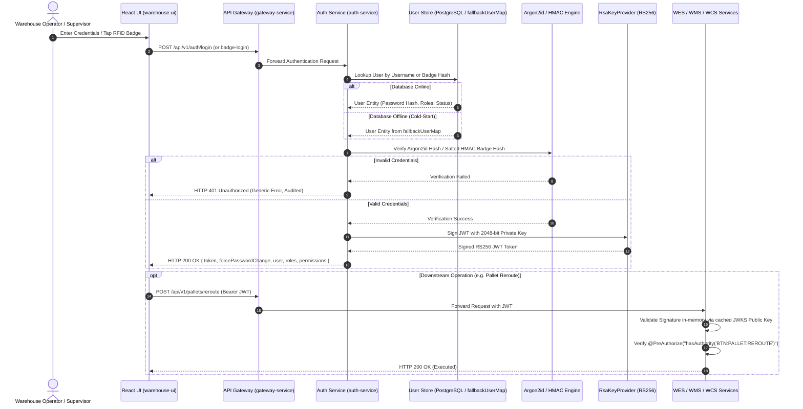

# User Management & Authentication Specification (IEC 62443 Industrial Standard)

**DOCUMENT ID**: SPEC-SEC-002  
**STATUS**: APPROVED / BASELINE  
**MODULE**: `services/auth-service` & `client/warehouse-ui`  
**BASE PACKAGE**: `com.company.warehouse.auth`  
**COMPLIANCE**: IEC 62443-3-3 (FR 1, FR 2, FR 3, FR 6), IEC 62443-4-2, NIST SP 800-63B, OWASP Top 10  
**REFERENCE BASELINE**: Derived from and expanding upon the IDP Industrial Digital Platform Security Architecture  

---

## 1. Executive Summary & Core Objectives

The **User Management & Identity (IAM) Module** (`auth-service`) serves as the authoritative gateway for identity, authentication, token issuance, and granular access control across the warehouse orchestration platform.

### Core Objectives:
1. **Dual-Mode Operational Flexibility**: Serve both air-gapped local warehouses (offline DB, physical RFID/barcode badges, 4-digit PINs) and global enterprises (Single Sign-On via Microsoft Entra ID / Azure AD, Okta, Keycloak) using the **exact same codebase**.
2. **Cold-Start Resilience (`fallbackUserMap`)**: Maintain an in-memory emergency user store to ensure plant supervisors are never locked out during database cold-starts or PostgreSQL maintenance.
3. **Decentralized Microservice Validation (RS256 & JWKS)**: Issue RS256-signed JWTs and expose a public JWKS endpoint (`/.well-known/jwks.json`). Downstream microservices (`wes-service`, `wms-service`, `wcs-service`) validate incoming tokens **100% in-memory locally** without calling `auth-service`.
4. **IEC 62443-4-2 Mandatory Credential Reset**: Default bootstrap credentials (`admin` / `TempIDP@2026!`) force a mandatory password update before granting access to operational dashboards.
5. **Shop-Floor Safety & Four-Eyes Principle (IEC 62443 SR 2.4)**: Safety-critical equipment overrides (e.g. Conveyor E-Stop reset, ASRS manual crane release) require dual-operator confirmation (Operator action + Supervisor badge/PIN verification).
6. **Air-Gapped 100% Offline UI**: The authentication UI uses npm-bundled fonts (`@fontsource/inter`) and pure SVG icons (`lucide-react`) with **zero external CDN requests**.

---

## 2. System Architecture & Technical Flow



---

## 3. Credential Security & Cryptographic Standards

| Mechanism | Technology | Implementation Details |
| :--- | :--- | :--- |
| **Password Hashing** | **Argon2id** | `m=65536, t=3, p=4`. Memory-hard hashing algorithm resistant to GPU/ASIC brute-force attacks. |
| **Terminal PIN Hashing** | **Argon2id** | Per-user salted Argon2id hash. Max 3 failed attempts before temporary account lockout. |
| **Operator RFID Badges** | **Salted HMAC-SHA256** | Physical badge serials (MIFARE UID) are **never** stored in plaintext. They are salted and hashed into `badge_hash`. |
| **Token Asymmetric Signing** | **RS256 (RSA 2048-bit)** | Signed exclusively by `auth-service` via private key. Verified by downstream services via public JWKS. |
| **Data-at-Rest Encryption** | **AES-256-GCM** | Third-party SSO secrets and keystore credentials encrypted at rest in PostgreSQL. |
| **Client Token Storage** | **In-Memory + httpOnly** | Zero tokens in `localStorage` / `sessionStorage`. Stored in React memory with `httpOnly, Secure, SameSite=Strict` refresh cookies. |

---

## 4. Dual-Mode Deployment Configurations

### 4.1. Mode A: Local Industrial Deployment (Air-Gapped)
Configured in `application.yml` for isolated manufacturing plants:

```yaml
warehouse:
  auth:
    mode: LOCAL # Options: LOCAL | SSO | HYBRID
    local:
      password-policy:
        min-length: 8
        require-special-char: true
        require-digit: true
      enable-badge-login: true
      enable-pin-unlock: true
      lockout:
        max-failed-attempts: 5
        lockout-duration-minutes: 15
```

### 4.2. Mode B: Enterprise SSO Deployment (Corporate IT Federation)
Configured for multi-facility corporate enterprises connecting to Microsoft Entra ID or Okta:

```yaml
warehouse:
  auth:
    mode: SSO
    sso:
      provider: AZURE_AD # AZURE_AD | OKTA | KEYCLOAK
      issuer-uri: "https://login.microsoftonline.com/${AZURE_TENANT_ID}/v2.0"
      client-id: "${AZURE_CLIENT_ID}"
      client-secret: "${AZURE_CLIENT_SECRET}"
      group-role-mapping:
        "AD-Warehouse-Supervisors": "ROLE_SUPERVISOR"
        "AD-Forklift-Operators": "ROLE_OPERATOR"
        "AD-Plant-Engineers": "ROLE_MAINTENANCE"
      jit-provisioning: true
```

---

## 5. IEC 62443 Compliance Controls

### 5.1. Mandatory First-Time Password Change (IEC 62443-4-2)
Default bootstrap accounts (`admin` / `TempIDP@2026!`) are created with `forcePasswordChange = true`:
1. Login returns `forcePasswordChange: true`.
2. React UI renders an un-dismissible `<PasswordChangeModal>`.
3. Calls `POST /api/v1/auth/change-password` with new password.
4. Only upon successful reset is `forcePasswordChange` flipped to `false` and full access unlocked.

### 5.2. Granular Permission Taxonomy (RBAC + PBAC / FR 2)
Permissions are categorized into three operational risk tiers:

```text
[TIER 1: MONITORING / READ-ONLY]
├── PAGE:DASHBOARD:VIEW
├── PAGE:PALLET:VIEW
└── PAGE:CONVEYOR:VIEW

[TIER 2: STANDARD OPERATIONAL]
├── BTN:PALLET:REROUTE
├── BTN:BIN:ASSIGN
└── API:INVENTORY:ADJUST

[TIER 3: SAFETY-CRITICAL (Requires Four-Eyes Dual Approval!)]
├── BTN:CONVEYOR:E_STOP_RESET
├── BTN:ASRS:MANUAL_EJECT
└── BTN:SAFETY_ZONE:BYPASS
```

### 5.3. Four-Eyes Principle / Dual Approval (IEC 62443 SR 2.4)
Dangerous equipment operations require confirmation from a second authorized supervisor:
1. Operator triggers a `SAFETY_CRITICAL` button.
2. `<DualApprovalModal>` opens, prompting for a Shift Supervisor badge scan or PIN.
3. Payload sent to backend includes `operatorToken` + `supervisorBadgeHash` + `reason`.
4. Backend verifies Supervisor clearance, executes hardware command, and appends a non-repudiable audit event to `dual_approval_audit`.

### 5.4. Terminal Inactivity Watchdog (IEC 62443 SR 2.11)
* Rugged forklift tablets and touchscreen terminals track touch/mouse/keyboard idle time (`useInactivityLock`).
* After **5 minutes** of inactivity, the screen enters a secure lock state, masking active operational data.
* Instant unlock via **RFID badge tap** or **4-digit PIN** restores the operator's active screen without loss of form state.

---

## 6. Public JWKS Specification

Downstream microservices configure Spring Security OAuth2 Resource Server pointing to the JWKS endpoint:

```text
GET /api/v1/auth/.well-known/jwks.json
```

### Sample JWKS Response:
```json
{
  "keys": [
    {
      "kty": "RSA",
      "e": "AQAB",
      "use": "sig",
      "kid": "warehouse-auth-key-2026",
      "alg": "RS256",
      "n": "u1v8...[2048-bit modulus]..."
    }
  ]
}
```

---

## 7. REST API Endpoints Specification

| Method | Path | Description | Authorization |
| :--- | :--- | :--- | :--- |
| `POST` | `/api/v1/auth/login` | Standard username & password login | Public |
| `POST` | `/api/v1/auth/badge-login` | Quick shop-floor RFID/barcode badge tap | Public (Local Floor Subnet) |
| `POST` | `/api/v1/auth/pin-unlock` | 4-digit PIN session unlock | Authenticated Terminal Session |
| `POST` | `/api/v1/auth/change-password` | Mandatory initial or voluntary password reset | Authenticated (`forcePasswordChange` scope) |
| `GET` | `/api/v1/auth/.well-known/jwks.json`| Public RSA verification keys | Public |
| `POST` | `/api/v1/auth/dual-approval/verify` | Validates secondary supervisor authorization | `ROLE_OPERATOR` |
| `GET` | `/api/v1/auth/users` | User management list | `hasAuthority('PAGE:USERS:MANAGE')` |
| `POST` | `/api/v1/auth/users` | Provision new user & pair operator badge | `hasAuthority('API:USER:CREATE')` |

---

## 8. Frontend Component Hierarchy (`client/warehouse-ui`)

All components reside under [`client/warehouse-ui/src/`](file:///c:/Users/Windows10/Documents/GitHub/Warehouse_orchestrator/client/warehouse-ui/src):

```text
src/
├── components/security/
│   ├── IecPageGuard.tsx            # Route guard checking tokens (PAGE:ASRS:VIEW)
│   ├── IecButton.tsx               # Button evaluating permissions & triggering dual approval
│   ├── DualApprovalModal.tsx       # Supervisor badge/PIN verification modal
│   └── InactivityLockScreen.tsx    # Masked idle screen for shop-floor tablets
├── features/auth/
│   ├── components/
│   │   ├── LoginPage.tsx           # Glassmorphism dark-theme login (Password, Badge, SSO)
│   │   └── PasswordChangeModal.tsx # Mandatory first-time reset modal
│   ├── hooks/
│   │   ├── useAuth.ts              # Core auth state & login/logout actions
│   │   └── useIecSecurity.ts       # Granular hasPermission / hasRole checks
│   └── types/
│       └── auth.types.ts           # TokenPayload, UserProfile, PermissionKey
└── hooks/
    └── useInactivityLock.ts        # 5-minute touchscreen inactivity timer
```

---

## 9. Database & Schema Configuration (`warehouse_db.auth`)

### 9.1. Multi-Schema Topology & Connection Scoping
Under the **Single Database with Multiple Schemas** topology, the `auth-service` connects exclusively to the `auth` schema inside `warehouse_db`:

```yaml
# services/auth-service/src/main/resources/application.yml
spring:
  datasource:
    url: jdbc:postgresql://${DB_HOST:localhost}:${DB_PORT:5432}/warehouse_db?currentSchema=auth
    username: ${DB_USERNAME:auth_user}
    password: ${DB_PASSWORD:auth_service_secret_2026}
    driver-class-name: org.postgresql.Driver
    hikari:
      pool-name: AuthHikariPool
      maximum-pool-size: 15          # Kept lean for on-premises bare metal
      minimum-idle: 5
      idle-timeout: 300000           # 5 minutes
      connection-timeout: 20000      # 20 seconds
      max-lifetime: 1800000          # 30 minutes

  jpa:
    open-in-view: false
    show-sql: false
    properties:
      hibernate:
        default_schema: auth         # Enforces all JPA queries target auth.*
        format_sql: false
        jdbc:
          time_zone: UTC
    hibernate:
      ddl-auto: validate             # Strictly validate schema managed by Flyway

  flyway:
    enabled: true
    schemas: auth                    # Migrations isolated to auth schema
    default-schema: auth
    table: flyway_schema_history     # auth.flyway_schema_history
    locations: classpath:db/migration
    baseline-on-migrate: true
```

---

### 9.2. Schema Data Dictionary (`auth.*`)

> [!NOTE]
> For the exhaustive column-by-column data dictionary, check constraints, default expressions, and ER diagram, refer to the dedicated specification:
> **[docs/database/USER_MANAGEMENT_TABLE_SPECIFICATION.md](file:///c:/Users/Windows10/Documents/GitHub/Warehouse_orchestrator/docs/database/USER_MANAGEMENT_TABLE_SPECIFICATION.md)**.

The `auth` schema defines **10 core tables**:

#### Table 1: `auth.users`
| Column | Type | Constraints | Description |
| :--- | :--- | :--- | :--- |
| `user_id` | `UUID` | `PRIMARY KEY DEFAULT gen_random_uuid()` | Immutable unique identifier |
| `username` | `VARCHAR(64)` | `UNIQUE NOT NULL` | Login username (case-insensitive) |
| `password_hash` | `VARCHAR(255)`| `NULL` | Argon2id memory-hard hash (null for pure SSO) |
| `full_name` | `VARCHAR(128)`| `NOT NULL` | Operator / Supervisor display name |
| `email` | `VARCHAR(128)`| `NULL` | Corporate email address |
| `operator_badge_id`| `VARCHAR(64)` | `UNIQUE NULL` | Physical RFID/Barcode badge serial |
| `badge_hash` | `VARCHAR(255)`| `NULL` | Salted HMAC-SHA256 hash for quick tap match |
| `pin_hash` | `VARCHAR(255)`| `NULL` | Argon2id hash for 4-digit quick terminal unlock |
| `sso_provider` | `VARCHAR(32)` | `NOT NULL DEFAULT 'LOCAL'` | `LOCAL`, `AZURE_AD`, `OKTA`, `KEYCLOAK` |
| `sso_external_id`| `VARCHAR(128)`| `NULL` | External IDP Subject/Object GUID |
| `status` | `VARCHAR(32)` | `NOT NULL DEFAULT 'ACTIVE'` | `ACTIVE`, `LOCKED`, `SUSPENDED` |
| `force_password_change`| `BOOLEAN`| `NOT NULL DEFAULT FALSE` | IEC 62443 mandatory first-login reset flag |
| `failed_login_attempts`| `INT` | `NOT NULL DEFAULT 0` | Lockout triggered after 5 consecutive failures |
| `locked_until` | `TIMESTAMPTZ` | `NULL` | Timestamp until account is automatically unlocked |
| `version` | `INT` | `NOT NULL DEFAULT 0` | JPA `@Version` optimistic locking |
| `created_at` / `updated_at` | `TIMESTAMPTZ` | `NOT NULL DEFAULT NOW()` | UTC audit timestamps |

#### Table 2: `auth.roles`
| Column | Type | Constraints | Description |
| :--- | :--- | :--- | :--- |
| `role_id` | `UUID` | `PRIMARY KEY DEFAULT gen_random_uuid()` | Role ID |
| `role_name` | `VARCHAR(64)` | `UNIQUE NOT NULL` | `ROLE_ADMIN`, `ROLE_SUPERVISOR`, `ROLE_OPERATOR`, `ROLE_MAINTENANCE` |
| `description` | `VARCHAR(255)`| `NULL` | Human-readable role description |
| `is_system_role` | `BOOLEAN` | `NOT NULL DEFAULT FALSE` | Prevents deletion of core system roles |

#### Table 3: `auth.permissions` (IEC 62443)
| Column | Type | Constraints | Description |
| :--- | :--- | :--- | :--- |
| `permission_id` | `UUID` | `PRIMARY KEY DEFAULT gen_random_uuid()` | Permission ID |
| `permission_code`| `VARCHAR(64)` | `UNIQUE NOT NULL` | e.g. `PAGE:ASRS:VIEW`, `BTN:CONVEYOR:E_STOP_RESET` |
| `category` | `VARCHAR(32)` | `NOT NULL` | `UI_PAGE`, `UI_BUTTON`, `API_MUTATION` |
| `risk_tier` | `VARCHAR(32)` | `NOT NULL DEFAULT 'STANDARD'` | `MONITORING`, `STANDARD`, `SAFETY_CRITICAL` |
| `requires_dual_approval`| `BOOLEAN`| `NOT NULL DEFAULT FALSE` | Flag for IEC 62443 SR 2.4 Four-Eyes Principle |

#### Table 4: `auth.role_permissions` (Junction Table)
| Column | Type | Constraints |
| :--- | :--- | :--- |
| `role_id` | `UUID` | `REFERENCES auth.roles(role_id) ON DELETE CASCADE` |
| `permission_id` | `UUID` | `REFERENCES auth.permissions(permission_id) ON DELETE CASCADE` |
| **PRIMARY KEY** | `(role_id, permission_id)` | Composite primary key |

#### Table 5: `auth.user_roles` (Junction Table)
| Column | Type | Constraints |
| :--- | :--- | :--- |
| `user_id` | `UUID` | `REFERENCES auth.users(user_id) ON DELETE CASCADE` |
| `role_id` | `UUID` | `REFERENCES auth.roles(role_id) ON DELETE CASCADE` |
| **PRIMARY KEY** | `(user_id, role_id)` | Composite primary key |

#### Table 6: `auth.user_facility_assignments` (IDOR Prevention)
| Column | Type | Constraints | Description |
| :--- | :--- | :--- | :--- |
| `id` | `UUID` | `PRIMARY KEY DEFAULT gen_random_uuid()` | Assignment ID |
| `user_id` | `UUID` | `REFERENCES auth.users(user_id) ON DELETE CASCADE` | Scoped User |
| `facility_id` | `VARCHAR(64)` | `NOT NULL` | Scoped Facility (e.g. `FAC-BLR-01`) |
| `default_zone` | `VARCHAR(32)` | `NULL` | Assigned Zone (e.g. `INBOUND_STAGING`) |
| `shift_code` | `VARCHAR(32)` | `NULL` | Active Shift (e.g. `SHIFT_A_MORNING`) |
| **UNIQUE** | `(user_id, facility_id)` | One active assignment record per facility |

#### Table 7: `auth.dual_approval_audit` (Four-Eyes Trail / IEC 62443 SR 2.4)
| Column | Type | Constraints | Description |
| :--- | :--- | :--- | :--- |
| `approval_id` | `UUID` | `PRIMARY KEY DEFAULT gen_random_uuid()` | Approval Record ID |
| `action_name` | `VARCHAR(128)`| `NOT NULL` | e.g. `CONVEYOR_ESTOP_RESET` |
| `target_resource`| `VARCHAR(128)`| `NOT NULL` | e.g. `CV-LINE-04` |
| `operator_user_id`| `UUID` | `NOT NULL REFERENCES auth.users(user_id)` | Initiating Operator |
| `supervisor_user_id`| `UUID` | `NOT NULL REFERENCES auth.users(user_id)` | Authorizing Shift Supervisor |
| `reason` | `VARCHAR(255)`| `NOT NULL` | Mandatory reason for override |
| `terminal_ip` | `VARCHAR(45)` | `NOT NULL` | Originating terminal IP |
| `approved_at` | `TIMESTAMPTZ` | `NOT NULL DEFAULT NOW()` | Immutable UTC timestamp |

---

### 9.3. High-Speed Indexing Strategy

```sql
-- 1. Case-insensitive fast username lookup (< 1ms)
CREATE UNIQUE INDEX idx_users_username_lower ON auth.users (LOWER(username));

-- 2. Partial index for physical RFID badge scans (< 2ms)
CREATE INDEX idx_users_badge_hash ON auth.users (badge_hash) WHERE badge_hash IS NOT NULL;

-- 3. Partial index for enterprise SSO GUID lookup
CREATE INDEX idx_users_sso_lookup ON auth.users (sso_provider, sso_external_id) WHERE sso_external_id IS NOT NULL;

-- 4. Audit query indexing (time-ordered by resource)
CREATE INDEX idx_dual_approval_resource_time ON auth.dual_approval_audit (target_resource, approved_at DESC);
```

---

### 9.4. Initial Bootstrap Seed Data (Flyway V1 Baseline)
When the schema is initialized:
1. **System Roles**: `ROLE_ADMIN`, `ROLE_SUPERVISOR`, `ROLE_OPERATOR`, `ROLE_MAINTENANCE`.
2. **Default Admin Bootstrap User**:
   * Username: `admin`
   * Password: `TempIDP@2026!` (Argon2id hashed)
   * **`force_password_change = TRUE`** (Strict IEC 62443 compliance: UI forces immediate password update on first login before granting operational access).
3. **Seed Permissions**: Standard `PAGE:*`, `BTN:*`, and `API:*` keys mapped to roles.

