# Pallet Journey & Travel Control Strategy Specification

**Document Version**: 1.0.0  
**Status**: Living Architecture & Strategy Document  
**Domain**: WES (Warehouse Execution System), WCS (Warehouse Control System), Fleet Manager (AMR/AGV)  
**Target RDBMS**: PostgreSQL 16+ (Multi-Schema `wes`, `wcs`, `fleet`)  
**Protocols**: gRPC over HTTP/2, VDA 5050 (MQTT 5.0), OPC UA (IEC 62541)  

---

## 1. Executive Summary & Objective

This document defines the operational and technical strategy for executing and controlling end-to-end **Pallet Journeys** across multi-modal warehouse automation tiers:
1. **Conveyor Transit**: Point-to-point transport across networked conveyor segments, diverters, photo-eye gates, and checkweighers.
2. **Dynamic Buffering & Staging**: Decoupled parking of pallets into buffer lanes or staging bays when downstream resources (conveyors, cranes, AMRs) face congestion, maintenance, or resource starvation.
3. **AMR Zone-to-Zone Transfer**: Robotic handoff and dispatch across physical warehouse zones adhering to the **VDA 5050** standard.
4. **Resource-Driven Journey Restart**: Event-driven and liveness-polled wakeup of buffered pallets once downstream capacity or transport vehicles become available.
5. **Quality, Safety & Tolerance Gatekeeping**: Continuous inspection of weight, profile contours, allergens, temperatures, and QA status against the **Pallet Handling Strategy** master recipe.

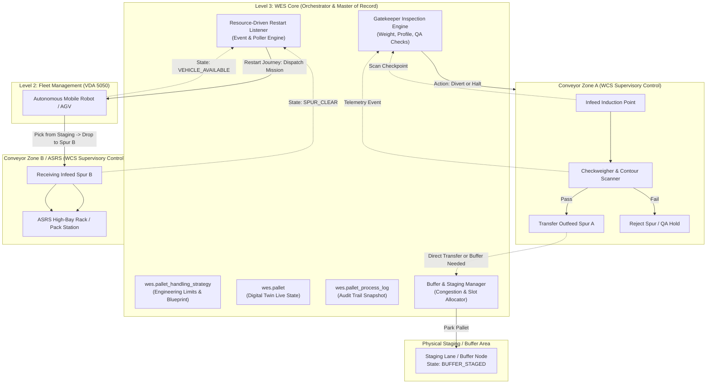

---

## 2. Master Data Foundation & Database Review

The strategy builds directly upon the existing `wes` schema migrations ([V1__create_master_data_and_pallet_tables.sql](file:///c:/Users/Windows10/Documents/GitHub/Warehouse_orchestrator/services/wes-service/src/main/resources/db/migration/V1__create_master_data_and_pallet_tables.sql) through `V5`):

### 2.1. Existing Schema Utilization

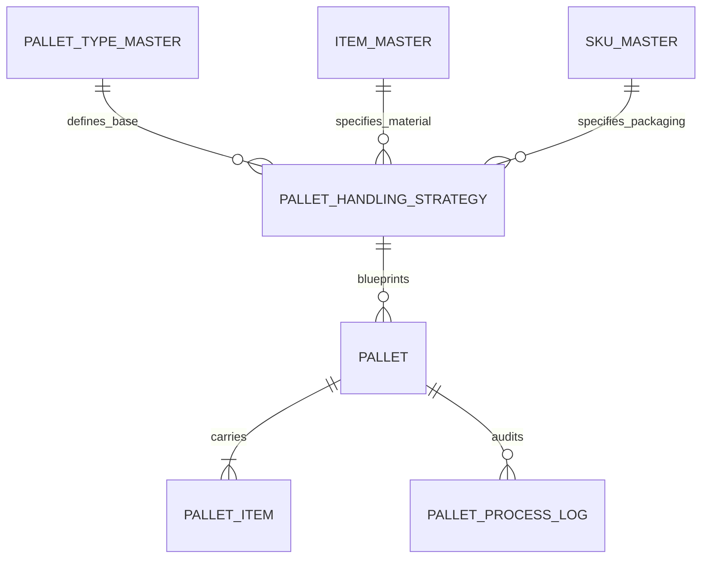

1. **`wes.pallet_type_master`**:
   * *Fields*: `tare_weight_kg`, `length_mm`, `width_mm`, `height_mm`, `max_payload_kg`.
   * *Role*: Base carrier safety limits for conveyor physical track clearance and AMR deck capacity.
2. **`wes.item_master` & `wes.sku_master`**:
   * *Fields*: `item_type`, `allow_mixed_pallet`, `mixed_pallet_group`, `units_per_package`, `custom_attributes`.
   * *Role*: Product compatibility (e.g. food allergen segregation, temperature requirements) and packaging unit specifications.
3. **`wes.pallet_handling_strategy`** (*The 3-Way Master Blueprint*):
   * *Fields*: `full_layer_qty` (TI), `max_layers` (HI), `standard_package_count`, `expected_total_weight_kg`, `expected_height_mm`, `custom_attributes` (`load_bearing`, `stretch_wrap_tension`, `slip_sheet_required`).
   * *Role*: Definitive engineering baseline for all gatekeeper validation checks.
4. **`wes.pallet`** (*The Live Digital Twin*):
   * *Fields*: `pallet_lpn`, `load_type`, `status`, `current_location`, `actual_weight_kg`, `telemetry` JSONB, `custom_attributes` JSONB, `version`.
   * *Role*: Master operational record of location, status, and state progression. Optimistic locking via `version` prevents race conditions.
5. **`wes.pallet_process_log`** (*Append-Only Audit Timeline*):
   * *Fields*: `pallet_id`, `pallet_lpn`, `process_stage`, `location`, `status`, `properties_snapshot` JSONB, `notes`, `created_at`.
   * *Role*: Immutable log recording every handoff, checkpoint inspection result, buffering event, and restart timestamp.

---

## 3. Pallet State Machine & Lifecycle Transitions

To handle real-world physical disruptions, queuing, and restarts, each pallet follows a strictly governed state machine:

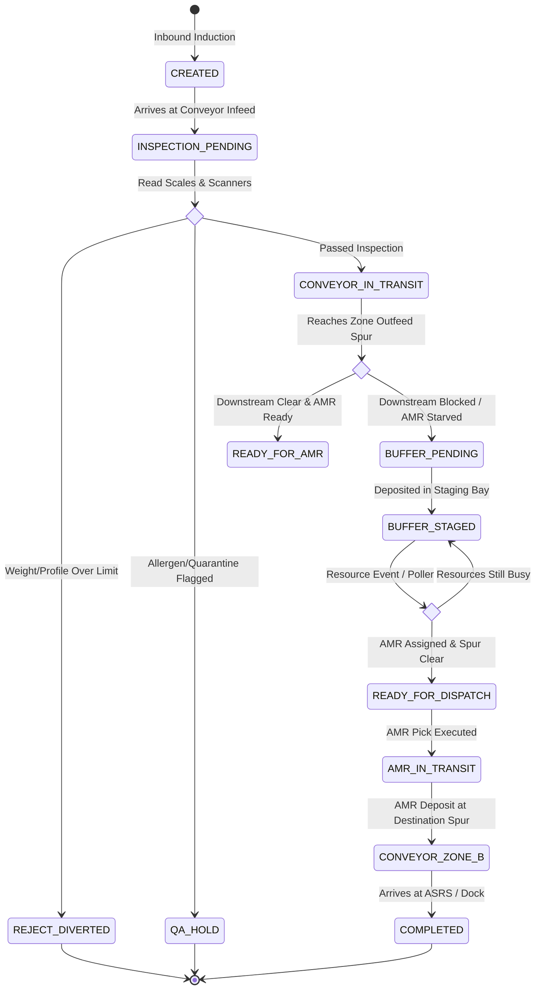

### State Definitions

| State Code | Category | Operational Meaning |
| :--- | :--- | :--- |
| `CREATED` | Inbound | Pallet LPN registered in WES; awaiting physical induction. |
| `INSPECTION_PENDING` | Active Transit | Pallet positioned at optical contour scanner or checkweigher. |
| `CONVEYOR_IN_TRANSIT` | Active Transit | Moving automatically on conveyor driven by WCS PLC logic. |
| `REJECT_DIVERTED` | Exception | Failed contour or scale check; diverted to physical rework/reject lane. |
| `QA_HOLD` | Exception | Inventory held by QA policy; diverted to inspection spur. |
| `BUFFER_PENDING` | Transit Decoupling | Downstream bottleneck detected; assigned a staging buffer slot. |
| `BUFFER_STAGED` | Parked | Resting safely in a buffer location; waiting for downstream resources. |
| `READY_FOR_DISPATCH` | Restart | Downstream path is cleared and vehicle is allocated; ready for pickup. |
| `AMR_IN_TRANSIT` | Active Transit | Transported by AMR across facility zones under VDA 5050 control. |
| `CONVEYOR_ZONE_B` | Active Transit | Deposited at Zone B receiving spur; resuming conveyor motion. |
| `COMPLETED` | Terminal | Successfully deposited at final destination (ASRS, Pick Station, or Dock). |

---

## 4. Checkpoint Gatekeeper: Checks & Actions Engine

At every automated decision point (photo-eyes, RFID portals, scales, contour gates), WES evaluates checks against the `pallet_handling_strategy` and executes discrete actions.

### 4.1. The 4 Core Checks

```
┌────────────────────────────────────────────────────────────────────────┐
│                   CHECKPOINT VALIDATION PIPELINE                       │
├───────────────────┬───────────────────┬────────────────────────────────┤
│ 1. Weight Check   │ Actual vs Target  │ |actual - expected| <= tol_kg  │
├───────────────────┼───────────────────┼────────────────────────────────┤
│ 2. Contour Check  │ Height & Overhang │ height <= max_h && overhang=0  │
├───────────────────┼───────────────────┼────────────────────────────────┤
│ 3. QA / Hazard    │ Items & Temp      │ QA=RELEASED && Segregation OK  │
├───────────────────┼───────────────────┼────────────────────────────────┤
│ 4. Capacity Check │ Downstream Route  │ Zone Occupancy < Max Limit     │
└───────────────────┴───────────────────┴────────────────────────────────┘
```

1. **Checkweigher Tolerance Check**:
   $$\Delta W = | \text{pallet.actual\_weight\_kg} - \text{strategy.expected\_total\_weight\_kg} |$$
   $$\text{Result} = \begin{cases} \text{PASS}, & \Delta W \le (\text{expected\_weight} \times \text{tolerance\_pct}) \\ \text{FAIL}, & \text{otherwise} \end{cases}$$
2. **Dimensional / Contour Check**:
   Optical scanners measure height, length, width, and pallet overhang:
   $$\text{height\_measured} \le \text{strategy.expected\_height\_mm} + \delta_{\text{clearance}}$$
   $$\text{overhang\_mm} \le \text{pallet\_type.max\_overhang\_mm}$$
3. **Product Compatibility & QA Check**:
   * Inspects `wes.pallet_item` for `expiry_date > NOW()` and `qc_status == 'RELEASED'`.
   * Validates `item_master.mixed_pallet_group` against other loads if mixed.
   * Validates temperature/chemical compatibility against downstream zone rules.
4. **Downstream Resource Capacity Check**:
   * Verifies destination spur occupancy $< \text{capacity}$.
   * Verifies AMR availability ($N_{\text{idle\_amr}} \ge 1$).

### 4.2. Actions Triggered

| Check Outcome | Action Name | Execution Detail |
| :--- | :--- | :--- |
| **All Checks PASS & Downstream Free** | `ACTION_PROCEED_DIRECT` | Command WCS to maintain main line divert toward Outfeed Spur A. |
| **Checks PASS & Downstream Busy** | `ACTION_BUFFER_TO_STAGING` | Command WCS to divert pallet into Staging Buffer Lane; set `BUFFER_STAGED`. |
| **Weight or Contour FAIL** | `ACTION_DIVERT_REJECT` | Command WCS divert to rework line; set `REJECT_DIVERTED`; trigger operator alarm. |
| **QA / Hazard Quarantine** | `ACTION_QA_HOLD` | Route to QA Quarantine spur; set `QA_HOLD`; lock inventory reservations. |

---

## 5. Buffer Management & Resource-Driven Restart Strategy

### 5.1. Why Buffering is Critical
In automated facilities, conveyor lines must **never experience back-pressure deadlocks**. If Zone B or the ASRS infeed is congested, pallets upstream must be systematically shunted to buffer staging spots.

```
Conveyor Zone A ──► [Divert Decision] ──┬──(Direct Clear)──► Spur A ──► AMR ──► Zone B
                                         │
                                         └──(Congested)─────► Staging Buffer (Parked)
                                                                    │
                                                               (WES Wakeup)
                                                                    ▼
                                                                AMR Pick
```

### 5.2. Facility Node Model
Staging areas and conveyor spurs are modeled as topology nodes in WES:
* **Node Types**: `CONVEYOR_INDUCTION`, `CONVEYOR_SPUR`, `STAGING_BUFFER`, `ASRS_INFEED`.
* **Attributes**: `zone_code`, `max_capacity`, `current_occupancy`, `is_blocked`.

### 5.3. Dual Wakeup Engine (Event-Driven + Liveness Poller)

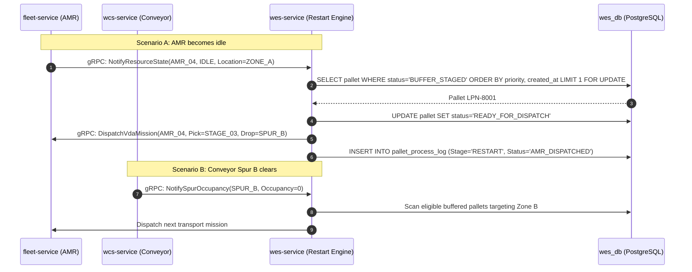

1. **Event-Driven Wakeup**:
   * Subscribed to gRPC events from `fleet-service` (`AMR_MISSION_COMPLETED`, `VEHICLE_AVAILABLE`) and `wcs-service` (`SPUR_CLEARED`).
   * Evaluates buffered candidates immediately with **< 10ms latency**.
2. **Liveness Poller (Safety Fallback)**:
   * A Spring `@Scheduled(fixedDelay = 5000)` worker scans for orphaned `BUFFER_STAGED` pallets where resources are available but no event was fired.
   * Employs PostgreSQL `FOR UPDATE SKIP LOCKED` to support multi-instance WES deployments without double-dispatch.

---

## 6. Proposed Schema Extensions (Migration V6)

To fully implement journey legs, facility nodes, and multi-modal routing, the following Flyway migration `V6` is specified:

```sql
-- ============================================================================
-- Flyway Migration V6: Multi-Modal Journey Legs, Facility Nodes & Transport Tasks
-- ============================================================================

-- 1. Facility Topology Nodes (Spurs, Staging Bays, ASRS infeed points)
CREATE TABLE IF NOT EXISTS wes.facility_node (
    node_id VARCHAR(50) PRIMARY KEY,              -- 'CONV_SPUR_A1', 'STAGE_BUF_01', 'CONV_IN_B2'
    zone_code VARCHAR(30) NOT NULL,               -- 'ZONE_A', 'STAGING_AREA', 'ZONE_B'
    node_type VARCHAR(30) NOT NULL,               -- 'CONVEYOR_SPUR', 'STAGING_BUFFER', 'DROP_POINT'
    max_capacity INT NOT NULL DEFAULT 1,
    current_occupancy INT NOT NULL DEFAULT 0,
    is_blocked BOOLEAN NOT NULL DEFAULT FALSE,
    coordinates JSONB DEFAULT '{"x": 0.0, "y": 0.0, "z": 0.0}'::jsonb,
    version INT NOT NULL DEFAULT 0,
    created_at TIMESTAMPTZ NOT NULL DEFAULT NOW(),
    updated_at TIMESTAMPTZ NOT NULL DEFAULT NOW()
);

-- 2. Master Pallet Journey
CREATE TABLE IF NOT EXISTS wes.pallet_journey (
    id UUID PRIMARY KEY DEFAULT gen_random_uuid(),
    pallet_id UUID NOT NULL REFERENCES wes.pallet(id) ON DELETE CASCADE,
    pallet_lpn VARCHAR(60) NOT NULL,
    origin_node_id VARCHAR(50) NOT NULL REFERENCES wes.facility_node(node_id),
    destination_node_id VARCHAR(50) NOT NULL REFERENCES wes.facility_node(node_id),
    current_leg_sequence INT NOT NULL DEFAULT 1,
    journey_status VARCHAR(30) NOT NULL DEFAULT 'ACTIVE', -- 'ACTIVE', 'BUFFERED', 'COMPLETED', 'FAILED'
    priority INT NOT NULL DEFAULT 5,
    version INT NOT NULL DEFAULT 0,
    created_at TIMESTAMPTZ NOT NULL DEFAULT NOW(),
    updated_at TIMESTAMPTZ NOT NULL DEFAULT NOW()
);

-- 3. Discrete Journey Legs (Conveyor leg, AMR leg, Buffer leg)
CREATE TABLE IF NOT EXISTS wes.journey_leg (
    id UUID PRIMARY KEY DEFAULT gen_random_uuid(),
    journey_id UUID NOT NULL REFERENCES wes.pallet_journey(id) ON DELETE CASCADE,
    leg_sequence INT NOT NULL,                    -- 1, 2, 3
    leg_type VARCHAR(30) NOT NULL,                -- 'CONVEYOR_TRANSIT', 'BUFFER_HOLD', 'AMR_TRANSFER'
    from_node_id VARCHAR(50) NOT NULL REFERENCES wes.facility_node(node_id),
    to_node_id VARCHAR(50) NOT NULL REFERENCES wes.facility_node(node_id),
    assigned_carrier_id VARCHAR(60),              -- Conveyor line ID or AMR Vehicle serial
    status VARCHAR(30) NOT NULL DEFAULT 'PENDING',-- 'PENDING', 'RUNNING', 'WAITING_RESOURCE', 'COMPLETED', 'SKIPPED'
    version INT NOT NULL DEFAULT 0,
    started_at TIMESTAMPTZ,
    completed_at TIMESTAMPTZ
);

-- Indexes for ultra-low latency routing and poller lookups
CREATE INDEX IF NOT EXISTS idx_journey_pallet_id ON wes.pallet_journey(pallet_id);
CREATE INDEX IF NOT EXISTS idx_journey_status_priority ON wes.pallet_journey(journey_status, priority DESC);
CREATE INDEX IF NOT EXISTS idx_journey_leg_lookup ON wes.journey_leg(journey_id, leg_sequence);
```

---

## 7. gRPC Inter-Service Communication Contracts

All inter-tier commands execute via low-latency Protobuf definitions in `common/common-grpc`:

```protobuf
syntax = "proto3";

package com.company.warehouse.grpc.v1;
option java_multiple_files = true;
option java_package = "com.company.warehouse.grpc.v1";

// 1. Conveyor Gatekeeper Service (WES <-> WCS)
service ConveyorGatekeeperService {
    rpc EvaluateInspection (ConveyorScanFrame) returns (InspectionDecision);
    rpc ConfirmDivertExecuted (DivertAckEvent) returns (GenericAck);
}

message ConveyorScanFrame {
    string pallet_lpn = 1;
    string checkpoint_node_id = 2;
    double measured_weight_kg = 3;
    double measured_height_mm = 4;
    double measured_width_mm = 5;
    string rfid_tag = 6;
}

message InspectionDecision {
    enum Action {
        PROCEED_MAIN_LINE = 0;
        DIVERT_TO_BUFFER = 1;
        DIVERT_TO_REJECT = 2;
        DIVERT_TO_QA_HOLD = 3;
    }
    Action action = 1;
    string target_node_id = 2;
    string reason = 3;
}

// 2. AMR Fleet Mission Service (WES <-> Fleet Manager)
service FleetOrchestrationService {
    rpc RequestAmrTransfer (AmrMissionRequest) returns (AmrMissionResponse);
    rpc NotifyResourceState (ResourceStateUpdate) returns (GenericAck);
}

message AmrMissionRequest {
    string pallet_lpn = 1;
    string pick_node_id = 2;
    string drop_node_id = 3;
    int32 priority = 4;
    double gross_weight_kg = 5;
    string pallet_type_code = 6;
}

message AmrMissionResponse {
    bool accepted = 1;
    string mission_id = 2;
    string assigned_vehicle_id = 3;
    string failure_reason = 4;
}

message ResourceStateUpdate {
    string resource_id = 1;
    string resource_type = 2; // 'AMR', 'CONVEYOR_SPUR', 'CRANE'
    string operational_status = 3; // 'IDLE', 'BUSY', 'FAULT', 'OFFLINE'
    string current_zone = 4;
}

message GenericAck {
    bool success = 1;
    string message = 2;
}
```

---

## 8. Strategy Review & Continuous Update Workflow

This document serves as the **living baseline specification**. As the system evolves through implementation, review updates must follow these criteria:

1. **Physical Equipment Calibration**: Adjust tolerance formulas as new checkweighers or SICK/Cognex contour scanners are integrated.
2. **Buffer Allocation Optimization**: Review buffer capacity thresholds and FIFO vs. priority dispatch weights as warehouse wave profiles change.
3. **Simulation & Dry-Run Validation**: Validate edge cases (e.g. simultaneous AMR battery low + Conveyor Zone B jam) in the simulation test suite before on-site commissioning.
4. **Audit Log Retention**: Review `wes.pallet_process_log` archiving policies to meet customer traceability regulations (e.g. 3-year audit retention).

---

## 9. Practical Shop-Floor Problems & Industrial Failure Modes

Real-world automated warehouses operate under harsh, chaotic conditions. An orchestration system that only accounts for "happy path" routing will suffer system-wide halts within hours of commissioning.

```
┌─────────────────────────────────────────────────────────────────────────────┐
│                    REAL-WORLD FAILURE TAXONOMY                              │
├──────────────────────────┬──────────────────────────┬───────────────────────┤
│ Mechanical & Sensor      │ Fleet & Robotics         │ Human & Operational   │
├──────────────────────────┼──────────────────────────┼───────────────────────┤
│ • Scanner No-Read        │ • Battery Depletion      │ • Manual Forklift Move│
│ • Flapping Film Trigger  │ • Path Obstacle Stalling │ • Pallet Misplacement │
│ • Conveyor Motor Fault   │ • Lift Mechanism Failure │ • Barcode Swap Fraud  │
│ • Spur Back-Pressure Jam │ • VDA 5050 Desync        │ • Emergency E-Stop    │
└──────────────────────────┴──────────────────────────┴───────────────────────┘
```

### 9.1. Sensor Misreads, Blind Spots & Barcode "No-Reads"
* **The Problem**: Labels get smudged, torn, or rotated away from fixed omni-directional scanners on the conveyor.
* **Orchestrator Defense**:
  1. **Secondary Read via RFID**: Read the secondary `telemetry.rfid_epc` if barcode scanner yields `NO_READ`.
  2. **Exception Divert Spur**: If both fail, the WCS diverts the carrier to a **Manual Identification Spur** (`MANUAL_ID_STATION`) rather than halting the main line.
  3. **WES Operator Assist UI**: The station terminal presents the last 3 suspected pallets inducted in that batch for fast 1-click verification by an operator with a handheld scanner.

### 9.2. False Positive Contour / Dimension Rejections
* **The Problem**: A loose tail of stretch wrap, an open cardboard box flap, or a slightly tilted pallet breaks the optical curtain, causing unwarranted rejects.
* **Orchestrator Defense**:
  * **Configurable Retry / Re-Scan Loop**: If height/contour fails by $< 30\text{mm}$, divert the pallet through an automated **Re-centering / Tamping Station** or a 360-degree re-orientation turntable rather than kicking it out to the human rework area.
  * **Tolerance Grace via Strategy**: `wes.pallet_handling_strategy` allows setting `overhang_tolerance_mm` per SKU packaging type.

### 9.3. Equipment Tripping & Line Jams (Zone Loss)
* **The Problem**: A roller motor overheats or an E-Stop is struck in Conveyor Zone B.
* **Orchestrator Defense**:
  * **Fail-Stop Isolation**: WCS broadcasts `ZONE_FAULT(Zone_B)` via gRPC.
  * **Immediate Upstream Gating**: Conveyor Zone A immediately switches all diverters to **Local Recirculation Loops** or **Staging Buffer Lanes**. Upstream lines remain operational; only traffic targeted for Zone B is buffered.

### 9.4. AMR Fleet Degradation (Low Battery & Obstacle Stalls)
* **The Problem**: An AMR carrying a 1000kg pallet encounters a stationary obstacle in an aisle, or battery drops below critical 15% threshold mid-route.
* **Orchestrator Defense**:
  * **VDA 5050 Mission Abort & Transfer**: The AMR halts safely, raises `driving_state=BLOCKED`, and reports to `fleet-service`.
  * If unresolvable within 60 seconds, WES marks the active journey leg as `AMR_BLOCKED` and sends a distress notification to the floor supervisor tablet.

### 9.5. Shop-Floor Circular Wait Deadlocks
* **The Problem**: Spur 1 has Pallet A waiting for an AMR to take it to Spur 2. Spur 2 has Pallet B waiting for an AMR to take it to Spur 1. Neither can discharge because the drop node is occupied.
* **Orchestrator Defense**:
  * **Virtual Node Reservations**: An AMR mission is **never** dispatched unless the *destination spur is either already empty or guaranteed to be vacant upon arrival*.
  * **Buffer Spillover**: If a deadlock is imminent, WES preemptively evicts one pallet to an intermediate `STAGING_BUFFER` node to break the cycle.

### 9.6. Physical vs. Digital Twin Desynchronization ("Ghost Pallets")
* **The Problem**: A forklift operator manually grabs a pallet off a conveyor buffer without scanning it, or places an unregistered pallet onto an induction line.
* **Orchestrator Defense**:
  * **Photo-Eye Occupancy vs Database Validation**: If a conveyor photo-eye stays blocked for $> 3\text{s}$ but no tracking record exists in `wcs.conveyor_tracking_register`, an `UNEXPECTED_CARRIER` alarm fires immediately.
  * **Heartbeat Verification**: Nodes periodically reconcile their physical sensors with `wes.pallet.current_location`.

---

## 10. Dynamic In-Flight Change of Journey

In production, business requirements change while a pallet is in physical motion.

```mermaid
sequenceDiagram
    autonumber
    participant ERP as Enterprise (SAP EWM)
    participant WES as WES Journey Engine
    participant WCS as Conveyor WCS
    participant Fleet as Fleet AMR Manager
    participant Pallet as Pallet LPN-1002

    Note over Pallet: Pallet traveling along Conveyor Zone A towards ASRS_AISLE_01
    ERP->>WES: gRPC/REST: PutawayTargetChanged(LPN-1002, NewTarget=DOCK_DOOR_04 [URGENT_SHIP])
    WES->>WES: Check Leg In-Flight State
    Note over WES: Leg 1 (Conveyor) is active; Leg 2 (AMR) is pending
    WES->>WES: Invalidate Pending Leg 2 (ASRS)<br/>Generate New Leg 2 (DOCK_04)
    WES->>WCS: UpdateDivertTarget(LPN-1002, NewOutfeed=SPUR_DOCK_TRANSFER)
    WCS-->>WES: DivertTargetUpdatedAck
    WES->>WES: Record Journey Mutation in wes.pallet_process_log
```

### 10.1. Common Triggers for In-Flight Journey Changes
1. **Dynamic Wave Re-Allocation**: SAP/ERP reallocates a pallet from standard storage putaway to immediate cross-docking because an outbound truck has arrived.
2. **Downstream Equipment Failure**: Target ASRS Crane 3 trips a motor circuit breaker; the pallet must be rerouted to ASRS Crane 1 or a floor staging buffer.
3. **Emergency QA Quarantine**: A lab test fails for Batch `#B409`; ERP sends a freeze command. Pallet must immediately divert to `QA_QUARANTINE_LANE`.

### 10.2. In-Flight Mutation Protocol
A journey cannot simply be overwritten while machinery is in physical motion:
* **The "Point of No Return" Rule**:
  * If a pallet has passed the mechanical divert wedge on a conveyor, that conveyor leg **cannot be cancelled**. It must complete to the immediate downstream spur.
  * If an AMR is navigating an intersection at $1.5\text{ m/s}$, the mission cannot be instantly stopped. WES instructs the Fleet Manager to route to the nearest safe **Waypoint Node**, then cancels the remaining path.
* **Optimistic Version Lock**:
  The journey record in `wes.pallet_journey` has a `@Version` field. Any mid-flight change performs:
  ```sql
  UPDATE wes.pallet_journey 
  SET journey_status = 'RE_ROUTING', 
      destination_node_id = :newDestNode, 
      version = version + 1
  WHERE id = :journeyId AND version = :currentVersion;
  ```

---

## 11. Dynamic Actions Policy Engine (Perform vs. Skip Decisions)

Not all pallets require the same physical operations. The WES rules engine evaluates conditional actions dynamically:

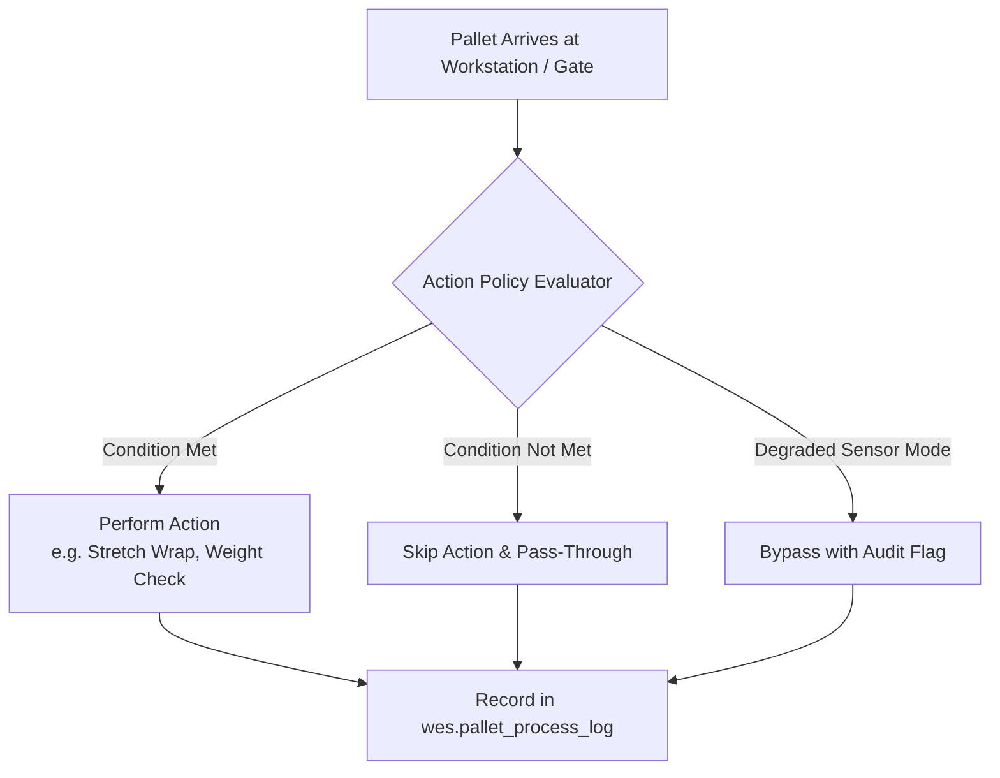

### 11.1. Conditional Action Decision Matrix

| Action | Execution Condition | Skip Condition | Bypass / Degradation Rule |
| :--- | :--- | :--- | :--- |
| **`ACTION_STRETCH_WRAP`** | Pallet going to High-Bay ASRS **AND** `custom_attributes.is_wrapped == false`. | Pallet is already pre-wrapped from supplier OR direct cross-dock. | If wrapper is broken, allow transit only to Floor Staging with max speed limited to 0.5 m/s. |
| **`ACTION_CHECKWEIGHER`** | Mandated for all inbound pallets and pick consolidations. | Internal empty carrier re-circulation (`load_type == 'NO_LOAD'`). | If scale is in FAULT, permit bypass **only** if authorized by Supervisor badge; flag `WEIGHT_UNVERIFIED`. |
| **`ACTION_DE-STACKING`** | `load_type == 'PALLET_STACK'` entering induction line. | Single loaded pallet. | Must not skip under any circumstance (prevents crane collision). |
| **`ACTION_QA_SAMPLING`** | First pallet of a new raw material batch (`is_first_of_lot == true`). | Subsequent pallets from an already approved lot. | If QA station is full, shunt to `QA_BUFFER_LANE` without rejecting. |

### 11.2. Action Policy Table Structure
Policies are declarative, stored in database JSON or rules:
```json
{
  "action_code": "STRETCH_WRAP",
  "trigger_node": "WRAPPER_INDUCTION_01",
  "is_mandatory": false,
  "condition_expression": "pallet.loadType != 'NO_LOAD' && pallet.customAttributes.is_wrapped != true",
  "on_skip_target_node": "CONV_BYPASS_LANE_01",
  "on_execute_target_node": "STRETCH_WRAPPER_01"
}
```

---

## 12. Re-Routing While Preserving Initial Target Location & Priority Dispatch

One of the most complex operational challenges in warehouse execution is:  
**A pallet gets diverted to an intermediate buffer due to a temporary roadblock, BUT it still must reach its initial target location as soon as possible, with elevated priority.**

```
Initial Plan:     [Origin Spur] ═══════════════════════════════════════► [Final Target: ASRS_04]
                                        ▲ (Blocked!)
Detour Executed:  [Origin Spur] ──► [Buffer Lane 03] (Parked)
                                           │
                                           ▼ (Wakeup with Elevated Priority!)
Resumed Plan:     [Buffer Lane 03] ════════════════════════════════════► [Final Target: ASRS_04]
```

### 12.1. Preserving the Initial Target Destination
The `wes.pallet_journey` maintains the immutable `destination_node_id` throughout the entire lifecycle. When a detour occurs:
1. The active leg is closed as `DIVERTED_TO_BUFFER`.
2. An intermediate leg `BUFFER_HOLD` is inserted at the current sequence.
3. The remaining leg back to the **original `destination_node_id`** is kept in `PENDING` state.

```
Table: wes.journey_leg
┌───────┬────────────┬──────────────────┬──────────────┬──────────────┬───────────────┐
│ leg_id│ sequence   │ leg_type         │ from_node    │ to_node      │ status        │
├───────┼────────────┼──────────────────┼──────────────┼──────────────┼───────────────┤
│ L-01  │ 1          │ CONVEYOR_TRANSIT │ INFEED_01    │ SPUR_A       │ COMPLETED     │
│ L-02  │ 2 (Detour) │ BUFFER_HOLD      │ SPUR_A       │ BUFFER_03    │ BUFFER_STAGED │
│ L-03  │ 3 (Resume) │ AMR_TRANSFER     │ BUFFER_03    │ ASRS_04      │ PENDING       │
└───────┴────────────┴──────────────────┴──────────────┴──────────────┴───────────────┘
```

### 12.2. Multi-Factor Dynamic Priority Scoring

When multiple pallets are competing for newly available AMRs or conveyor slots, a simple FIFO queue causes starvation and missed shipping deadlines. WES calculates an **Effective Dynamic Priority Score**:

$$P_{\text{effective}}(t) = P_{\text{base}} + \Delta P_{\text{detour}} + \alpha \cdot (t_{\text{wait\_minutes}}) + \beta \cdot (\text{wave\_urgency}) + \gamma \cdot (SLA_{\text{urgency}})$$

Where:
* **$P_{\text{base}}$**: The initial priority assigned to the transport task (Scale: $1$ to $10$, default $5$).
* **$\Delta P_{\text{detour}}$**: **Detour Compensation Boost** ($+15$ points). Pallets that were bumped off course into a buffer immediately jump ahead of standard pallets.
* **$\alpha \cdot (t_{\text{wait}})$**: **Starvation Aging Factor** ($+1.5$ points per minute spent waiting in buffer). Guarantees no pallet is stranded indefinitely.
* **$\beta \cdot (\text{wave\_urgency})$**: Critical wave release tier (e.g. Next-Day Air Express = $+25$ points).
* **$\gamma \cdot (SLA_{\text{urgency}})$**: Remaining time before truck dispatch deadline.

### 12.3. Prioritized Wakeup SQL Implementation
When an AMR or destination spur becomes available, WES queries for the highest scoring candidate using high-performance atomic locking:

```sql
-- Select the highest priority buffered pallet targeting Zone B
WITH ranked_pallets AS (
    SELECT 
        j.id AS journey_id,
        j.pallet_id,
        j.pallet_lpn,
        j.destination_node_id,
        l.from_node_id AS current_buffer_node,
        (
            j.priority + 
            15 + -- Detour Compensation Boost
            (EXTRACT(EPOCH FROM (NOW() - l.started_at)) / 60.0) * 1.5 -- Aging Factor
        ) AS effective_score
    FROM wes.pallet_journey j
    JOIN wes.journey_leg l ON j.id = l.journey_id
    WHERE j.journey_status = 'BUFFERED'
      AND l.status = 'BUFFER_STAGED'
      AND j.destination_node_id IN (
          SELECT node_id FROM wes.facility_node 
          WHERE zone_code = :availableZone AND is_blocked = FALSE
      )
    ORDER BY effective_score DESC
    LIMIT 1
)
SELECT * FROM ranked_pallets
FOR UPDATE SKIP LOCKED;
```

### 12.4. Deadlock Prevention: Destination Reservation Lock
To ensure that a detoured pallet doesn't wake up only to hit another block:
1. **Two-Phase Commit Dispatch**:
   * **Phase 1 (Reservation)**: Atomically claim a reservation slot on the destination node (`facility_node.current_occupancy + 1`).
   * **Phase 2 (Dispatch)**: Send VDA 5050 mission to the AMR.
2. If Phase 1 fails (destination filled up in the last 100ms), the pallet remains safely in `BUFFER_STAGED` with its aging score further elevated, avoiding pointless half-trips across the warehouse floor.

---

## 13. CT Junction Dynamic Re-Routing Architecture

### 13.1. Concept: CTs as First-Class Decision Nodes
In the facility conveyor network, every **Chain Transfer (`CT`)** (e.g., `B3CT1`, `B6CT2`, `B8CT1`, `B9CT1`, `B9CT2`, `B12CT2`) is an active **Routing Decision Point (Branching Node)**.

Rather than static point-to-point conveyor routing, the WES evaluates each CT junction dynamically as a pallet approaches:
* **Inputs Evaluated**:
  1. `pallet_id` / `pallet_lpn`: Target destination, load type, priority, and handling strategy constraints.
  2. **Downstream Station Health**: Real-time operational state (`HEALTHY`, `JAMMED`, `FAULT`, `E_STOP`, `MAINTENANCE`) of next-in-line segments.
  3. **Queue Occupancy & Back-Pressure**: Number of accumulated pallets in the downstream corridor vs. maximum capacity.
  4. **Available Alternate Modalities**: Availability of idle AMRs, alternative spurs, or bypass loops.

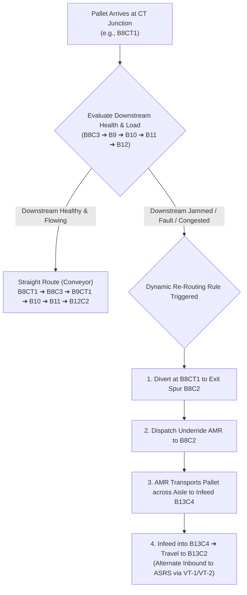

---

### 13.2. Case Study: The B8C2 $\rightarrow$ AMR $\rightarrow$ B13C4 $\rightarrow$ B13C2 Alternate ASRS Bypass

In the layout (**P24V3_STAGING & FORWARD PICKING AREA LAYOUT_V3.0.pdf**):
* **Primary Path**:  
  `B8CT1` $\rightarrow$ `B8C3` $\rightarrow$ `B9CT1` $\rightarrow$ `B9C3` $\rightarrow$ `B9CT2` $\rightarrow$ Trunk `B10` & `B11` $\rightarrow$ `B12CT2` $\rightarrow$ `B12C2` (Primary Inbound for ASRS via VT-8/VT-9).
* **Failure Trigger**:  
  If roller motor faults in Bay 10, or optical photo-eye at `B12CT2` is blocked, or `B12C2` spur queue is full:
* **The Redundant Bypass Route**:
  1. **Divert at `B8CT1`**: WES commands WCS divert to exit spur **`B8C2`** (*FG Full & Mix Pallet Out*).
  2. **AMR Mission Dispatch**: WES emits a VDA 5050 mission over gRPC to `fleet-service`:
     * Pick Location: `B8C2`
     * Drop Location: `B13C4` (*Conveyor Infeed Spur*)
  3. **Conveyor Induction at `B13C4`**: Underride AMR deposits the pallet onto `B13C4`.
  4. **Final Delivery to `B13C2`**: The pallet moves from `B13C4` $\rightarrow$ `B13C2`, which directly feeds Vertical Transporters **VT-1 / VT-2** into the ASRS chamber!

---

### 13.3. Database Schema for Dynamic Junction Rules & Station Health

To power this architecture, the following data tables govern junction evaluation:

```sql
-- ============================================================================
-- 1. Real-Time Station Health & Occupancy Registry
-- ============================================================================
CREATE TABLE IF NOT EXISTS wes.station_health (
    node_id VARCHAR(50) PRIMARY KEY REFERENCES wes.facility_node(node_id),
    operational_status VARCHAR(30) NOT NULL DEFAULT 'HEALTHY', -- 'HEALTHY', 'DEGRADED', 'JAMMED', 'FAULT', 'OFFLINE'
    current_occupancy INT NOT NULL DEFAULT 0,
    max_capacity INT NOT NULL DEFAULT 1,
    is_blocked BOOLEAN NOT NULL DEFAULT FALSE,
    last_fault_code VARCHAR(50),
    last_heartbeat_at TIMESTAMPTZ NOT NULL DEFAULT NOW(),
    updated_at TIMESTAMPTZ NOT NULL DEFAULT NOW()
);

-- ============================================================================
-- 2. Declarative Dynamic Re-Routing Rules at CT Junctions
-- ============================================================================
CREATE TABLE IF NOT EXISTS wes.junction_rerouting_rule (
    rule_id UUID PRIMARY KEY DEFAULT gen_random_uuid(),
    junction_node_id VARCHAR(50) NOT NULL REFERENCES wes.facility_node(node_id), -- e.g. 'B8CT1'
    rule_name VARCHAR(100) NOT NULL,                                             -- 'Bypass Bay 10-12 via AMR to B13'
    target_destination_zone VARCHAR(50) NOT NULL,                                -- 'ASRS_COLD_OR_AMBIENT'
    
    -- Condition Evaluation
    monitored_downstream_nodes TEXT[] NOT NULL,                                  -- ARRAY['B8C3', 'B9CT1', 'B10C1', 'B11C1', 'B12CT2']
    trigger_condition VARCHAR(50) NOT NULL DEFAULT 'ANY_UNHEALTHY_OR_FULL',      -- 'ANY_FAULT', 'QUEUE_EXCEEDED', 'ANY_UNHEALTHY_OR_FULL'
    max_allowable_queue INT NOT NULL DEFAULT 3,
    
    -- Primary vs Alternate Divert Actions
    primary_next_node_id VARCHAR(50) NOT NULL,                                   -- 'B8C3' (Straight Conveyor)
    alternate_divert_node_id VARCHAR(50) NOT NULL,                               -- 'B8C2' (Exit Spur to AMR)
    alternate_intermediate_handoff VARCHAR(30) NOT NULL DEFAULT 'AMR_TRANSFER',  -- 'AMR_TRANSFER', 'BUFFER_HOLD'
    alternate_target_infeed_node_id VARCHAR(50) NOT NULL,                        -- 'B13C4' (Re-entry spur)
    alternate_final_station_id VARCHAR(50) NOT NULL,                             -- 'B13C2' (Alternate ASRS infeed)
    
    is_active BOOLEAN NOT NULL DEFAULT TRUE,
    priority INT NOT NULL DEFAULT 10,
    version INT NOT NULL DEFAULT 0,
    created_at TIMESTAMPTZ NOT NULL DEFAULT NOW(),
    updated_at TIMESTAMPTZ NOT NULL DEFAULT NOW()
);

CREATE INDEX IF NOT EXISTS idx_junction_rules ON wes.junction_rerouting_rule (junction_node_id, is_active);
```

---

### 13.4. Sub-Millisecond In-Memory Execution Loop

Conveyor diverts require ultra-fast decisions ($< 5\text{ms}$) as the carrier rolls over the photo-eye:

```java
@Service
@RequiredArgsConstructor
@Slf4j
public class JunctionRoutingEngine {

    private final JunctionRuleCache ruleCache;         // In-memory Caffeine/Hazelcast cache
    private final StationHealthCache healthCache;       // Subscribed to PLC heartbeats via OPC UA
    private final FleetMissionServiceClient fleetClient;// gRPC client to Fleet
    private final PalletJourneyRepository journeyRepo;

    /**
     * Called by WCS over gRPC when photo-eye at CT junction triggers
     */
    public DivertDecision evaluateJunctionDivert(String palletLpn, String junctionNodeId) {
        // 1. Lookup active rules for this junction (e.g. 'B8CT1')
        List<JunctionReroutingRule> rules = ruleCache.getRulesForJunction(junctionNodeId);
        if (rules.isEmpty()) {
            return DivertDecision.proceedDefault();
        }

        for (JunctionReroutingRule rule : rules) {
            // 2. Evaluate downstream health corridor in-memory (< 0.5ms)
            boolean downstreamBlocked = rule.getMonitoredDownstreamNodes().stream().anyMatch(nodeId -> {
                StationHealth health = healthCache.get(nodeId);
                return health != null && (!"HEALTHY".equals(health.getOperationalStatus()) || health.isBlocked() || health.getCurrentOccupancy() >= health.getMaxCapacity());
            });

            if (downstreamBlocked) {
                log.warn("Downstream corridor for {} blocked. Triggering alternate bypass: spur={}, amrTarget={}",
                        junctionNodeId, rule.getAlternateDivertNodeId(), rule.getAlternateTargetInfeedNodeId());

                // 3. Mutate Journey: Divert to Exit Spur B8C2 & schedule AMR Leg to B13C4 -> B13C2
                scheduleAmrBypassLeg(palletLpn, rule);

                return DivertDecision.divert(
                        rule.getAlternateDivertNodeId(), // Divert to 'B8C2'
                        "Downstream congested; rerouted via AMR to B13C4"
                );
            }
        }

        // 4. Default: Continue straight on primary trunk
        return DivertDecision.proceedStraight();
    }

    private void scheduleAmrBypassLeg(String palletLpn, JunctionReroutingRule rule) {
        // Asynchronously register AMR mission and update journey state
        CompletableFuture.runAsync(() -> {
            fleetClient.dispatchAmrMission(
                    palletLpn,
                    rule.getAlternateDivertNodeId(),         // Pick at B8C2
                    rule.getAlternateTargetInfeedNodeId()     // Drop at B13C4
            );
        });
    }
}
```

---

## 14. Configurable Path Finder Engine: Resources, Relations, Rules & Validation Architecture

To eliminate hardcoded routing scripts and enable universal adaptability across diverse automated facilities, the platform implements a **Configurable Graph-Based Path Finder Engine**.

The engine operates on **4 Decoupled Pillars**:
```
┌─────────────────────────────────────────────────────────────────────────────┐
│                    THE 4-PILLAR ROUTING FOUNDATION                          │
├──────────────────────────┬──────────────────────────┬───────────────────────┤
│ 1. Resources (Nodes)     │ 2. Relations (Edges)     │ 3. Rules (Cost Logic) │
├──────────────────────────┼──────────────────────────┼───────────────────────┤
│ • Equipment Attributes   │ • Modality (Conv/AMR/VT) │ • Congestion Penalty  │
│ • Max Payload & Clearance│ • Distance & Speed       │ • Zone Health Penalty │
│ • Capacity & Occupancy   │ • Transfer Constraints   │ • Priority Multiplier │
├──────────────────────────┴──────────────────────────┴───────────────────────┤
│ 4. Validations (Physical & Policy Gatekeepers)                              │
│ • Height/Contour vs Strategy Clearance  • Weight vs Resource Capacity       │
│ • Chemical/Allergen Segregation Matrix   • Wrap/Strap Handling Requirements  │
└─────────────────────────────────────────────────────────────────────────────┘
```

---

### 14.1. Pillar 1: Resource Configuration (`wes.facility_resource`)

A **Resource** represents any physical or virtual location capable of holding, conveying, or manipulating a carrier:
* **Resource Types**: `CONVEYOR_SEGMENT`, `CT_JUNCTION`, `SPUR`, `STAGING_BUFFER`, `AMR_DOCK`, `VERTICAL_TRANSPORTER`, `ASRS_CELL`.
* **Hardware Physical Constraints**: Max length, width, height clearance, tare weight limit, maximum payload capacity.

```sql
CREATE TABLE IF NOT EXISTS wes.facility_resource (
    resource_id VARCHAR(50) PRIMARY KEY,          -- 'B8CT1', 'B8C2', 'B13C4', 'VT_1', 'AMR_ZONE_A'
    zone_code VARCHAR(30) NOT NULL,               -- 'STAGING_AREA', 'ZONE_A', 'ASRS_COLD_CHAMBER'
    resource_type VARCHAR(30) NOT NULL,           -- 'CT_JUNCTION', 'CONVEYOR_SPUR', 'BUFFER', 'ELEVATOR'
    
    -- Engineering Limits
    max_payload_kg NUMERIC(10, 2) NOT NULL DEFAULT 1500.0,
    max_height_clearance_mm NUMERIC(10, 2) NOT NULL DEFAULT 2200.0,
    max_width_clearance_mm NUMERIC(10, 2) NOT NULL DEFAULT 1200.0,
    max_capacity INT NOT NULL DEFAULT 1,
    
    -- Environmental & Safety Capabilities
    temperature_zone VARCHAR(30) NOT NULL DEFAULT 'AMBIENT', -- 'AMBIENT', 'CHILLED_4C', 'FROZEN_20C'
    is_flammable_approved BOOLEAN NOT NULL DEFAULT FALSE,
    is_active BOOLEAN NOT NULL DEFAULT TRUE,
    
    version INT NOT NULL DEFAULT 0,
    created_at TIMESTAMPTZ NOT NULL DEFAULT NOW(),
    updated_at TIMESTAMPTZ NOT NULL DEFAULT NOW()
);
```

---

### 14.2. Pillar 2: Relation Configuration (`wes.resource_relation`)

A **Relation** represents a directed topological path (graph edge) connecting two resources. It models the physical connection and the transportation mechanism:
* **Modality**: `CONVEYOR`, `AMR_TRAJECTORY`, `VERTICAL_TRANSPORTER`, `FORKLIFT`.
* **Kinematics**: Distance in meters, nominal travel speed ($m/s$), handover transfer time (e.g. lift loading delay).

```sql
CREATE TABLE IF NOT EXISTS wes.resource_relation (
    relation_id UUID PRIMARY KEY DEFAULT gen_random_uuid(),
    from_resource_id VARCHAR(50) NOT NULL REFERENCES wes.facility_resource(resource_id),
    to_resource_id VARCHAR(50) NOT NULL REFERENCES wes.facility_resource(resource_id),
    
    modality VARCHAR(30) NOT NULL,                -- 'CONVEYOR', 'AMR', 'VERTICAL_TRANSPORTER'
    directionality VARCHAR(20) NOT NULL DEFAULT 'UNIDIRECTIONAL', -- 'UNIDIRECTIONAL', 'BIDIRECTIONAL'
    
    -- Cost & Kinematics Baseline
    distance_meters NUMERIC(8, 2) NOT NULL,       -- Physical distance
    nominal_speed_mps NUMERIC(6, 2) NOT NULL,     -- e.g. Conveyor 0.5 m/s, AMR 1.5 m/s
    handover_time_seconds INT NOT NULL DEFAULT 0, -- Time required to load/unload
    base_cost NUMERIC(10, 2) NOT NULL,            -- Calculated baseline time or energy cost
    
    is_enabled BOOLEAN NOT NULL DEFAULT TRUE,
    version INT NOT NULL DEFAULT 0,
    created_at TIMESTAMPTZ NOT NULL DEFAULT NOW(),
    updated_at TIMESTAMPTZ NOT NULL DEFAULT NOW(),
    
    CONSTRAINT uq_resource_relation UNIQUE (from_resource_id, to_resource_id)
);
```

---

### 14.3. Pillar 3: Dynamic Routing Rules (`wes.routing_rule`)

Rules dynamically evaluate live conditions (congestions, equipment health, pallet priority) to modify edge weights in real-time:

$$\text{EdgeCost}(e, \text{pallet}) = \text{base\_cost}(e) \times W_{\text{health}}(e) + W_{\text{congestion}}(e) + W_{\text{pallet\_rule}}(e, \text{pallet})$$

```sql
CREATE TABLE IF NOT EXISTS wes.routing_rule (
    rule_id UUID PRIMARY KEY DEFAULT gen_random_uuid(),
    rule_name VARCHAR(100) NOT NULL,
    rule_type VARCHAR(30) NOT NULL,               -- 'HEALTH_PENALTY', 'CONGESTION_PENALTY', 'CARRIER_PREFERENCE'
    scope_resource_id VARCHAR(50) REFERENCES wes.facility_resource(resource_id), -- null applies globally
    
    -- Dynamic Evaluation Logic (SpEL or JSON logic)
    condition_expression TEXT NOT NULL,           -- e.g. "target_node.health != 'HEALTHY'"
    cost_multiplier NUMERIC(8, 2) NOT NULL DEFAULT 1.0, -- e.g. 1000.0 (penalty) or 0.0 (infinite barrier)
    fixed_penalty_cost NUMERIC(10, 2) NOT NULL DEFAULT 0.0,
    
    is_active BOOLEAN NOT NULL DEFAULT TRUE,
    priority INT NOT NULL DEFAULT 10
);
```

#### Standard Rule Evaluation:
1. **Health Barrier Rule**: If `station_health.operational_status IN ('FAULT', 'JAMMED', 'OFFLINE')` $\implies \text{Cost} = \infty$ (Edge effectively pruned).
2. **Back-Pressure Queue Rule**: If `current_occupancy / max_capacity > 0.8` $\implies \text{Cost} += 50.0 \times \text{queue\_count}$.
3. **AMR Fleet Availability Rule**: If relation modality is `AMR` and `idle_amr_count == 0` $\implies \text{Cost} += 120.0$ (Conveyor preferred unless blocked).

---

### 14.4. Pillar 4: Validation Engine (`wes.path_validation_policy`)

Before an edge or path is considered eligible by the Path Finder, it must pass strict physical and chemical **Validation Policies**:

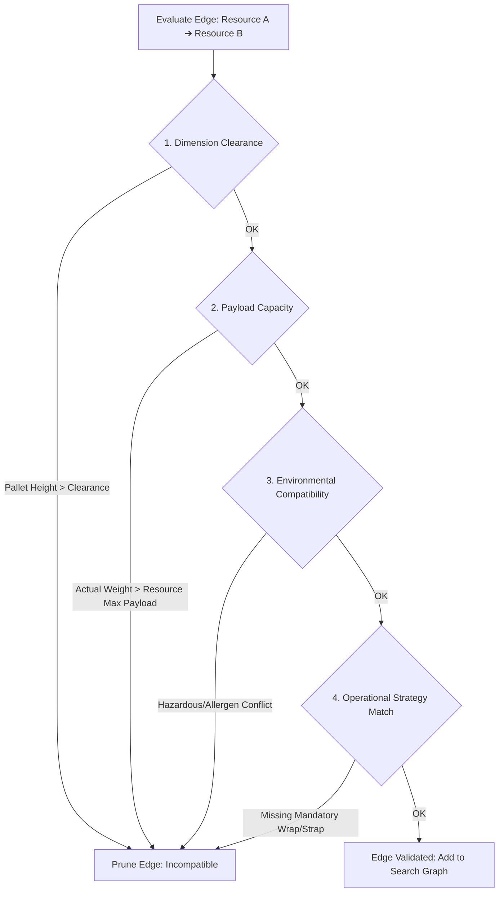

1. **Dimensional Gate**:
   $$\text{pallet.actual\_height\_mm} \le \text{resource.max\_height\_clearance\_mm}$$
2. **Payload Gate**:
   $$\text{pallet.actual\_weight\_kg} \le \text{resource.max\_payload\_kg}$$
3. **Environmental Segregation**:
   If `item_master.custom_attributes.storage_condition == 'COLD_CHAIN'`, the path cannot traverse an ambient staging zone with dwell time $> 15\text{ minutes}$.

---

### 14.5. Path Finder Algorithm: Modified A* Search Engine

The Path Finder constructs an in-memory directed graph from `wes.facility_resource` and `wes.resource_relation`. When routing from `CurrentNode` to `DestinationZone`:

```
Algorithm: Dynamic Validated Path Search (A*)
Input: pallet, start_node, destination_zone
Output: List<RouteLeg> (Optimal Valid Path)

1. G = LoadInVirtualGraph(wes.facility_resource, wes.resource_relation);
2. For each edge (u, v) in G:
     If NOT ValidateEdge(pallet, u, v) THEN
         RemoveEdge(G, u, v); // Hard Constraint Pruning
     Else
         G.setWeight(u, v, ComputeDynamicEdgeCost(pallet, u, v));
3. Path = AStarSearch(G, start_node, destination_zone, heuristic=EuclideanDistance);
4. If Path IS NULL:
     Trigger Exception: RerouteToBufferOrHold(pallet, "No legal traversable path available");
5. Return BuildJourneyLegs(Path);
```

---

### 14.6. Concrete Application: Solving the B8CT1 Re-Routing Automatically

How the Path Finder autonomously derives the **B8C2 $\rightarrow$ AMR $\rightarrow$ B13C4 $\rightarrow$ B13C2** route:

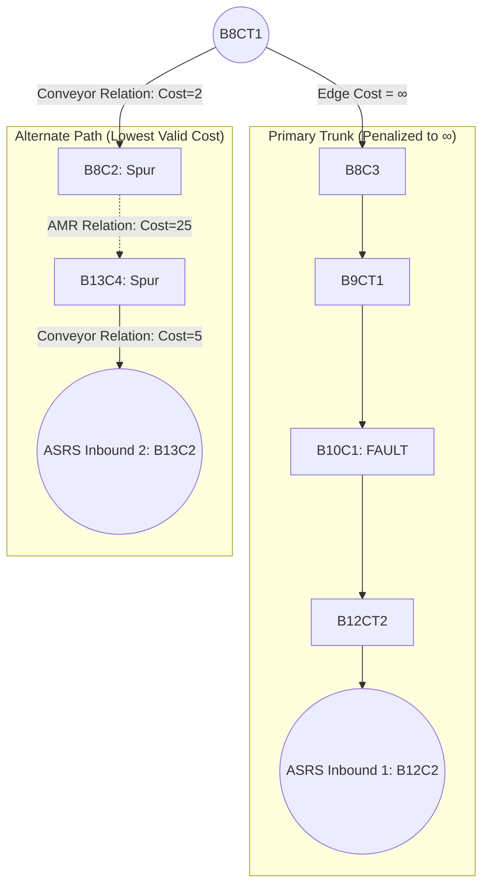

1. Pallet arrives at `B8CT1`.
2. Photo-eye alert triggers: `PathFinderService.findNextOptimalLeg(palletLpn, "B8CT1", "ASRS_CHAMBER")`.
3. The engine computes costs:
   * Edge `B8CT1 -> B8C3`: Motor fault in Bay 10 makes downstream path cost $\infty$.
   * Edge `B8CT1 -> B8C2`: Relation is healthy $\implies \text{Cost} = 2.0$.
   * Edge `B8C2 -> B13C4`: Modality is `AMR`, relation is active, AMR available $\implies \text{Cost} = 25.0$.
   * Edge `B13C4 -> B13C2`: Relation is healthy $\implies \text{Cost} = 5.0$.
4. **Validation Check**: Pallet weight ($850\text{kg}$) $\le$ AMR payload capacity ($1200\text{kg}$) $\implies$ **PASS**.
5. **Path Output**: The engine outputs `[B8C2 (Conveyor Divert), B13C4 (AMR Leg), B13C2 (ASRS Infeed)]` seamlessly through pure configuration!

---

## 15. Implementation Blueprint: Database Tables, Class Structure, Crash Recovery & Real-Time Hot-Reloading

This section specifies the software engineering architecture required to implement the configurable path finder engine in `wes-service`.

```
┌─────────────────────────────────────────────────────────────────────────────┐
│                       ARCHITECTURE AT A GLANCE                              │
├──────────────────────────┬──────────────────────────┬───────────────────────┤
│ Database Tier (14 Tables)│ Java Layer (~30 Classes) │ In-Memory Core        │
├──────────────────────────┼──────────────────────────┼───────────────────────┤
│ • 7 Master & Twin Tables │ • 7 Entities & 7 Repos   │ • RCU In-Memory Graph │
│ • 4 Topology Config      │ • Core Graph Engine      │ • AtomicReference Swap│
│ • 3 Operational Runtime  │ • Pipeline Validations   │ • < 1.0 ms Decisions  │
├──────────────────────────┴──────────────────────────┴───────────────────────┤
│ Resilience & High Availability                                              │
│ • Zero-Loss Crash Recovery (Post-reboot Rehydration Pipeline)               │
│ • Zero-Downtime Real-Time Hot Reloading of Topology & Rules                 │
└─────────────────────────────────────────────────────────────────────────────┘
```

---

### 15.1. Database Inventory: The 14 Required Tables

The complete database architecture spans **14 tables** in the `wes` schema:

| Group | # | Table Name | Purpose | Primary Key |
| :--- | :---: | :--- | :--- | :--- |
| **Existing Master Data & Digital Twin** | 1 | `wes.custom_attribute_definition` | Dynamic attribute metadata (Allergens, Wrap tension) | UUID |
| | 2 | `wes.pallet_type_master` | Base carrier specifications (Euro, GMA, Plastic) | UUID |
| | 3 | `wes.item_master` | Product definitions, compatibility groups | UUID |
| | 4 | `wes.sku_master` | Packaging specs, barcode, dimensions | UUID |
| | 5 | `wes.pallet_handling_strategy` | 3-way blueprint (TI/HI, expected height/weight) | UUID |
| | 6 | `wes.pallet` | Physical pallet digital twin instance | UUID |
| | 7 | `wes.pallet_item` | Inventory items carried on the pallet | UUID |
| | 8 | `wes.pallet_process_log` | Append-only journey checkpoint audit trail | UUID |
| **Topology & Configuration** | 9 | `wes.facility_resource` | Nodes: Spurs, CTs, Lifts, Buffers with physical limits | `resource_id` (String) |
| | 10 | `wes.resource_relation` | Edges: Conveyor, AMR, VT connections with kinematics | UUID |
| | 11 | `wes.routing_rule` | Dynamic cost penalties & health barrier rules | UUID |
| | 12 | `wes.path_validation_policy` | Pre-transit gatekeeper predicates (clearance, payload) | UUID |
| **Runtime Operational State** | 13 | `wes.pallet_journey` | Active multi-modal journey record (tracks initial target) | UUID |
| | 14 | `wes.journey_leg` | Discrete sequence of movement legs | UUID |
| *(Monitoring)* | 15 | `wes.station_health` | Real-time PLC heartbeats, occupancy, and jam flags | `node_id` (String) |

---

### 15.2. Java Package & Class Structure (~30 Files)

Organized cleanly inside `services/wes-service/src/main/java/com/company/warehouse/wes/`:

```
com.company.warehouse.wes
├── data
│   ├── entity
│   │   ├── FacilityResourceEntity.java          // Table: wes.facility_resource
│   │   ├── ResourceRelationEntity.java          // Table: wes.resource_relation
│   │   ├── RoutingRuleEntity.java               // Table: wes.routing_rule
│   │   ├── PathValidationPolicyEntity.java      // Table: wes.path_validation_policy
│   │   ├── PalletJourneyEntity.java             // Table: wes.pallet_journey
│   │   ├── JourneyLegEntity.java                // Table: wes.journey_leg
│   │   └── StationHealthEntity.java             // Table: wes.station_health
│   └── repository
│       ├── FacilityResourceRepository.java
│       ├── ResourceRelationRepository.java
│       ├── RoutingRuleRepository.java
│       ├── PathValidationPolicyRepository.java
│       ├── PalletJourneyRepository.java
│       ├── JourneyLegRepository.java
│       └── StationHealthRepository.java
│
├── business
│   └── routing
│       ├── model
│       │   ├── RoutingGraph.java                // Directed graph holding nodes & edges
│       │   ├── GraphNode.java                   // In-memory node with engineering limits
│       │   ├── GraphEdge.java                   // In-memory edge with modality & base cost
│       │   ├── RouteLegPlan.java                // Calculated route step
│       │   └── PathSearchResult.java            // Search output (path + total cost)
│       ├── engine
│       │   ├── InMemoryRoutingGraphHolder.java  // Manages AtomicReference<RoutingGraph>
│       │   ├── AStarPathFinderEngine.java       // Core A* / Dijkstra path solver
│       │   ├── DynamicCostEvaluator.java        // Live edge cost evaluator (health/congestion)
│       │   └── PathValidationPipeline.java      // Gatekeeper checks (weight, clearance, QA)
│       ├── service
│       │   ├── PathFinderService.java           // High-level API for route discovery
│       │   ├── JunctionDivertService.java       // Ultra-low latency (<3ms) CT divert handler
│       │   └── JourneyOrchestrationService.java // Manages leg transitions and handoffs
│       ├── event
│       │   ├── TopologyChangedEvent.java        // Triggered when resource/relation is modified
│       │   ├── StationHealthUpdatedEvent.java   // Triggered when PLC reports fault or occupancy
│       │   └── RouteInvalidationListener.java   // Spring listener that triggers graph hot-swap
│       └── recovery
│           └── RoutingEngineWarmupService.java  // Post-crash bootstrap & rehydration
│
└── api
    ├── controller
    │   ├── TopologyConfigurationController.java // REST APIs for configuring nodes & edges
    │   └── RoutingRuleController.java          // REST APIs for managing rules & penalties
    ├── dto
    │   ├── FacilityResourceDto.java
    │   ├── ResourceRelationDto.java
    │   └── DivertDecisionResponse.java
    └── grpc
        └── ConveyorGatekeeperGrpcService.java   // Binary gRPC server for WCS photo-eye calls
```

---

### 15.3. In-Memory Processing & Sub-Millisecond Diverts

Conveyors travel at $0.5\text{ to }1.5\text{ m/s}$. When a pallet trips a photo-eye at a CT junction, WES has **under $15\text{ milliseconds}$** to return the divert command before the carrier passes the divert mechanism.

#### Lock-Free Read-Copy-Update (RCU) Architecture
The in-memory graph is held in an atomic reference:
```java
@Component
public class InMemoryRoutingGraphHolder {

    // Atomic pointer guarantees lock-free reads for high-frequency queries
    private final AtomicReference<RoutingGraph> activeGraphRef = new AtomicReference<>();

    public RoutingGraph getActiveGraph() {
        return activeGraphRef.get();
    }

    public synchronized void hotSwapGraph(RoutingGraph newGraph) {
        // Atomic pointer swap takes < 10 nanoseconds
        activeGraphRef.set(newGraph);
        log.info("Successfully hot-swapped active routing graph. Nodes={}, Edges={}",
                newGraph.getNodeCount(), newGraph.getEdgeCount());
    }
}
```
* **Read Latency**: **$< 0.2\text{ milliseconds}$**. Divert queries read from memory without hitting PostgreSQL or acquiring thread locks.

---

### 15.4. Crash Recovery & State Rehydration Pipeline

In the event of a sudden JVM crash, host reboot, or power outage:
**Zero in-memory state is lost** because PostgreSQL is the immutable source of truth.

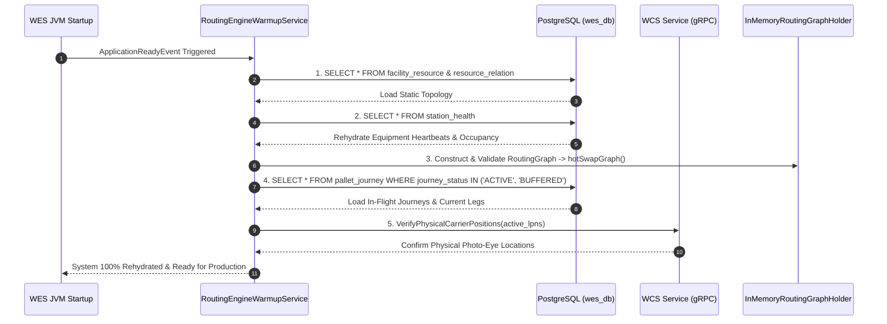

#### The 4-Phase Recovery Sequence
1. **Phase 1 (Topology Load)**: Reads all `facility_resource` and `resource_relation` rows $\implies$ builds base directed graph.
2. **Phase 2 (Health Telemetry Rehydration)**: Reads `station_health` $\implies$ sets initial edge cost multipliers based on known faults or occupied queues.
3. **Phase 3 (In-Flight Journey Reconciliation)**:
   * Selects all journeys in `ACTIVE` or `BUFFERED` status.
   * Compares `journey_leg.from_node_id` with `pallet.current_location`.
4. **Phase 4 (Physical Sensor Cross-Check)**:
   * Dispatches a batch gRPC health check to WCS: queries whether pallets are physically detected at their recorded check-points.
   * Any desynchronization transitions the pallet into `RECOVERY_VERIFICATION` status for supervisor review.

---

### 15.5. Real-Time Configuration Updates (Zero-Downtime Hot-Reloading)

When a warehouse engineer modifies a relation, alters an AMR path, adjusts a clearance limit, or disables a conveyor segment via the Web UI:

```mermaid
flowchart TD
    UI[User Modifies Topology via Web UI] --> API[TopologyConfigurationController]
    API --> DB[(Save to wes.resource_relation)]
    API --> Event[Publish TopologyChangedEvent]
    
    Event --> Listener[RouteInvalidationListener]
    Listener --> Shadow[1. Build Shadow Graph in Background]
    Shadow --> Validate[2. Validate Graph Integrity: Connectivity, No Deadlocks]
    Validate -- Valid --> Swap[3. Atomic Reference Swap: activeGraphRef.set(newGraph)]
    Validate -- Broken --> Reject[Reject Update: Rollback & Raise Alert]
    
    Swap --> Recheck[4. Check In-Flight Journeys]
    Recheck --> Pending[Mark Pending Legs: RE_EVALUATE_REQUIRED]
```

#### Safe In-Flight Handoff
1. **The Active Leg is Preserved**: A pallet currently traveling on a conveyor segment or being transported by an AMR continues its immediate physical leg to prevent abrupt stoppages.
2. **Subsequent Legs Re-Evaluated**: All remaining downstream legs in `PENDING` status are marked `RE_EVALUATE_REQUIRED`.
3. **Automatic Recalculation at Next CT**: When the pallet arrives at the next CT junction, the `JunctionDivertService` queries the newly swapped graph, picking up the updated route without restarting the server or stopping conveyor lines.

---

## 16. Universal Generic Metamodel: JSON Resource Schema, Generic Relations & Entity-to-Entity Handover Matrix

To ensure the platform is completely layout- and hardware-agnostic, the routing engine supports a **Universal Generic Metamodel**. 

Instead of writing rigid, vendor-specific database schemas or hardcoded Java classes for every piece of automation equipment, the entire facility topology is modeled via **Generic Resources**, **Generic Relations**, and **Entity-to-Entity Handover Handshake Policies**.

```
┌─────────────────────────────────────────────────────────────────────────────┐
│                   UNIVERSAL GENERIC METAMODEL                               │
├──────────────────────────┬──────────────────────────┬───────────────────────┤
│ Generic Resource JSON    │ Generic Relation Edge    │ Entity Handover Matrix│
├──────────────────────────┼──────────────────────────┼───────────────────────┤
│ • resourceId & Name      │ • fromResourceId         │ • sourceEntityType    │
│ • resourceType           │ • toResourceId           │ • targetEntityType    │
│ • isRedirectionalPoint   │ • distance & transitTime │ • handoverProtocol    │
│ • dynamic attributes{}   │ • dynamic constraints{}  │ • handshakeConfig{}   │
└──────────────────────────┴──────────────────────────┴───────────────────────┘
```

---

### 16.1. Generic Resource JSON Specification

Every physical or logical node (Conveyor line, Chain Transfer junction, AMR pick spur, Lift cage, Staging lane) is represented by a uniform JSON payload:

```json
{
  "resourceId": "B8CT1",
  "name": "Bay 8 Chain Transfer Junction",
  "resourceType": "TRANSFER_JUNCTION",
  "isRedirectionalPoint": true,
  "supportedFlow": "MULTI_DIRECTIONAL",
  "attributes": {
    "nominalSpeedMps": 0.6,
    "maxPayloadKg": 1500,
    "clearanceMm": { "length": 1400, "width": 1000, "height": 2200 },
    "hasDivertMechanism": true,
    "divertAngles": [0, 90, -90],
    "divertTimeMs": 1200,
    "plcNodeId": "PLC_ZONE_A.DB102.CT_B8"
  },
  "safetyZones": ["ZONE_A_CONVEYOR"],
  "isActive": true
}
```

#### Example: AMR Handoff Spur Resource
```json
{
  "resourceId": "B8C2",
  "name": "Bay 8 Outfeed Exit Spur",
  "resourceType": "CONVEYOR_SPUR",
  "isRedirectionalPoint": false,
  "supportedFlow": "OUTBOUND_DISCHARGE",
  "attributes": {
    "capacity": 1,
    "handoffMechanism": "UNDER_RIDE_PICKUP",
    "dockingHeightMm": 450,
    "lightCurtainPin": "LC_B8C2",
    "palletOrientation": "SHORT_SIDE_LEADING"
  }
}
```

---

### 16.2. Entity-to-Entity Transfer Handover Matrix

When a carrier transitions from **Entity Type A $\rightarrow$ Entity Type B**, the orchestrator evaluates a modular **Handover Protocol**:

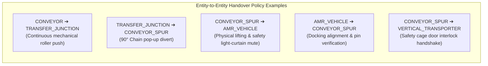

#### Handover Contract JSON Schema
```json
{
  "ruleId": "RULE-SPUR-TO-AMR",
  "sourceEntityType": "CONVEYOR_SPUR",
  "targetEntityType": "AMR_VEHICLE",
  "transferProtocol": "VDA_5050_MUTED_PICKUP",
  "handshakeConfig": {
    "preTransferChecks": [
      "SPUR_PALLET_SETTLED",
      "SAFETY_MUTING_CONFIRMED",
      "AMR_PIN_ALIGNED"
    ],
    "settlingTimeMs": 1500,
    "allowedPalletTypes": ["EUR_WOOD", "US_GMA", "PLASTIC_CLEANROOM"],
    "requiresWeightVerification": true,
    "interlockSignal": "PLC_SAFE_OUTPUT_Q0.4"
  },
  "maxTransferDurationSeconds": 45,
  "onTimeoutAction": "RAISE_INTERLOCK_ALARM"
}
```

---

### 16.3. Database Schema: 3 Generic Universal Tables

This architecture replaces dozens of rigid, equipment-specific tables with **3 lean, high-performance tables**:

```sql
-- ============================================================================
-- 1. GENERIC RESOURCE REGISTRY
-- ============================================================================
CREATE TABLE IF NOT EXISTS wes.generic_resource (
    resource_id VARCHAR(50) PRIMARY KEY,              -- 'B8CT1', 'B8C2', 'AMR_FLEET_01'
    name VARCHAR(100) NOT NULL,                       -- 'Bay 8 Chain Transfer'
    resource_type VARCHAR(40) NOT NULL,               -- 'CONVEYOR', 'TRANSFER_JUNCTION', 'CONVEYOR_SPUR', 'AMR_VEHICLE', 'LIFT'
    
    -- Routing Flags
    is_redirectional_point BOOLEAN NOT NULL DEFAULT FALSE, -- True if path can branch/divert here
    supported_flow VARCHAR(30) NOT NULL DEFAULT 'BI_DIRECTIONAL', -- 'UNIDIRECTIONAL', 'BI_DIRECTIONAL', 'OMNI_DIRECTIONAL'
    
    -- Dynamic Equipment Specs & Sensor Pins
    attributes JSONB NOT NULL DEFAULT '{}'::jsonb,
    
    is_active BOOLEAN NOT NULL DEFAULT TRUE,
    version INT NOT NULL DEFAULT 0,
    created_at TIMESTAMPTZ NOT NULL DEFAULT NOW(),
    updated_at TIMESTAMPTZ NOT NULL DEFAULT NOW()
);

CREATE INDEX IF NOT EXISTS idx_generic_resource_type ON wes.generic_resource(resource_type);
CREATE INDEX IF NOT EXISTS idx_generic_resource_attrs ON wes.generic_resource USING GIN (attributes jsonb_path_ops);

-- ============================================================================
-- 2. GENERIC RESOURCE RELATIONS (Directed Graph Edges)
-- ============================================================================
CREATE TABLE IF NOT EXISTS wes.generic_relation (
    relation_id UUID PRIMARY KEY DEFAULT gen_random_uuid(),
    from_resource_id VARCHAR(50) NOT NULL REFERENCES wes.generic_resource(resource_id),
    to_resource_id VARCHAR(50) NOT NULL REFERENCES wes.generic_resource(resource_id),
    
    -- Edge Properties & Kinematics
    distance_meters NUMERIC(8, 2) NOT NULL DEFAULT 1.0,
    nominal_transit_time_sec NUMERIC(8, 2) NOT NULL DEFAULT 2.0,
    
    -- Dynamic Custom Constraints (e.g. max height, forbidden hazmat)
    relation_constraints JSONB NOT NULL DEFAULT '{}'::jsonb,
    
    is_enabled BOOLEAN NOT NULL DEFAULT TRUE,
    version INT NOT NULL DEFAULT 0,
    CONSTRAINT uq_generic_relation UNIQUE (from_resource_id, to_resource_id)
);

-- ============================================================================
-- 3. ENTITY-TO-ENTITY TRANSFER HANDOVER RULES
-- ============================================================================
CREATE TABLE IF NOT EXISTS wes.entity_transfer_rule (
    rule_id VARCHAR(60) PRIMARY KEY,                  -- 'TRANSFER_CONV_TO_AMR', 'TRANSFER_CT_TO_SPUR'
    source_entity_type VARCHAR(40) NOT NULL,          -- 'CONVEYOR_SPUR', 'TRANSFER_JUNCTION'
    target_entity_type VARCHAR(40) NOT NULL,          -- 'AMR_VEHICLE', 'CONVEYOR_SPUR'
    
    -- The Handshake Blueprint
    handover_protocol VARCHAR(50) NOT NULL,           -- 'VDA_5050_PICKUP', 'OPC_UA_PHOTOEYE_HANDSHAKE'
    handshake_config JSONB NOT NULL DEFAULT '{}'::jsonb,
    
    max_timeout_seconds INT NOT NULL DEFAULT 30,
    is_active BOOLEAN NOT NULL DEFAULT TRUE,
    version INT NOT NULL DEFAULT 0,
    CONSTRAINT uq_entity_handover UNIQUE (source_entity_type, target_entity_type)
);
```

---

### 16.4. Runtime Execution: Dynamic Handover Validation

When traversing from `B8CT1` $\rightarrow$ `ASRS`:

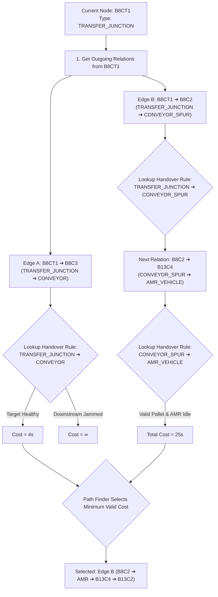

1. **Relation Traversal**: The Path Finder extracts outgoing relations for `B8CT1`.
2. **Handover Contract Match**: For each candidate edge $(A \rightarrow B)$, the engine resolves `entity_transfer_rule` for $(A.\text{resource\_type}, B.\text{resource\_type})$.
   * Validates carrier suitability: e.g. pallet carrier `pallet_type_master.code` $\in$ `handshake_config['allowedPalletTypes']`.
   * Checks resource clearance: pallet actual dimensions $\le A.\text{attributes}['clearanceMm']$.
3. **Automated Mission Synthesis**: Once an edge is selected, the orchestrator utilizes the `handshake_config` to automatically construct the exact southbound commands:
   * **For WCS**: Emits OPC UA write to activate divert arm and safety muting light curtains.
   * **For Fleet**: Formats the VDA 5050 JSON action block for robot docking and fork elevation.

---

### 16.5. Architectural Evaluation: Why This Universal Metamodel is Preferred

| Metric | Pure Monolithic JSON Document | Rigid Dedicated Tables | Hybrid Universal Metamodel |
| :--- | :--- | :--- | :--- |
| **Pathfinding Speed** | Slow ($> 50\text{ms}$ deep parsing per query) | Fast ($< 0.5\text{ms}$) | **Ultra-Fast ($< 0.2\text{ms}$ lock-free JVM heap)** |
| **Extensibility for New Hardware** | High | Low (Requires DB DDL migration per machine) | **Infinite (Add new JSON to `attributes`)** |
| **Referential Integrity** | None (Typo in ID breaks graph) | Strict (Foreign Keys) | **Strict Foreign Keys + Flexible JSON** |
| **Handover Reusability** | Buried inside node scripts | Rigid Java if-else statements | **Universal Handshake Matrix (`entity_transfer_rule`)** |


