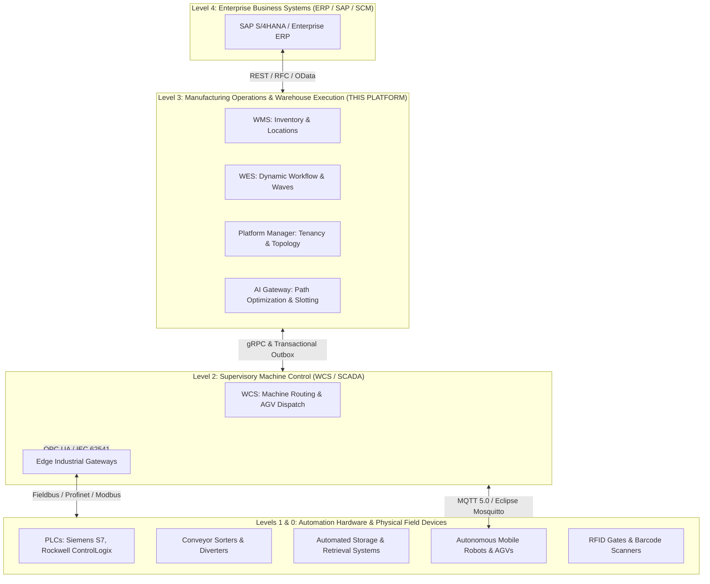
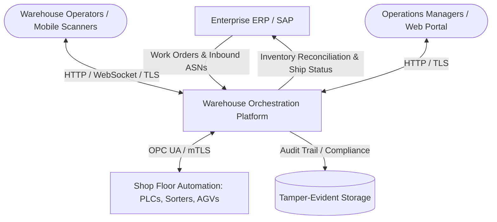

# System Design: Warehouse & Manufacturing Orchestration Platform

## 1. Executive Summary & Domain Scope

The **Warehouse Orchestrator Platform** is an enterprise-scale distributed execution and control system designed for modern automated factories, distribution centers, and smart warehouses. It unifies high-level logistics planning (WMS), dynamic operational orchestration (WES), and physical hardware supervisory control (WCS) into a resilient, event-driven microservices architecture.

The platform adheres strictly to **ISA-95 (IEC 62264)** enterprise-control integration models and **IEC 62443** industrial cybersecurity specifications.

---

## 2. Industrial Automation Hierarchy (ISA-95 / Purdue Model)



---

## 3. C4 Architecture Specifications

### 3.1. System Context Diagram (C4 Level 1)
The platform acts as the operational bridge between enterprise ERPs, warehouse workforce interfaces, and physical shop-floor machinery.



### 3.2. Container Diagram (C4 Level 2)
The platform is organized into decoupled, highly specialized containerized microservices:

```mermaid
graph TD
    ClientWeb([Web UI & Control Room]) -->|HTTPS / WSS| APIGateway[API Gateway / Ingress]
    ClientScanner([Mobile Scanners & Terminals]) -->|HTTPS| APIGateway

    subgraph Orchestrator Core Services
        APIGateway -->|REST / mTLS| WMS[WMS Service]
        APIGateway -->|REST / mTLS| WES[WES Service]
        APIGateway -->|REST / mTLS| WCS[WCS Service]
        APIGateway -->|REST / mTLS| Fleet[Fleet Manager Service]
        APIGateway -->|REST / mTLS| Auth[Auth Service (IEC 62443)]

        WES <-->|gRPC / HTTP/2| WCS
        WES <-->|gRPC / HTTP/2| WMS
        WES <-->|gRPC / HTTP/2| Fleet
        WES <-->|gRPC| AIGateway[AI Gateway]

        WMS -->|Transactional Outbox| DB_WMS
        WES -->|Transactional Outbox| DB_WES
        WCS -->|Transactional Outbox| DB_WCS
    end

    subgraph Data & Persistence Tier
        WMS --> DB_WMS[(PostgreSQL WMS)]
        WES --> DB_WES[(PostgreSQL WES)]
        WCS --> DB_WCS[(PostgreSQL WCS)]
        Auth --> DB_Auth[(PostgreSQL Auth)]
        
        WES <--> Hazelcast[(Embedded Hazelcast Cache)]
    end

    subgraph Southbound Hardware Integration Tier
        WCS <-->|OPC UA / Eclipse Milo| OPC_Server[OPC UA Server / Edge PLC Gateway]
        Fleet <-->|MQTT 5.0 / Eclipse Mosquitto| MosquittoBroker[[Eclipse Mosquitto Broker]]
        WCS <-->|MQTT 5.0 / Eclipse Mosquitto| MosquittoBroker
        MosquittoBroker <-->|VDA 5050 / MQTT| AGV_Fleet[AGVs / AMRs / IoT Scanners]
    end
```

---

## 4. Microservice Boundaries & Responsibilities

| Microservice | Bounded Context | Primary Responsibilities | Data Store |
| :--- | :--- | :--- | :--- |
| **`wms-service`** | Warehouse Management | SKU master catalog, stock allocation, location hierarchy (aisle/bay/shelf/bin), inventory reservations, receiving, putaway, and shipping validation. | PostgreSQL (JSONB custom attributes) |
| **`wES-service`** | Warehouse Execution | Dynamic wave planning, pick-task batching, real-time workload balancing, operator task dispatch, order release management, and bottleneck mitigation. | PostgreSQL + Redis (Distributed locks) |
| **`wcs-service`** | Warehouse Control | Real-time conveyor routing, diversion confirmation, Automated Guided Vehicle (AGV/AMR) mission sequencing, AS/RS crane control, and PLC heartbeat monitoring. | PostgreSQL + Low-latency In-Memory Cache |
| **`platform-manager`** | Platform Core & Security | Multi-tenant and multi-facility configuration, User RBAC/ABAC, equipment topology configuration, and license enforcement. | PostgreSQL |
| **`ai-gateway`** | AI/ML Optimization | Real-time pick-path routing (Traveling Salesperson heuristic), dynamic slotting optimization, and predictive equipment maintenance telemetry scoring. | Python / FastEmbed + gRPC Bridge |

---

## 5. Event-Driven Architecture & Message Flow

### 5.1. Synchronous vs. Asynchronous Communication Rules
1. **User/Operator Interactions**: Synchronous REST APIs over HTTPS for transactional operations (e.g., operator scanning a bin barcode).
2. **Inter-Service Workflows**: Synchronous binary **gRPC over HTTP/2** for low-latency command/dispatch, plus **PostgreSQL Transactional Outbox Pattern** for guaranteed durable state events and audit streams.
3. **High-Frequency AI Path Optimization**: Synchronous **gRPC** with strict 100ms deadlines.
4. **Southbound Machine & Robot Control**:
   * **PLCs & Conveyors**: **OPC UA TCP (IEC 62541)** with keep-alive heartbeats (500ms) and subscription-based state notifications.
   * **AGVs / AMRs & IoT Sensors**: **MQTT 5.0 over Eclipse Mosquitto** (VDA 5050 standard) for sub-millisecond robot state broadcasts and telemetry.

### 5.2. Core Event Topologies
* `warehouse.wms.inventory-allocated.v1`: Broadcast when inventory is locked for an order.
* `warehouse.wes.wave-released.v1`: Triggers WCS task generation and AGV mission creation.
* `warehouse.wcs.divert-confirmed.v1`: Emitted by WCS when optical sensors confirm a tote diversion.
* `warehouse.equipment.fault.v1`: High-priority alert triggered when a PLC trips an interlock or safety state.

---

## 6. Resilience, Safety & Degraded Operations

1. **Loss of External Network (ERP Offline)**:
   - The platform must continue running shop-floor picking, packing, and sorting autonomously using local database state.
   - Outbound ERP synchronizations queue in PostgreSQL Outbox tables and resume with exponential backoff upon network restoration.
2. **Loss of PLC Connection (WCS Heartbeat Loss)**:
   - If a PLC fails to respond to heartbeats within 1500ms, the WCS triggers an immediate `FAULT_HOLD` state on active conveyor tasks in that zone.
   - Tasks are marked for manual inspection; adjacent zones continue operating if safely isolated.
3. **Power Outage & Safe Restart**:
   - Every physical transport task relies on database `@Version` optimistic locking. Upon JVM recovery, state machines resume from the exact last verified optical check-point.
