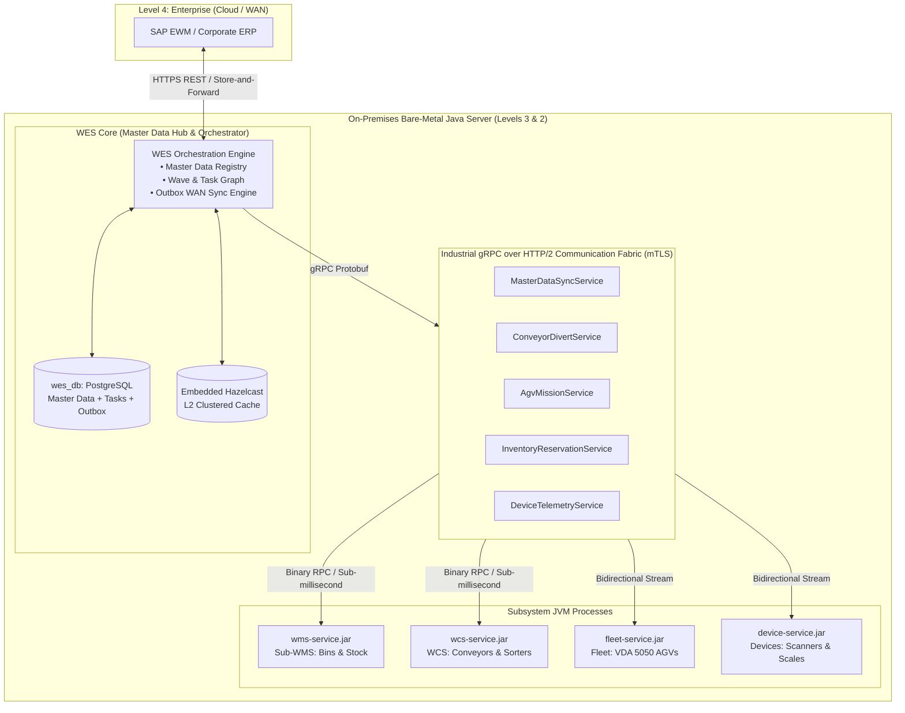
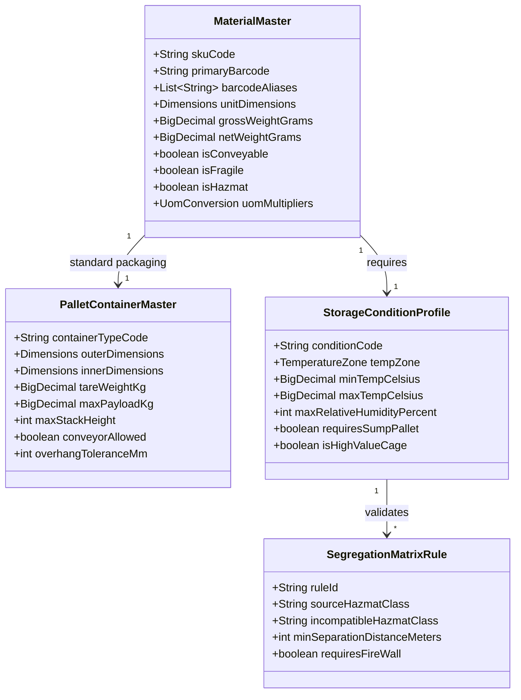

# WES-Centric Master Data & gRPC Communication Architecture

## 1. Executive Summary & Core Philosophy

This document defines the architectural specification for the **Warehouse Orchestrator Platform** where:

1. **WES (Warehouse Execution System)** is the **Master of Record** for all warehouse operational master data (the **Warehouse Digital Twin**).
2. **gRPC over HTTP/2** is the **mandatory inter-service communication backbone** connecting WES with all subsystems (Sub-WMS, WCS, Fleet Managers, and Devices).
3. The platform is designed for **100% on-premises bare-metal Java server execution** (no Docker required), with **offline survivability** and **store-and-forward synchronization** with upstream enterprise ERPs (SAP EWM).



---

## 2. WES Master Data Domain Model (The Warehouse Digital Twin)

WES maintains the complete operational reality of the warehouse in `wes_db`. Subsystems synchronize only their required operational slice over gRPC.

### 2.1. The 4 Core Master Data Catalogs in WES



1. **Material / SKU Physical Master**:
   - Precise dimensions $(L \times W \times H \text{ mm})$, gross/net weight, unit of measure conversions (Eaches $\rightarrow$ Cases $\rightarrow$ Pallets).
   - Conveyability, fragility, and machine clearances.
2. **Pallet / Container / Handling Unit (HU) Master**:
   - Physical footprint (Euro 1200x800, Industrial 1200x1000, Custom Totes).
   - Tare weight, maximum load limits, overhang tolerances, and stackability coefficients (e.g., max 2-high when loaded).
3. **Storage Condition & Environmental Profile**:
   - Temperature zones (Ambient $+15^\circ\text{C}$ to $+25^\circ\text{C}$, Cold Chain $+2^\circ\text{C}$ to $+8^\circ\text{C}$, Frozen $-20^\circ\text{C}$).
   - Humidity restrictions, cleanroom classifications, and ESD (electrostatic discharge) requirements.
4. **Hazardous Material & Co-Storage Segregation Matrix**:
   - Flammable, toxic, corrosive, and oxidizer classifications.
   - Physical segregation rules (e.g., Flammable Class 3 cannot be stored within 15 meters of Oxidizers Class 5.1).

---

## 3. The Industrial gRPC Communication Fabric

### 3.1. Why gRPC Replaces REST & JSON Between Subsystems

* **Ultra-Low Latency (< 1ms)**: Binary Protocol Buffers eliminate JSON parsing overhead, reducing CPU serialization latency by 85%.
* **Zero Garbage Collection Churn**: Protobuf uses pre-allocated direct byte buffers, preventing JVM heap fragmentation in 100Hz telemetry loops.
* **HTTP/2 Multiplexing**: Thousands of concurrent divert requests, scanner events, and AGV coordinates share a single persistent TCP connection per subsystem.
* **Bidirectional Streaming**: Enables continuous real-time telemetry streams (e.g., AGV battery and coordinate updates streaming to WES at 20Hz).
* **Strict Compile-Time Contracts**: Client stubs and server interfaces are auto-generated from `.proto` files, eliminating runtime API mismatches.

### 3.2. Protobuf Contract Architecture (`common-grpc`)

All gRPC interfaces are defined in the shared `common/common-grpc` library:

```protobuf
syntax = "proto3";

package com.company.warehouse.grpc.v1;
option java_multiple_files = true;
option java_package = "com.company.warehouse.grpc.v1";

// 1. MASTER DATA SYNCHRONIZATION SERVICE
service MasterDataSyncService {
    rpc GetMaterialProfile (MaterialLookupRequest) returns (MaterialProfileResponse);
    rpc GetPalletProfile (PalletLookupRequest) returns (PalletProfileResponse);
    rpc StreamMasterDataUpdates (MasterDataSubscriptionRequest) returns (stream MasterDataUpdateEvent);
}

// 2. CONVEYOR & SORTER ROUTING SERVICE (WES <-> WCS)
service ConveyorDivertService {
    rpc RequestDivertDecision (DivertRequest) returns (DivertDecision);
    rpc ConfirmDivertExecuted (DivertConfirmation) returns (DivertAck);
}

// 3. FLEET AGV MISSION SERVICE (WES <-> Fleet Manager)
service FleetMissionService {
    rpc DispatchMission (VdaMissionCommand) returns (MissionAck);
    rpc StreamVehicleTelemetry (stream VehicleTelemetryFrame) returns (TelemetryAck);
}

// 4. STORAGE & BIN RESERVATION SERVICE (WES <-> Sub-WMS)
service InventoryReservationService {
    rpc ReserveBin (BinReservationRequest) returns (BinReservationResponse);
    rpc ConfirmPutaway (PutawayConfirmation) returns (PutawayAck);
}
```

---

## 4. Subsystem Integration Protocols & Workflows

### 4.1. WES $\leftrightarrow$ WCS (Conveyor / Sorter Sizing & Diverts)

1. Tote arrives at optical photo-eye on conveyor.
2. WCS scanner reads barcode `TOTE-8812`.
3. WCS invokes `ConveyorDivertService.RequestDivertDecision` over gRPC.
4. WES evaluates Material Dimensions, Pallet Master overhang, and Wave destination $\rightarrow$ returns destination lane `DEST_LANE_04` in **under 3 milliseconds**.
5. WCS fires mechanical divert arm and calls `ConfirmDivertExecuted`.

### 4.2. WES $\leftrightarrow$ Fleet Manager (AGV / AMR Dispatch)

1. WES generates an inventory transfer task.
2. WES queries its **Pallet Type Master**: recognizes payload is `CHEP_INDUSTRIAL_PALLET` weighing `650kg`.
3. WES calls `FleetMissionService.DispatchMission` over gRPC, encoding the VDA 5050 payload, loaded weight, and physical station coordinates.
4. Fleet Manager assigns an AGV with matching fork clearance and payload capacity.
5. AGV streams live coordinates back to WES over a **bidirectional gRPC stream**.

### 4.3. WES $\leftrightarrow$ Sub-WMS (Storage Condition Validation)

1. Inbound pallet arrives at receiving dock.
2. WES resolves material: requires `CHILLED_COLD_CHAIN` and `NO_TOP_STACKING`.
3. WES calls `InventoryReservationService.ReserveBin` over gRPC.
4. Sub-WMS queries bin layout: filters out ambient zones and double-deep racking, and reserves a bottom-tier bin in Cold Room 2.

---

## 5. Bare-Metal Server Deployment & Edge Offline Autonomy

* **Pure Java Execution**: Every service is a standalone Spring Boot JAR running on the on-premises host (Linux `systemd` or Windows Services).
* **Embedded Hazelcast Cache**: Master data lookups in WES hit **L1 Caffeine (In-JVM)** and **L2 Hazelcast (Clustered In-Memory)**, guaranteeing sub-millisecond gRPC responses without hitting the database disk on repetitive queries.
* **Store-and-Forward WAN Sync**:
  - Outgoing confirmations to SAP EWM write to the local PostgreSQL `outbox_events` table in the same ACID transaction.
  - If the enterprise WAN connection drops, local gRPC calls between WES, WCS, and AGVs continue at full speed with **zero cloud dependencies**.
  - When WAN reconnects, an autonomous background worker drains the outbox queue chronologically to SAP EWM.

---

## 6. Industrial Cybersecurity (IEC 62443 / mTLS)

All gRPC communication over HTTP/2 is secured using **Mutual TLS (mTLS) with X.509 certificates**:

1. **Zero Unencrypted Channels**: Plaintext gRPC (`InsecureChannelCredentials`) is **strictly banned** in production.
2. **Mutual Authentication**: Both WES (gRPC server) and subsystems (gRPC clients) validate each other's certificates using Spring Boot 3.1+ SSL Bundles.
3. **Internal Process Sandboxing**: In single-server mode, gRPC services bind strictly to `127.0.0.1` (loopback). In multi-server mode, they bind strictly to the private OT VLAN interface.
