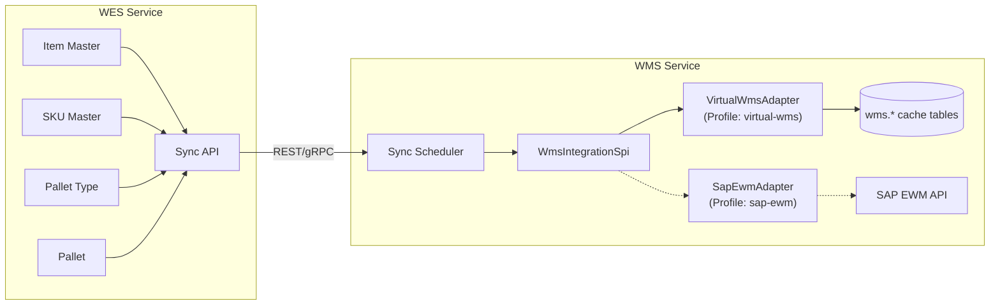

# WMS ↔ WES Integration Strategy: Replaceable Virtual WMS

> **Status**: DRAFT — Pending design decisions  
> **Created**: 2026-09-10  
> **Owner**: Architecture Team  

---

## Problem Statement

We want to build a **virtual WMS** (`wms-service`) that consumes master data owned by WES. The WMS must be **replaceable** — i.e., we should be able to swap our virtual WMS for a third-party WMS (SAP EWM, Manhattan, Blue Yonder, etc.) without touching WES internals.

The shared data flowing from WES → WMS:
- `wes.pallet` (live pallet instances)
- `wes.pallet_type_master` (standard carrier bases)
- `wes.item_master` (product catalog)
- `wes.sku_master` (packaging units)

---

## Key Design Principles

> [!WARNING]
> **Shared Database Anti-Pattern**: Directly sharing PostgreSQL tables between WES and WMS (via cross-schema JPA queries or DB views) creates **tight coupling** that makes third-party WMS replacement nearly impossible. A third-party WMS will never read our `wes.*` tables — it will expect API/event-based integration.

---

## Options Analysis

### Option A: Shared Database (Cross-Schema Views) ❌ Not Recommended

```
WES (wes schema) ←── PostgreSQL Views ──→ WMS (wms schema)
```

| Pros | Cons |
|------|------|
| Simple to implement | **Cannot swap to third-party WMS** — they won't share our DB |
| Zero latency | Tight schema coupling; WES schema changes break WMS |
| No data duplication | Both services must run on same DB instance |

**Verdict**: Fast to build, impossible to replace. Violates our stated goal.

---

### Option B: API-First + Event Sync ✅ Recommended

```
┌──────────┐    REST/gRPC APIs     ┌───────────────────────┐
│          │ ◄──────────────────── │                       │
│   WES    │    (Master Data)      │  WMS Adapter Layer    │
│ (Source  │                       │  (Integration SPI)    │
│  of      │ ──────────────────►   │                       │
│  Truth)  │    Domain Events      │  ┌─────────────────┐  │
│          │  (Pallet Created,     │  │ Virtual WMS Impl │  │
│          │   Item Updated, etc.) │  │   (Our Code)     │  │
└──────────┘                       │  └─────────────────┘  │
                                   │          OR           │
                                   │  ┌─────────────────┐  │
                                   │  │ SAP EWM Adapter  │  │
                                   │  │  (Third-Party)   │  │
                                   │  └─────────────────┘  │
                                   └───────────────────────┘
```

| Pros | Cons |
|------|------|
| **Third-party swappable** — just implement a new adapter | More initial work |
| Clean service boundary | Eventual consistency (not real-time) |
| WES schema changes don't cascade to WMS | Need event infrastructure |
| Already have `common-grpc` module for inter-service comms | |
| WMS gets its own local cache/replica of master data | |

**Verdict**: Right architecture for replaceability. Moderate complexity.

---

### Option C: CDC (Change Data Capture) via Debezium ⚠️ Advanced

```
WES PostgreSQL ──► Debezium ──► Kafka ──► WMS Consumer
```

| Pros | Cons |
|------|------|
| Real-time sync with zero application code changes | Heavy infrastructure (Kafka, Debezium, Connect) |
| Third-party WMS can consume Kafka topics | Overkill for current scale |
| No API changes needed in WES | Complex operational overhead |

**Verdict**: Enterprise-grade but premature for current stage.

---

## Proposed Architecture (Option B: API-First + Event Sync)

The architecture has 3 layers:

### Layer 1: WES Sync API (Data Provider)

New REST/gRPC endpoints on WES that expose master data for external consumers.

#### WesDataSyncController.java
Path: `wes-service/src/main/java/com/company/warehouse/wes/api/controller/WesDataSyncController.java`

Dedicated sync endpoints (separate from internal CRUD controllers):

```java
GET /api/wes/sync/items                    → List<ItemMasterSyncDto>
GET /api/wes/sync/items?updatedAfter=...   → Delta sync
GET /api/wes/sync/skus                     → List<SkuMasterSyncDto>
GET /api/wes/sync/pallet-types             → List<PalletTypeSyncDto>
GET /api/wes/sync/pallets?status=...       → List<PalletSyncDto>
GET /api/wes/sync/pallets/{lpn}            → PalletSyncDto
```

Key design points:
- **Sync DTOs** are flattened, self-contained (no lazy-loaded relationships)
- Support `updatedAfter` parameter for delta/incremental sync
- Separate from existing CRUD controllers to keep concerns clean

#### Sync DTOs
Path: `wes-service/src/main/java/com/company/warehouse/wes/api/dto/sync/`

```
ItemMasterSyncDto.java      — Flat item + custom attributes
SkuMasterSyncDto.java       — Flat SKU + resolved item code
PalletTypeSyncDto.java      — Flat pallet type
PalletSyncDto.java          — Flat pallet + items + strategy (denormalized)
```

These DTOs form the **integration contract**. They are stable and versioned — even if internal WES entities change, sync DTOs stay backward-compatible.

---

### Layer 2: WMS Integration SPI (Adapter Interface)

A **Service Provider Interface** in `wms-service` that defines what ANY WMS implementation must do. This is the key to replaceability.

#### WmsIntegrationSpi.java
Path: `wms-service/src/main/java/com/company/warehouse/wms/business/service/WmsIntegrationSpi.java`

```java
public interface WmsIntegrationSpi {
    // Master Data Sync (WES → WMS)
    void syncItems(List<ItemMasterSyncDto> items);
    void syncSkus(List<SkuMasterSyncDto> skus);
    void syncPalletTypes(List<PalletTypeSyncDto> palletTypes);
    
    // Pallet Events (WES → WMS)
    void onPalletCreated(PalletSyncDto pallet);
    void onPalletStatusChanged(String palletLpn, String newStatus, String location);
    
    // WMS → WES Commands (Outbound)
    void requestPalletMove(String palletLpn, String targetLocation);
    void requestPalletShipment(String palletLpn, String shipmentId);
}
```

#### VirtualWmsAdapter.java (Our Implementation)
Path: `wms-service/src/main/java/com/company/warehouse/wms/infrastructure/adapter/VirtualWmsAdapter.java`

```java
@Service
@Profile("virtual-wms")     // Active when using OUR WMS
public class VirtualWmsAdapter implements WmsIntegrationSpi {
    // Stores data in local wms.* tables
    // Full WMS business logic lives here
}
```

#### [FUTURE] SapEwmAdapter.java (Third-Party Replacement)
```java
@Service
@Profile("sap-ewm")         // Active when using SAP
public class SapEwmAdapter implements WmsIntegrationSpi {
    // Translates calls to SAP EWM REST/IDoc/RFC APIs
    // No local tables needed — SAP is the system of record
}
```

**Swapping WMS = changing a Spring profile.** No code changes in WES.

---

### Layer 3: Sync Scheduler (Orchestration)

#### WesSyncScheduler.java
Path: `wms-service/src/main/java/com/company/warehouse/wms/infrastructure/sync/WesSyncScheduler.java`

Periodic job that pulls delta changes from WES sync API:

```java
@Scheduled(fixedDelay = 60_000)  // Every 60 seconds
public void syncMasterData() {
    Instant lastSync = syncStateRepository.getLastSyncTimestamp("ITEMS");
    List<ItemMasterSyncDto> items = wesClient.getItems(lastSync);
    wmsIntegrationSpi.syncItems(items);
    syncStateRepository.updateLastSyncTimestamp("ITEMS", Instant.now());
}
```

---

## WMS Local Tables (Virtual WMS Only)

The virtual WMS should maintain its **own replica** of master data in the `wms` schema. These are NOT shared tables — they're local copies synced via the API.

```sql
-- wms schema — local replicas (NOT shared with WES)
CREATE TABLE wms.item_cache (
    wes_item_id UUID PRIMARY KEY,     -- FK reference to WES source
    item_code VARCHAR(60) NOT NULL,
    name VARCHAR(255),
    item_type VARCHAR(40),
    base_uom VARCHAR(20),
    synced_at TIMESTAMPTZ NOT NULL
);

CREATE TABLE wms.sku_cache (
    wes_sku_id UUID PRIMARY KEY,
    sku_code VARCHAR(60) NOT NULL,
    wes_item_id UUID NOT NULL,
    package_type VARCHAR(30),
    synced_at TIMESTAMPTZ NOT NULL
);

CREATE TABLE wms.pallet_cache (
    wes_pallet_id UUID PRIMARY KEY,
    pallet_lpn VARCHAR(60) NOT NULL,
    status VARCHAR(30),
    current_location VARCHAR(100),
    synced_at TIMESTAMPTZ NOT NULL
);
```

> [!TIP]
> These `*_cache` tables are owned by the virtual WMS adapter. When swapping to SAP EWM, these tables become irrelevant — SAP maintains its own inventory. The SPI adapter simply forwards API calls to SAP instead.

---

## Data Flow Diagram



---

## Implementation File Map

### WES Service Changes

| Action | File | Purpose |
|--------|------|---------|
| NEW | `wes/.../api/controller/WesDataSyncController.java` | Sync endpoints for external consumers |
| NEW | `wes/.../api/dto/sync/ItemMasterSyncDto.java` | Stable integration contract DTOs |
| NEW | `wes/.../api/dto/sync/SkuMasterSyncDto.java` | |
| NEW | `wes/.../api/dto/sync/PalletTypeSyncDto.java` | |
| NEW | `wes/.../api/dto/sync/PalletSyncDto.java` | |
| NEW | `wes/.../business/service/DataSyncService.java` | Business logic for delta queries |

### WMS Service Changes

| Action | File | Purpose |
|--------|------|---------|
| NEW | `wms/.../business/service/WmsIntegrationSpi.java` | Adapter interface (replaceability) |
| NEW | `wms/.../infrastructure/adapter/VirtualWmsAdapter.java` | Our WMS implementation |
| NEW | `wms/.../infrastructure/sync/WesSyncScheduler.java` | Periodic sync orchestrator |
| NEW | `wms/.../infrastructure/sync/WesSyncClient.java` | REST client calling WES sync API |
| NEW | `wms/.../data/entity/ItemCacheEntity.java` | Local replica entities |
| NEW | `wms/.../data/entity/SkuCacheEntity.java` | |
| NEW | `wms/.../data/entity/PalletCacheEntity.java` | |
| NEW | `wms/src/main/resources/db/migration/V1__wms_cache_tables.sql` | Cache tables DDL |

---

## Open Design Decisions

### 1. Communication Protocol
Our project already has `common-grpc` set up. Should the WES sync API be **REST** (simpler, easier for third-party WMS) or **gRPC** (already in stack, higher performance)?

**Recommendation**: REST for sync endpoints (third-party friendly) + gRPC for real-time pallet events (internal performance).

### 2. Sync Frequency
How fresh does the WMS data need to be?
- **Near real-time** (< 5 sec): Need event-driven push (WebSocket/gRPC streaming)
- **Periodic** (30-60 sec): Simple scheduled polling (recommended to start)
- **On-demand**: WMS pulls from WES only when needed

### 3. WMS Scope (Phase 1)
What business logic should the virtual WMS handle? Typical WMS responsibilities:
- Bin/Location management and warehouse topology
- Put-away optimization (assigning pallets to storage bins)
- Pick-wave planning and order allocation
- Inventory counting and cycle counts

### 4. Event Infrastructure
For `onPalletCreated` / `onPalletStatusChanged`, should we use:
- **Direct gRPC calls** (simple, already in stack)
- **Spring Application Events** + internal queue (no external infra)
- **Message broker** (RabbitMQ/Kafka — more decoupled but adds infra)

---

## Verification Plan

### Automated Tests
- Integration test: WES sync endpoints return correct delta data
- Unit test: `VirtualWmsAdapter` correctly persists synced data
- Contract test: Sync DTOs remain backward-compatible

### Manual Verification
- Create items/SKUs/pallets in WES → verify they appear in WMS cache within sync interval
- Swap Spring profile to `sap-ewm` → verify WMS boots without errors (adapter stub)

---

## Revision History

| Date | Author | Change |
|------|--------|--------|
| 2026-09-10 | — | Initial draft: 3 options analysis, recommended Option B |
