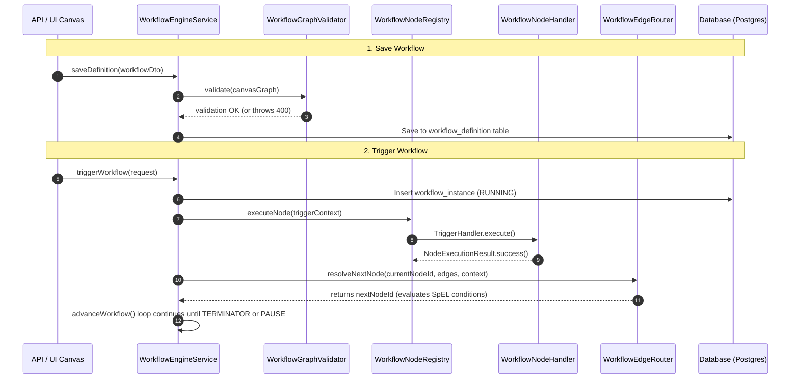

# Workflow Engine: Architecture & Node Documentation

This document explains the architecture of the **Workflow Engine** (`wes-service`), detailing every source file, how execution flows across the system, and how each individual node type operates.

---

## 1. Directory & File Overview

The workflow engine codebase resides under:
`services/wes-service/src/main/java/com/company/warehouse/wes/business/workflow/`

```
business/workflow/
├── WorkflowEngineService.java                # Central execution orchestrator
├── WorkflowNodeExecutionContext.java         # Immutable context passed to each node
├── NodeExecutionResult.java                  # Result payload returned by node handlers
├── WorkflowExecutionMode.java                # REAL vs SIMULATION mode enum
├── WorkflowNodeTemplateService.java          # Service managing reusable composed templates
│
├── routing/
│   └── WorkflowEdgeRouter.java               # SpEL condition evaluator & edge resolver
│
├── validation/
│   └── WorkflowGraphValidator.java           # Save-time graph structural integrity validator
│
├── logging/
│   ├── WorkflowStructuredLogger.java         # Writes step audit records to DB & MDC
│   └── WorkflowTraceDto.java                 # DTO reconstructing timeline trace
│
└── node/
    ├── WorkflowNodeHandler.java              # Universal SPI interface implemented by all nodes
    ├── WorkflowNodeRegistry.java             # Spring registry dispatching node execution
    │
    ├── control/
    │   ├── TriggerHandler.java               # TRIGGER / START node handler
    │   ├── TerminatorHandler.java            # TERMINATOR / END node handler
    │   ├── GatewayExclusiveHandler.java      # DECISION / XOR branch node handler
    │   ├── GatewayParallelHandler.java       # FORK / JOIN parallel gateway handler
    │   ├── AsyncGateHandler.java             # ASYNC_GATE callback & wait handler
    │   ├── SubWorkflowHandler.java           # SUB_WORKFLOW child process invoker
    │   └── ComposedNodeHandler.java          # COMPOSED reusable template handler
    │
    ├── integration/
    │   ├── MathOperationHandler.java         # MATH_OPERATION arithmetic calculator
    │   ├── ValidationHandler.java            # VALIDATION master data & bounds checker
    │   └── ApiMapperHandler.java             # API_MAPPER outbound REST dispatcher
    │
    ├── equipment/
    │   ├── ResourceActionHandler.java        # RESOURCE_ACTION physical equipment handler
    │   ├── EquipmentDispatchHandler.java     # AMR/Crane/ASRS direct dispatcher
    │   └── OpcUaStationActionHandler.java    # Industrial PLC/OPC-UA sequence handler
    │
    └── mes/
        ├── StateMutationHandler.java         # STATE_MUTATION database status mutator
        ├── InventoryAllocateHandler.java     # INVENTORY_ALLOCATE bin reservation handler
        ├── MaterialStageHandler.java         # MATERIAL_STAGE WIP staging & kitting handler
        └── QualityInspectionHandler.java     # QUALITY_INSPECTION QA check handler
```

---

## 2. Core Engine Components & How They Interact



### Detailed Component Explanations:

### `WorkflowEngineService.java`
* **Role:** The core orchestrator.
* **Responsibilities:**
  - Manages definitions (CRUD) and checks validity using `WorkflowGraphValidator`.
  - Spawns instances in `workflow_instance` table.
  - Recursively advances execution from node to node via `advanceWorkflow()`.
  - Enforces `MAX_WORKFLOW_STEPS = 100` to prevent infinite cycle loops.
  - Handles callbacks when external systems resume a paused `ASYNC_GATE`.

### `WorkflowNodeExecutionContext.java`
* **Role:** Input packet passed into every node handler.
* **Contents:**
  - `nodeId`: ID of the executing node.
  - `nodeType`: Type discriminator string (e.g. `TRIGGER`, `MATH_OPERATION`).
  - `nodeLabel`: Human-readable label.
  - `nodeConfig`: The node's specific JSON configuration map.
  - `context`: The current execution context map (variables produced by earlier steps).
  - `instance`: The parent `WorkflowInstanceEntity`.
  - `simulationMode`: Boolean flag indicating if real hardware should be mocked.

### `NodeExecutionResult.java`
* **Role:** Output packet returned by each node handler.
* **Contents:**
  - `status`: `"SUCCESS"`, `"FAILED"`, or `"PAUSED_WAITING"`.
  - `outputData`: Key-value map of new or updated variables to merge into context.
  - `errorMessage`: Error description if failed.
  - `correlationKey`: Correlation identifier if paused at an async gate.

### `WorkflowEdgeRouter.java`
* **Role:** Determines which outgoing edge to traverse next.
* **How it works:**
  - Matches edges where `edge.source == currentNodeId`.
  - If a node failed, looks for an edge with `condition == "FAILED"` (failure fallback routing).
  - Evaluates SpEL conditions (e.g. `#context['weight'] > 1000`) against the context map.
  - If no condition is specified or evaluates to true, takes the default unconditional edge.

### `WorkflowGraphValidator.java`
* **Role:** Save-time gatekeeper.
* **Checks:**
  - No duplicate node IDs.
  - Must have at least 1 `TRIGGER` node and at least 1 `TERMINATOR` node.
  - Every node type must be supported by an active registered handler.
  - Edges must point only to existing source and target node IDs.
  - Validates required fields on nodes (e.g. `resourceId` on `RESOURCE_ACTION`).

### `WorkflowNodeRegistry.java`
* **Role:** Node handler lookup and dispatcher.
* **Behavior:** Automatically discovers all Spring beans implementing `WorkflowNodeHandler`. Queries `supports(nodeType)` to dispatch execution to the correct handler. Fails fast if no handler supports the node type.

---

## 3. Comprehensive Breakdown of All Workflow Nodes

---

### A. Control & Flow Nodes

#### 1. `TRIGGER` (`TriggerHandler.java`)
* **Category:** Control / Start
* **Supported Type Names:** `TRIGGER`, `START`, `EVENT_TRIGGER`
* **Purpose:** Entry point of the workflow. Initializes runtime variables and records step #1.
* **Configuration Fields:**
  * `triggerEvent`: Unique event name (e.g. `PALLET_SCANNED`).
  * `sourceChannel`: Origin (e.g. `HMI_OPERATOR`, `MANUAL_CLICK`, `WEBHOOK`).
  * `manualFields`: Key-value input field definitions.
* **Output to Context:** Preserves initial trigger payload and sets `executed: true`.

#### 2. `TERMINATOR` (`TerminatorHandler.java`)
* **Category:** Control / End
* **Supported Type Names:** `TERMINATOR`, `END`
* **Purpose:** Concludes workflow execution and determines final terminal status.
* **Configuration Fields:**
  * `completionStatus`: `COMPLETED` (success), `DIVERTED`, `QUARANTINED`, `ABORTED`.
* **Output to Context:** Sets instance final status to match `completionStatus`. Halts graph traversal.

#### 3. `DECISION` (`GatewayExclusiveHandler.java`)
* **Category:** Control / Branching
* **Supported Type Names:** `DECISION`, `GATEWAY_EXCLUSIVE`, `SWITCH`
* **Purpose:** Evaluates conditional branches. Edges originating from this node define SpEL expressions.
* **Configuration Fields:**
  * `conditionExpression`: SpEL condition (e.g. `#context['validationOutcome'] == 'APPROVED'`).
* **Output to Context:** Emits routing marker; `WorkflowEdgeRouter` chooses the appropriate outgoing path.

#### 4. `GATEWAY_PARALLEL` (`GatewayParallelHandler.java`)
* **Category:** Control / Concurrency
* **Supported Type Names:** `GATEWAY_PARALLEL`, `FORK`, `JOIN`
* **Purpose:** Split execution into concurrent branches (FORK) or wait for all branches to reach synchronization point (JOIN).

#### 5. `ASYNC_GATE` (`AsyncGateHandler.java`)
* **Category:** Control / Asynchronous Wait
* **Supported Type Names:** `ASYNC_GATE`, `WAIT_CALLBACK`
* **Purpose:** Pauses execution until an external callback arrives.
* **Configuration Fields:**
  * `waitEvent`: Name of expected callback event (e.g. `WMS_PALLET_CONFIRMATION`).
  * `timeoutSeconds`: Max wait duration (e.g. `300`).
* **Output to Context:** Generates unique `correlationKey` (e.g. `CORR-2C5EDD62`), sets instance status to `WAITING_CALLBACK`, and halts execution until `POST /api/v1/wes/workflows/callbacks/{key}` is invoked.

#### 6. `SUB_WORKFLOW` (`SubWorkflowHandler.java`)
* **Category:** Control / Modularity
* **Supported Type Names:** `SUB_WORKFLOW`, `CHILD_WORKFLOW`, `CALL_ACTIVITY`
* **Purpose:** Invokes a separate published workflow definition as a child process.
* **Configuration Fields:**
  * `subWorkflowCode`: Code of the workflow definition to invoke.
  * `outputVariable`: Context key to hold child results (default: `subWorkflowResult`).

#### 7. `COMPOSED` (`ComposedNodeHandler.java`)
* **Category:** Control / Reusable Template
* **Supported Type Names:** `COMPOSED`, `COMPOSED_STEP`, `TEMPLATE_STEP`
* **Purpose:** Executes a composite step template loaded from `workflow_node_template` table.
* **Configuration Fields:**
  * `templateCode`: Key referencing the template.
  * `parameters`: Key-value parameter overrides.
* **Output to Context:** Merges template default configuration with node overrides and delegates execution to the underlying capability.

---

### B. Logic, Math & Integration Nodes

#### 8. `MATH_OPERATION` (`MathOperationHandler.java`)
* **Category:** Logic / Calculation
* **Supported Type Names:** `MATH_OPERATION`, `MATH`, `CALCULATION`
* **Purpose:** Performs arithmetic calculations on context variables.
* **Configuration Fields:**
  * `operation`: `ADD`, `SUBTRACT`, `MULTIPLY`, `DIVIDE`, `PERCENTAGE`, `ROUND`, `CEIL`, `FLOOR`.
  * `operandA`: Variable name (e.g. `tareWeight`) or numeric constant.
  * `operandB`: Variable name (e.g. `netWeight`) or numeric constant.
  * `outputVariable`: Variable name to store result (e.g. `grossWeightKg`).
* **Output to Context:** Writes `{ [outputVariable]: calculatedResult }` into context.

#### 9. `VALIDATION` (`ValidationHandler.java`)
* **Category:** Logic / Rules
* **Supported Type Names:** `VALIDATION`, `RULE_CHECK`, `SCHEMA_VALIDATION`, `SANITY_CHECK`
* **Purpose:** Validates SKU existence, dimension profile, or weight tolerance against Master Data.
* **Configuration Fields:**
  * `validationType`: `WEIGHT`, `DIMENSIONS`, `PALLET_MASTER_DATA`.
  * `rejectOnMissingSku`: Boolean flag.
* **Output to Context:** Outputs `validationOutcome: "APPROVED"` or `"REJECTED"`, plus count of violations.

#### 10. `API_MAPPER` (`ApiMapperHandler.java`)
* **Category:** Integration / REST
* **Supported Type Names:** `API_MAPPER`, `REST_DISPATCH`, `HTTP_REQUEST`
* **Purpose:** Dispatches outbound HTTP REST calls (e.g. WMS or ERP integration).
* **Configuration Fields:**
  * `endpointUrl`: Target URL with variable substitution (`{{context.lpn}}`).
  * `httpMethod`: `GET`, `POST`, `PUT`, `DELETE`.
  * `mappingCode`: Dynamic mapping template code.
  * `outputVariable`: Variable to store response (default: `apiResponse`).
* **Output to Context:** Injects HTTP response body and status code into context under `outputVariable`.

---

### C. Industrial Equipment & Warehouse Operations

#### 11. `RESOURCE_ACTION` (`ResourceActionHandler.java`)
* **Category:** Equipment / Hardware
* **Supported Type Names:** `RESOURCE_ACTION`, `RESOURCE_METHOD`, `EQUIPMENT_METHOD`
* **Purpose:** Executes an action on physical hardware (crane, conveyor, AMR) via `entityServiceDispatcher`.
* **Configuration Fields:**
  * `resourceId` (or fallback `resourceCode`): ID of equipment (e.g. `CRANE-01`).
  * `methodName`: Method to invoke (e.g. `pickPallet`, `divert`).
  * `parameters`: Key-value arguments passed to method.
  * `outputVariable`: Variable to store result (default: `actionResult`).
* **Output to Context:** Merges method execution result into context. In simulation mode, returns simulated success.

#### 12. `EQUIPMENT_DISPATCH` (`EquipmentDispatchHandler.java`)
* **Category:** Equipment / Direct Dispatch
* **Supported Type Names:** `EQUIPMENT_DISPATCH`, `AMR_MISSION`, `CRANE_PUTAWAY`, `CRANE_RETRIEVE`, `ASRS_ACTION`
* **Purpose:** Directly initiates an automated transport mission or crane move.

#### 13. `OPCUA_STATION_ACTION` (`OpcUaStationActionHandler.java`)
* **Category:** Equipment / PLC
* **Supported Type Names:** `OPCUA_STATION_ACTION`, `OPCUA_SEQUENCE`, `CONVEYOR_STATION`
* **Purpose:** Writes or reads industrial PLC tags over OPC-UA protocol.

#### 14. `STATE_MUTATION` (`StateMutationHandler.java`)
* **Category:** MES / Entity State
* **Supported Type Names:** `STATE_MUTATION`, `UPDATE_STATUS`
* **Purpose:** Updates database records for pallets, tasks, or locations.
* **Configuration Fields:**
  * `entityType`: Target entity (e.g. `PALLET`).
  * `status`: New status (`AVAILABLE`, `IN_TRANSIT`, `STORED`, `QUARANTINED`).
  * `location`: New location code.
* **Output to Context:** Updates entity in DB and emits `palletStatus` to context.

#### 15. `INVENTORY_ALLOCATE` (`InventoryAllocateHandler.java`)
* **Category:** MES / Inventory
* **Supported Type Names:** `INVENTORY_ALLOCATE`, `BIN_ALLOCATION`, `RESERVE_LOCATION`
* **Purpose:** Allocates a warehouse storage bin/shelf for inventory.

#### 16. `MATERIAL_STAGE` (`MaterialStageHandler.java`)
* **Category:** MES / Production
* **Supported Type Names:** `MATERIAL_STAGE`, `WIP_STAGING`, `KITTING`
* **Purpose:** Tracks work-in-progress materials staging and kitting operations.

#### 17. `QUALITY_INSPECTION` (`QualityInspectionHandler.java`)
* **Category:** MES / Quality
* **Supported Type Names:** `QUALITY_INSPECTION`, `QA_CHECK`, `ALLERGEN_GATE`
* **Purpose:** Evaluates quality control checks, returning verdict `PASS` or `HOLD`.

---

## 4. Execution Data Storage Structure

Every workflow instance stores its execution progress in the database across two primary tables:

### Table: `workflow_instance`
* `id` (`UUID`): Primary key.
* `workflow_code` (`VARCHAR`): Reference to workflow definition.
* `entity_reference` (`VARCHAR`): Associated business entity (e.g. Pallet LPN `PLT-1001`).
* `status` (`VARCHAR`): Current state (`RUNNING`, `WAITING_CALLBACK`, `COMPLETED`, `FAILED`, `DIVERTED`, `QUARANTINED`, `ABORTED`).
* `current_node_id` (`VARCHAR`): ID of node currently executing or last completed.
* `correlation_key` (`VARCHAR`): Non-null when paused at an `ASYNC_GATE`.
* `context_data` (`TEXT`): Serialized JSON of all variables in the workflow.

### Table: `workflow_execution_log`
An immutable, append-only step log tracking every single transition:
* `instance_id` (`UUID`): Parent instance.
* `step_number` (`INT`): Sequence (1, 2, 3...).
* `node_id`, `node_type`, `node_label`: Details of executed node.
* `input_payload`, `output_payload`: Complete JSON snapshot of data before and after the step.
* `status`: Step outcome (`SUCCESS`, `FAILED`, `PAUSED`).
* `execution_time_ms`: Duration in milliseconds.
* `error_message`: Full error text if failed.
