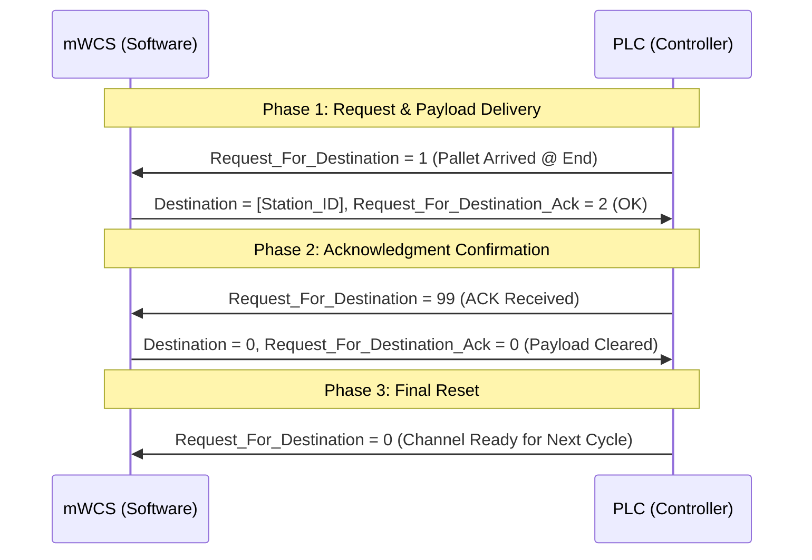

# Interface Control Document (ICD) Context: PLC ↔ mWCS Integration
**Document Reference:** `P24V3_PLC_WMS_ICD_V1.17.xlsx`  
**System:** P24V3 Warehouse Automation & Material Handling System  
**Integration Parties:** Conveyor / Equipment PLCs ↔ mWCS (Micro Warehouse Control System / Orchestrator)

---

## 1. System Overview & Purpose

This document establishes the communication protocol, data structures, station state models, and handshake sequences between the PLC industrial automation layer and the mWCS software layer.

The integration controls automated pallet transport, routing decisions, profile inspection, weighing, sorting, wrapping/unwrapping, labelling, destacking/stacking, vertical transport (elevators/shuttles), and error handling across warehouse zones (Inbound, ASRS, Outbound, Production Floors, Flammable Storage, and Goods-to-Person stations).

---

## 2. Architecture & Data Direction Conventions

Tags and variables are structured around two complementary memory blocks per station/zone:
- **`*IP[X]` (Input to PLC / Output from mWCS):** Variables written by mWCS and read by the PLC.
- **`*OP[X]` (Output from PLC / Input to mWCS):** Variables written by the PLC and read by mWCS.
- **`X`**: Represents the unique Station ID, Zone ID, or PLC instance ID defined in the Station Master tables.

### 2.1 Common Interface (Global Watchdog)
| Tag | Direction | Type | Description |
| :--- | :--- | :--- | :--- |
| `ConveyorOP[X].PLCPowerOn` | PLC → mWCS | Byte | `0` = Power Off, `1` = Power On. |
| `ConveyorIP[X].HeartBitIP` | mWCS → PLC | Byte | mWCS toggles between `1` and `2` at 1.0s intervals. If static for > 1.0s, PLC triggers watchdog fault. |

### 2.2 Zone Interface & Dynamic Roles
Zones (e.g., EZ1 to EZ17) provide supervisory telemetry and dynamic conveyor role reassignment:
- **`ZoneOP[X].Mode`**: `1` = Auto, `2` = Manual.
- **`ZoneOP[X].PLC_Error_No`**: `0` = Normal, `> 0` = Fault condition.
- **Dynamic Infeed/Outfeed Reconfiguration**:
  - `ZoneIP[X].Function`: `1` = Configured as Loading Station, `2` = Configured as Unloading Station.
  - `ZoneIP[X].ConveyorNo`: Logical conveyor identifier assigned to the function.
  - Handshake: mWCS sets `Read_function = true` → PLC acknowledges with `Read_function_Ack = 1` (Success) or `2` (Failure) → mWCS resets `Read_function = false` → PLC clears `Read_function_Ack = 0`.

---

## 3. Standard Handshake Protocol (3-Way Positive Acknowledgment)

To ensure zero dropped messages, race-condition safety, and deterministic recovery across network reconnects or PLC cycle boundaries, all command interactions follow a **3-Way Handshake pattern**:

### 3.1 Handshake Return Codes
- **Request values:**
  - `0`: Idle / Default
  - `1`: Active Request initiated
  - `99`: Requestor acknowledges receipt of response from partner
- **Acknowledgment (ACK) values:**
  - `0`: Idle / Cleared
  - `1`: Wait / Busy (Hold transfer; e.g., downstream blocked)
  - `2`: OK / Accepted (Proceed)

### 3.2 Handshake Fault Recovery Rules
- If power fails, system trips, or mode changes to Manual during an incomplete handshake, mWCS resets written registers to `0`.
- Once healthy, incomplete handshakes re-trigger from the beginning.
- Completed handshakes do not repeat unless physical position state falls back to waiting state (State `4` or `5`).

---

## 4. Universal Station State Model

All handling stations (Loading, Unloading, Conveyor, Cross-Transfer, Profile, Elevator, etc.) publish an operational state byte `State`:

| State Value | Meaning | Action / Expected Behavior |
| :---: | :--- | :--- |
| `1` | Ready to Receive | Equipment is free and available to receive incoming load. |
| `2` | Receive in Progress | Motor running; pallet in-transit into station. |
| `4` | Pallet Present @ Forward End | Pallet positioned at primary discharge/inspection limit. |
| `5` | Pallet Present @ Reverse End | Pallet positioned at secondary discharge limit. |
| `6` | Pallet Move up to End in Progress | In-station centering / creep indexing. |
| `8` | Transfer in Progress | Motor running; discharging pallet to downstream station. |
| `16` | In Error | Station fault (interlock, drive trip, timeout). |
| `32` | Unusable | Operator marked module out of service from HMI. mWCS reroutes. |
| `64` | Role-Specific Ready | Single/Vendor Pallet ready to receive/unload. |
| `128` | Manual Mode Interlock | Configuration or positioning modified while under manual override. |

---

## 5. Station Types & Operational Sequences

### 5.1 Loading Station (Infeed)
Handles system pallets (SP) and vendor pallets (KO) introduced manually or via AMR / Fork AGV.
1. **Load Type Registration**:
   - mWCS writes `Loading_Type` (`1`=None, `2`=Manual, `3`=AMR, `4`=Fork AGV, `5`=Conveyor-Top AMR, or connected Station ID).
   - mWCS sets `Type_of_Operation` (`1`=Single pallet two-stage loading, `2`=Multi/combined stack loading).
   - mWCS triggers `Read_Loading_type = 1` → PLC sets `Read_Loading_type_Ack = 2` → mWCS sets `99` → PLC resets to `0` → mWCS resets to `0`.
2. **Pallet Identification**:
   - When pallet arrives (`State = 4` or `5`), mWCS writes `Pallet_ID_From_WCS` (10 ASCII chars, padded with space `ASCII 32`).
3. **Destination Assignment**:
   - PLC raises `Request_For_Destination = 1`.
   - mWCS responds with `Destination = [NextStationID]` and `Request_For_Destination_Ack = 2`.
   - Handshake clears via `99` → `0`.
4. **Handoff Completion**:
   - On discharge, PLC fires `Pallet_Transferred = 1`.
   - mWCS clears `Pallet_ID_From_WCS` and sets `Pallet_Transferred_Ack = 1` → Handshake clears via `99` → `0`.

---

### 5.2 Profile Check & Weighing Station
Automated quality gate validating physical pallet dimensions, weight tolerances, and optical barcode scans.
1. **Barcode Capture**:
   - PLC reads optical barcode and populates `Pallet_ID_From_PLC` (System Pallet ID, 10 chars) and `Vendor_Pallet_ID_From_PLC` (up to 50 chars).
   - **Barcode Read Failure:** PLC transmits `'1111111111'`. mWCS detects no-read and routes pallet to the Reject Spur.
2. **Pallet Type Verification**:
   - PLC sets `Request_For_Pallet_Type = 1`.
   - mWCS returns `Pallet_Type_To_PLC` (referenced against Pallet Type Master) and `Request_For_Pallet_Type_Ack = 2`.
3. **Telemetry & Destination Routing**:
   - PLC supplies physical telemetry:
     - `Profile_Status`: `1`=Length error, `2`=Width error, `3`=L&W error, `4`=Height error, `5`=L&H error, `6`=H&W error, `7`=L,W&H error, `8`=Profile OK, `9`=Height unsuitable for stretch wrapping.
     - `Weight`: Integer value from scale cell (kg).
   - PLC raises `Request_For_Destination = 1`.
   - mWCS evaluates telemetry vs tolerances:
     - Sets `Pallet_Status`: `1` = Accepted, `2` = Rejected.
     - Sets `Destination`: Forward routing or Reject Lane ID.
     - Sets `Request_For_Destination_Ack = 2`.

---

### 5.3 Decision Station & Cross-Transfer (CT) / Turntable (TT)
Dynamic intersection points directing pallets along branching paths.
- **Station Addressing Schema**:
  - `Type`: `1` = Cross Transfer (CT), `2` = Turn Table (TT).
  - Identifier encodes: `[Type] [Branch_No] [Device_Index]`.
- **In-transit Routing**:
  - As pallet engages arrival photo-eye (`State = 4` or `5`), PLC initiates `Request_For_Destination = 1`.
  - mWCS looks up pallet route and replies with `Destination = [NextStationID]`, `Request_For_Destination_Ack = 2`.
  - PLC actuates lifting chains, rollers, or turntable heading.
  - Discharge completion signaled by `Pallet_Transferred = 1` / `Pallet_Transferred_Ack = 1`.
- **Abort Sequence**:
  - If a jam or operator intervention occurs, PLC issues `Abort = true`.
  - mWCS acknowledges via `Abort_Ack = true`, drops current reservation, and marks route segment for recovery.

---

### 5.4 Wrap / Unwrap Station
Automated rotary stretch wrapper or de-pallet wrapping cell.
1. **Consumable Health**:
   - PLC continuously publishes `Wrapping_Status`: `0` = OK, `1` = Film low warning, `2` = Film empty / reload required.
2. **Process Authorization**:
   - Load enters wrapper (`State = 4` or `5`), PLC triggers `Request_For_Operation = true`.
   - mWCS specifies recipe via `Request_For_Operation_ACK`: `1` = Wrapping, `2` = Unwrapping, `3` = Pass-through (no action).
   - PLC resets `Request_For_Operation = false`.
3. **Operation Execution & Report**:
   - PLC cycles wrapper. On finish, writes `Pallet_Operation_Status`:
     - `1` = Wrapping Done, `2` = Wrapping Fault/Incomplete.
     - `3` = Unwrapping Done, `4` = Unwrapping Fault/Incomplete.
   - mWCS confirms receipt via `Pallet_Operation_Status_ACK = 1` → PLC resets to `99` → mWCS to `0`.
4. **Discharge**: Standard `Request_For_Destination` and `Pallet_Transferred` sequence resumes.

---

### 5.5 Labelling Station
Automatic Print-and-Apply applicator for pallet logistics labels.
1. **Application Trigger**:
   - Pallet docked; PLC asserts `Request_For_Labelling = true`.
   - mWCS evaluates order requirements and sets `Request_For_Labelling_ACK`: `1` = Required, `2` = Not Required (Bypass).
   - PLC clears `Request_For_Labelling = false`.
2. **Application Status**:
   - PLC sets `Pallet_Labelling_Status`: `1` = Done, `2` = Not Done / Applicator Fault.
   - mWCS acknowledges via `Pallet_Labelling_Status_Ack = true` → PLC transitions to `99` → mWCS to `0`.

---

### 5.6 Stack / Destack Station
Automated magazine holding empty slave or master pallets.
1. **Inventory Telemetry**:
   - PLC publishes `Stack_Status`: `1` = Empty (no pallet), `2` = Partial stack, `3` = Full stack, `4` = Low warning level (1–2 pallets remaining).
2. **Dispense / Replenish Handshake**:
   - mWCS initiates pallet dispensing via `Release_Pallet_Request`: `1` = Single pallet release, `2` = Full stack release.
   - PLC acknowledges with `Release_Pallet_Request_Ack`: `1` = No pallet available, `2` = OK (Dispensing cycle active).
   - Handshake clears via `99` → `0`.
3. **Passthrough Options**:
   - Supports modes `3` (Single pass-through) and `4` (Stack pass-through) via `Type_of_Operation`.

---

### 5.7 Separator Station
Separates or merges vendor pallets and system slave pallets.
- Handshake triggered via `Request_For_Operation = true`.
- mWCS issues command via `Request_For_Operation_ACK`: `1` = Separation required, `2` = Separation not required, `3` = Merge required, `4` = Merge not required.
- mWCS supplies slave association: `VendorPalletID` and `PalletStack` flags.
- Results confirmed via `Pallet_Operation_Status` (`1`=Done, `2`=Failed).

---

### 5.8 Elevator & Vertical Lifter Stations
Facilitates multi-level material transfer (Ground, Mezzanine G+1, G+2, High-Bay 10M).
- PLC provides `State` and tracks pallet barcode across levels.
- Destination handshake specifies vertical level destination station ID.
- Supports timeout holding: if mWCS replies `Request_For_Destination_Ack = 1` (Wait), PLC pauses with a parametric timer (typically 60s) before re-querying.

---

## 6. Warehouse Zones & Redundancy Topologies

| Zone Key | Name / Function | Redundancy Strategy |
| :--- | :--- | :--- |
| **EZ1** | Inbound Lines | Infeed conveyors `B8C1`, `B9C1`, `B8C2`, `B9C2` configure as redundant AMR outfeeds if main spur is offline. |
| **EZ2** | ASRS Infeed/Outfeed | Dual spurs for Zeron AMR handoffs (`B13C4`, `B14C1`, `B16C1`, `B18C1-B22C1`). |
| **EZ3** | Outbound Sorting | Conveyors `B23C1` through `B26C1` support bi-directional reconfiguration (Fork AMR In/Out) via mWCS UI. |
| **EZ4** | Flammable Storage | Dual buffer conveyors (`BC179` / `BC180`) toggle between Inbound and Outbound dynamically upon mWCS command. |
| **EZ5** | Ambient Ground Floor | Vertical Lifters `VT13` and `VT22` serve as mutual active-active fallbacks. If `VT12` fails, infeed shifts to `BC-174 (B117C2)` via 4-way shuttles. |
| **EZ6** | Production Ground Floor | Elevators `EL16` and `EL17` operate in mutual hot-standby redundancy. |
| **EZ7** | Cold Ground Floor | Infeed `VT14` backed up by `BC-177 (B45C2)` and 4-way shuttle routing to `VT15`. |
| **EZ8** | Prod G+1 & G+2 Ambient | Dual lifters (`VT12` & `VT13`) with reversible linking conveyors `B61C9` for bi-directional routing. |
| **EZ9** | Prod G+1 & G+2 Cold | Dual cold lifters (`VT14` & `VT15`) with reversible linking conveyors `B78C10`. |
| **EZ10** | Goods-To-Person (GTP) | Dedicated order picking loops. Stations `B88C1/C2/C4`, `B93C1/C2` removed in v1.13 due to layout constraints. |
| **EZ17** | Manual Unwrapping Line | Manual rework and inspection spurs without automated redundancy. |

---

## 7. Diagnostics, Error & Warning Architecture

1. **Error vs Warning Segregation**:
   - `PLC_Error_No` (> 0): Critical equipment faults requiring line stoppage or automatic diverting away from the faulted component.
   - `PLC_Warning_No` (> 0): Non-fatal advisory notifications (e.g., film low, maintenance intervals, temporary queue backup) logged by mWCS without halting automated execution.
2. **Error Manager Hierarchy**:
   - System error handling is compartmentalized into **Main Error Managers** and **Branch Error Managers** across each physical zone (e.g., `Inbound_Branch_Error_Manager`, `GroundCold_Main_Error_Manager`).
   - Drive-level diagnostics (`CNV_Movimot_Drive`, `CT_Movifit_Drive`, `TT_Movimot_Drive`) publish low-level inverter codes for root-cause tracking.
